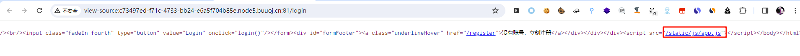
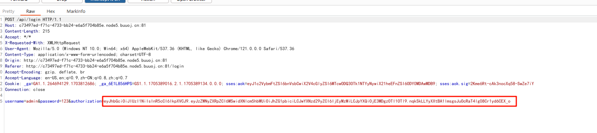
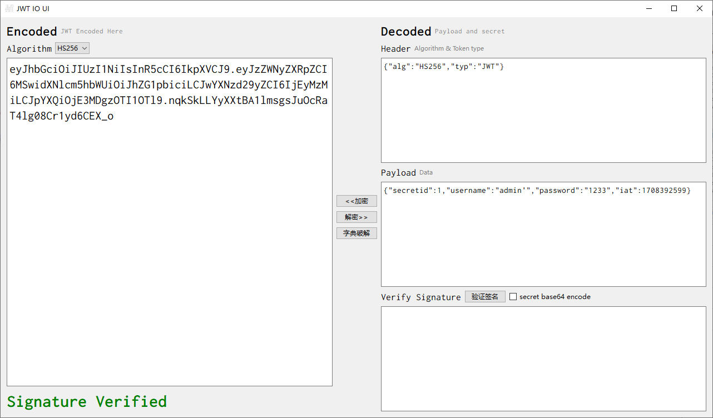
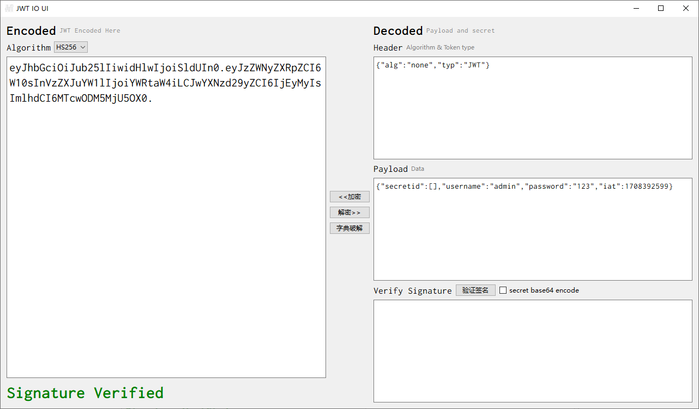
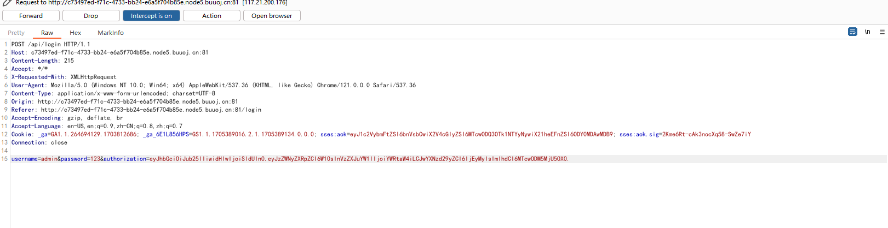
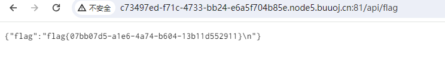

# [HFCTF2020]EasyLogin

## 知识点

`JWT none`

`javascript代码审计`

## 解题

进入首页发现一个登录框,然后查看源代码找东西,发现`app.js`,进入查看时发现`js登录和get_flag逻辑`



```javascript
/**
 *  或许该用 koa-static 来处理静态文件
 *  路径该怎么配置？不管了先填个根目录XD
 */

function login() {
    const username = $("#username").val();
    const password = $("#password").val();
    const token = sessionStorage.getItem("token");
    $.post("/api/login", {username, password, authorization:token})
        .done(function(data) {
            const {status} = data;
            if(status) {
                document.location = "/home";
            }
        })
        .fail(function(xhr, textStatus, errorThrown) {
            alert(xhr.responseJSON.message);
        });
}

function register() {
    const username = $("#username").val();
    const password = $("#password").val();
    $.post("/api/register", {username, password})
        .done(function(data) {
            const { token } = data;
            sessionStorage.setItem('token', token);
            document.location = "/login";
        })
        .fail(function(xhr, textStatus, errorThrown) {
            alert(xhr.responseJSON.message);
        });
}

function logout() {
    $.get('/api/logout').done(function(data) {
        const {status} = data;
        if(status) {
            document.location = '/login';
        }
    });
}

function getflag() {
    $.get('/api/flag').done(function(data) {
        const {flag} = data;
        $("#username").val(flag);
    }).fail(function(xhr, textStatus, errorThrown) {
        alert(xhr.responseJSON.message);
    });
}
```

采用的是`koa`框架，并且访问`/api/flag`路径会校验并返回flag,按照`koa`框架的常见结构去获取下控制器文件的源码。

`controllers/api.js`

```javascript
const crypto = require('crypto');
const fs = require('fs')
const jwt = require('jsonwebtoken')

const APIError = require('../rest').APIError;

module.exports = {
    'POST /api/register': async (ctx, next) => {
        const {username, password} = ctx.request.body;

        if(!username || username === 'admin'){
            throw new APIError('register error', 'wrong username');
        }

        if(global.secrets.length > 100000) {
            global.secrets = [];
        }

        const secret = crypto.randomBytes(18).toString('hex');
        const secretid = global.secrets.length;
        global.secrets.push(secret)

        const token = jwt.sign({secretid, username, password}, secret, {algorithm: 'HS256'});

        ctx.rest({
            token: token
        });

        await next();
    },

    'POST /api/login': async (ctx, next) => {
        const {username, password} = ctx.request.body;

        if(!username || !password) {
            throw new APIError('login error', 'username or password is necessary');
        }

        const token = ctx.header.authorization || ctx.request.body.authorization || ctx.request.query.authorization;

        const sid = JSON.parse(Buffer.from(token.split('.')[1], 'base64').toString()).secretid;

        console.log(sid)

        if(sid === undefined || sid === null || !(sid < global.secrets.length && sid >= 0)) {
            throw new APIError('login error', 'no such secret id');
        }

        const secret = global.secrets[sid];

        const user = jwt.verify(token, secret, {algorithm: 'HS256'});

        const status = username === user.username && password === user.password;

        if(status) {
            ctx.session.username = username;
        }

        ctx.rest({
            status
        });

        await next();
    },

    'GET /api/flag': async (ctx, next) => {
        if(ctx.session.username !== 'admin'){
            throw new APIError('permission error', 'permission denied');
        }

        const flag = fs.readFileSync('/flag').toString();
        ctx.rest({
            flag
        });

        await next();
    },

    'GET /api/logout': async (ctx, next) => {
        ctx.session.username = null;
        ctx.rest({
            status: true
        })
        await next();
    }
};
```

随便注册登录一个账号,在登录时抓包发现有`JWT`



解密一下



这里我当时尝试了一下破解密钥,半天之后破解失败,然后想到尝试签名算法`none`漏洞,将`头部`修改为`{"alg":"none"}`,然后`secretid`也需要为空或者`undefined`否则还是会触发验证，所以将`JWT`中`secretid`项修改为`[]`。



登录之后修改`authorization`后放包,且用户名和密码要和你生成的`JWT`一致,然后一直放包,到`/home`目录后请求`/api/flag`即可获得`flag`





