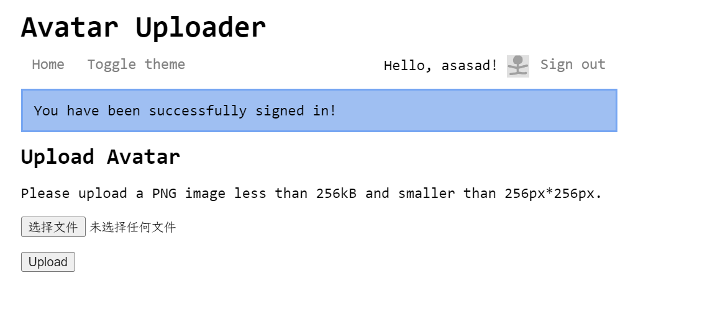
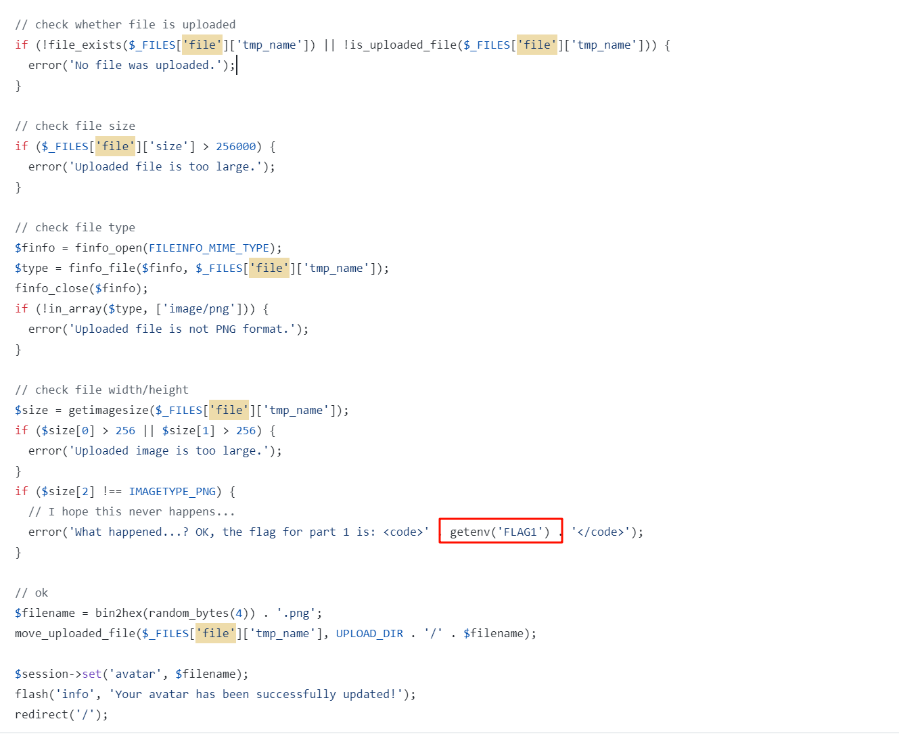
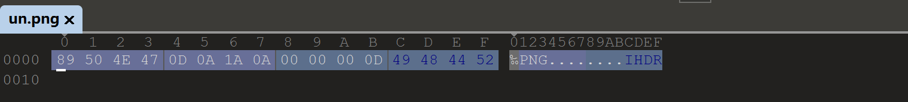
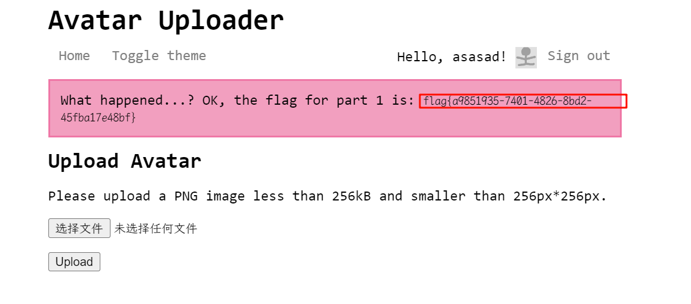

# [HarekazeCTF2019]Avatar Uploader 1

## 知识点

`文件上传绕过getimagesize`

## 解题

今日题目首页

要我们输入个`Name`来登录，随便输入一个点击登录后发现`文件上传`

常规上传`shell` 的手段都没用，`github`看一下源码

在后面判断照片的宽高，一般图片的宽高在`010editor`都是在`第二行`的开始处，这里直接将`第二行之后`的数据删除后，只留文件头即可绕过判断获取`flag`

