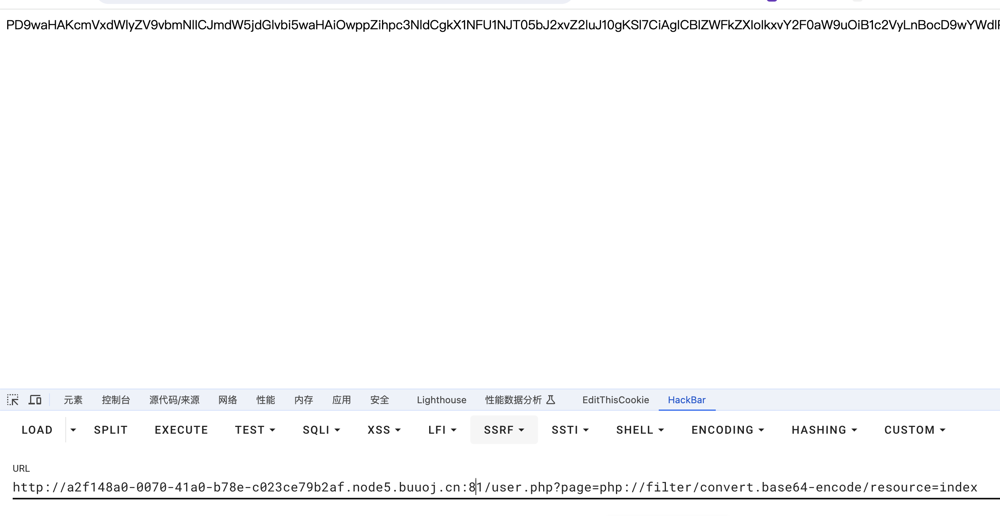
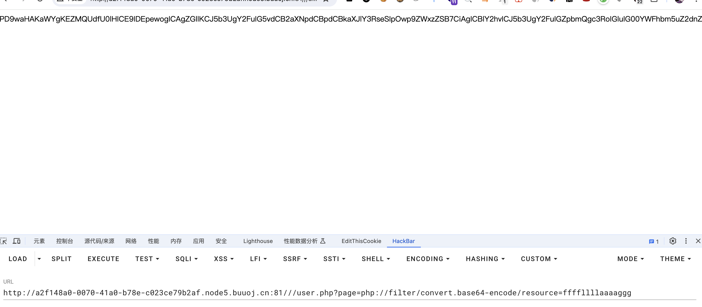
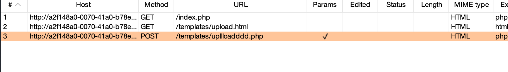
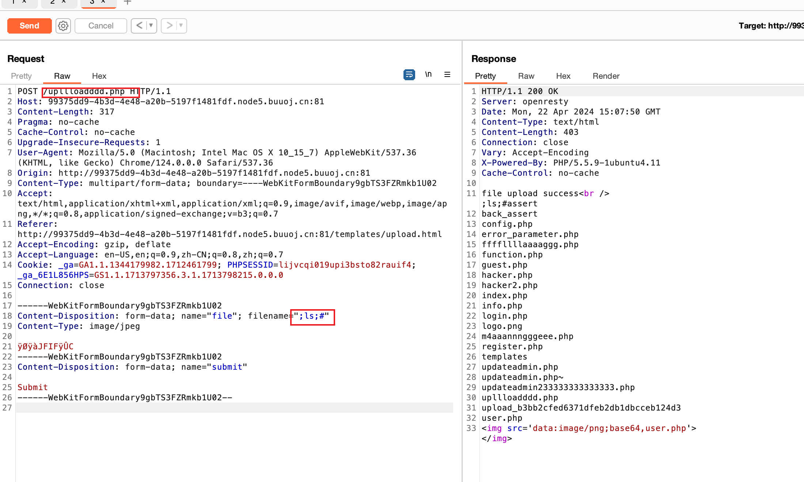
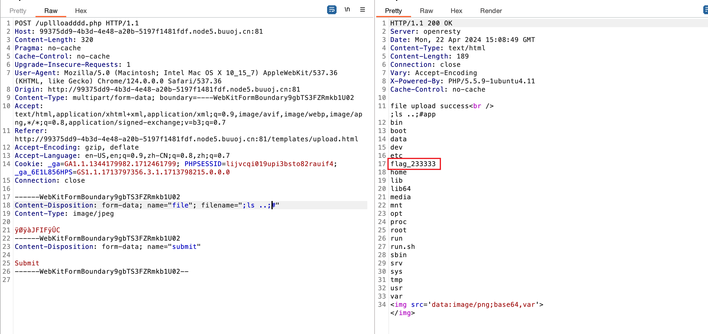
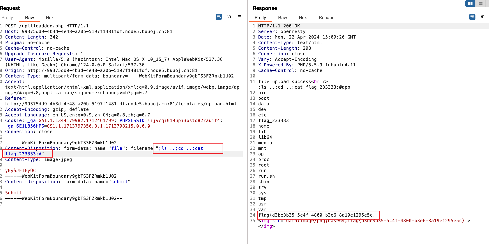

# [N1CTF 2018]eating_cms.md

## 知识点

`任意文件读取`

`php代码审计`

## 解题

进入题目首页，给了一个登录框


也没发现备份文件，猜测可以注册，看看`register.php`


尝试注册`admin'`试试有没有二次注入，登录后进入主页`url`为`http://xxx/user.php?page=guest`，看起来似乎有文件包含，使用`/user.php?page=php://filter/convert.base64-encode/resource=index`时成功获取了`index.php`的源代码



根据各种`php`引用找到最终可以利用的代码为`function.php`

```php
<?php
session_start();
require_once "config.php";
function Hacker()
{
    Header("Location: hacker.php");
    die();
}


function filter_directory()
{
    $keywords = ["flag","manage","ffffllllaaaaggg"];
    $uri = parse_url($_SERVER["REQUEST_URI"]);
    parse_str($uri['query'], $query);
//    var_dump($query);
//    die();
    foreach($keywords as $token)
    {
        foreach($query as $k = $v)
        {
            if (stristr($k, $token))
                hacker();
            if (stristr($v, $token))
                hacker();
        }
    }
}
?>
```

通过末尾添加`//`绕过`parse_url`和`parse_str`，然后尝试包含`ffffllllaaaaggg`



```php
<?php
if (FLAG_SIG != 1){
    die("you can not visit it directly");
}else {
    echo "you can find sth in m4aaannngggeee";
}
?>
```

找`m4aaannngggeee`

```php
<?php
if (FLAG_SIG != 1){
    die("you can not visit it directly");
}
include "templates/upload.html";

>
```

访问`templates/upload.html`发现需要传文件，传文件时发现时通过`/templates/upllloadddd.php`传的文件



读取一下``/templates/upllloadddd.php`,发现没有什么，直接读取`upllloadddd.php`获取到源代码为

```php
<?php
$allowtype = array("gif","png","jpg");
$size = 10000000;
$path = "./upload_b3bb2cfed6371dfeb2db1dbcceb124d3/";
$filename = $_FILES['file']['name'];
if(is_uploaded_file($_FILES['file']['tmp_name'])){
    if(!move_uploaded_file($_FILES['file']['tmp_name'],$path.$filename)){
        die("error:can not move");
    }
}else{
    die("error:not an upload file！");
}
$newfile = $path.$filename;
echo "file upload success<br />";
echo $filename;
$picdata = system("cat ./upload_b3bb2cfed6371dfeb2db1dbcceb124d3/".$filename." | base64 -w 0");
echo "</img>";
if($_FILES['file']['error']>0){
    unlink($newfile);
    die("Upload file error: ");
}
$ext = array_pop(explode(".",$_FILES['file']['name']));
if(!in_array($ext,$allowtype)){
    unlink($newfile);
}
?>
```

发现直接在`filename`处截断即可执行命令





