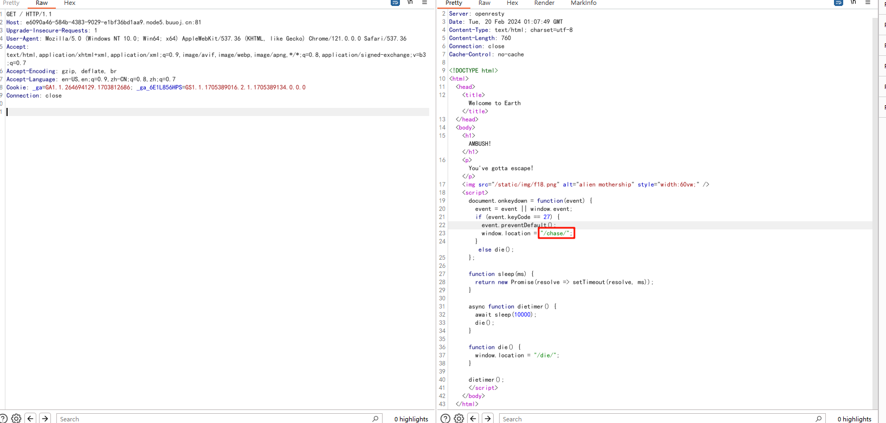
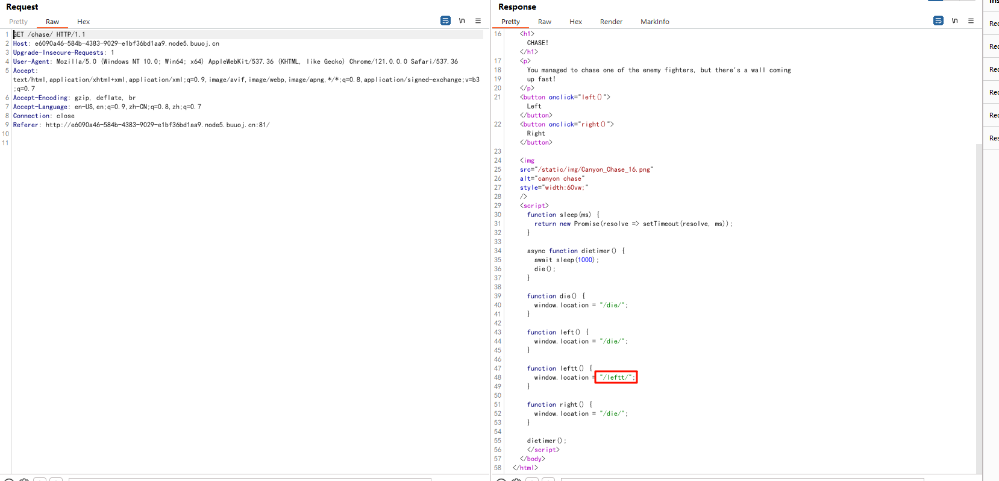
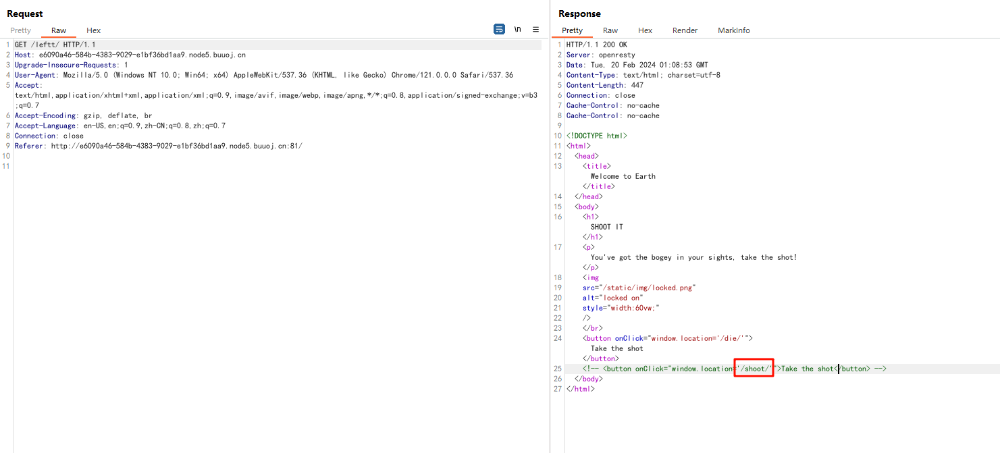
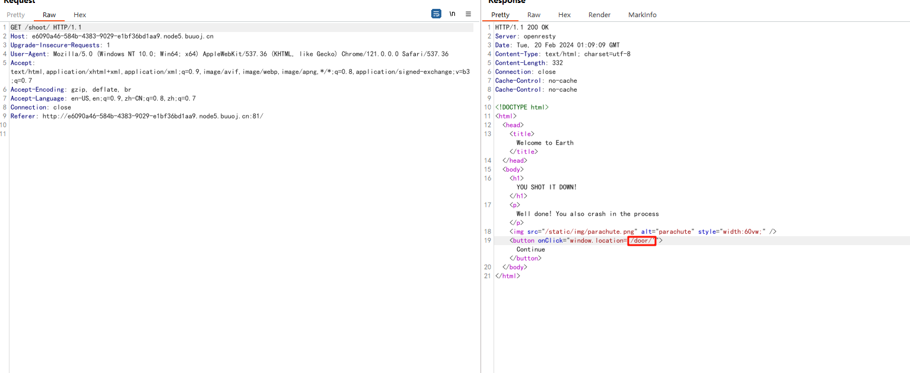
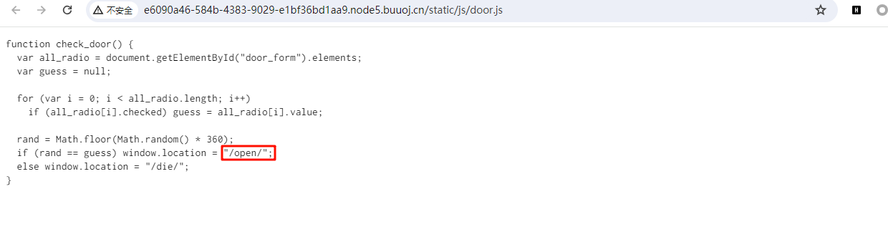
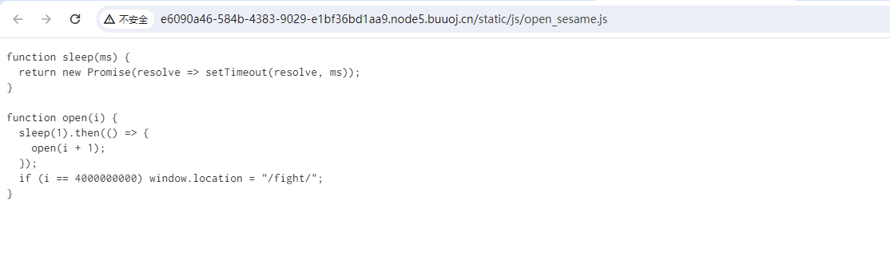
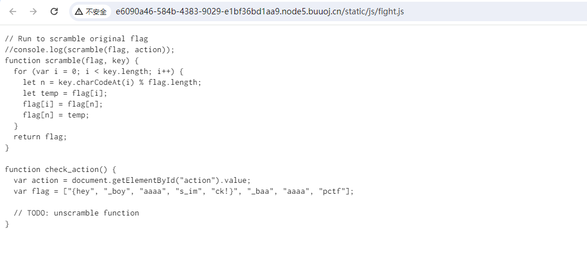

# [b01lers2020]Welcome to Earth

## 知识点

`javascript逆向`

## 解题

一步步抓包的找源码路径















最终找到源码

```javascript
// Run to scramble original flag
//console.log(scramble(flag, action));
function scramble(flag, key) {
  for (var i = 0; i < key.length; i++) {
    let n = key.charCodeAt(i) % flag.length;
    let temp = flag[i];
    flag[i] = flag[n];
    flag[n] = temp;
  }
  return flag;
}

function check_action() {
  var action = document.getElementById("action").value;
  var flag = ["{hey", "_boy", "aaaa", "s_im", "ck!}", "_baa", "aaaa", "pctf"];

  // TODO: unscramble function
}
```

直接`排列`一下,最后输出各种猜测结果

```python
from itertools import permutations


flag = ["{hey", "_boy", "aaaa", "s_im", "ck!}", "_baa", "aaaa", "pctf"]

data = permutations(flag)

for _, v in enumerate(data):
    res = ''.join(v)
    if res.startswith("pctf{hey") and res.endswith('ck!}'):
        print(res)
```


