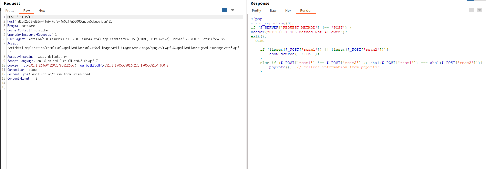
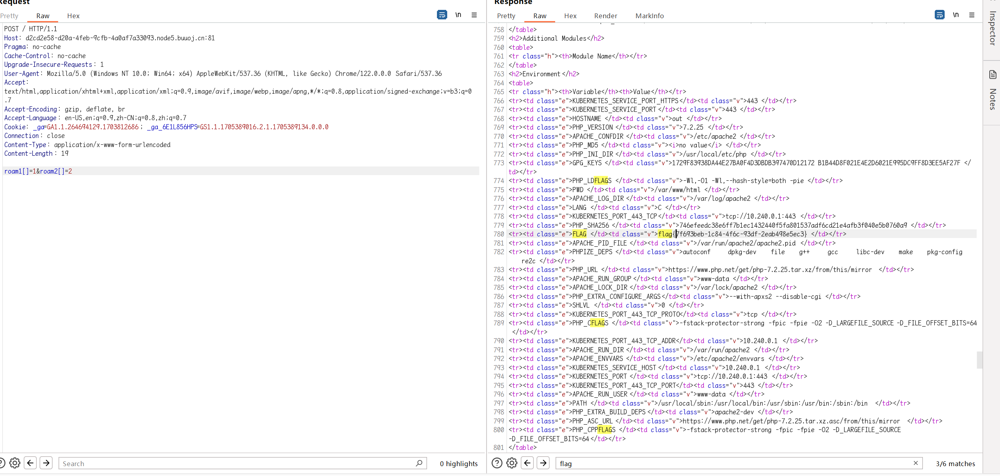

# [极客大挑战 2020]Roamphp1-Welcome

## 知识点

`http请求方式修改`

`弱类型数组绕过`

## 解题

刚打开题目`405`我还以为题目环境出问题了，看了请求头和响应头都没啥东西，因为是`BUUCTF`，扫目录会崩，看别人的`wp`说是修改为`POST`请求，ok继续

发现源码弱类型数组绕过可以显示`phpinfo`

直接构造

`roam1[]=1&roam2[]=2`

直接可以获得`flag`