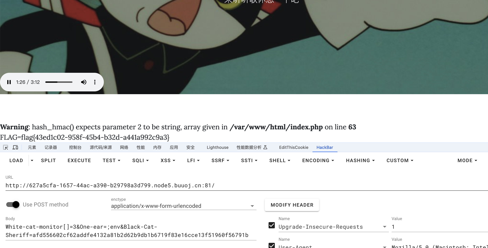

# [羊城杯 2020]Blackcat

## 知识点

`hash_hmac`

## 解题

下载音乐，然后使用`010editor`打开即可查看源码

```php
if(empty($_POST['Black-Cat-Sheriff']) || empty($_POST['One-ear'])){
    die('谁！竟敢踩我一只耳的尾巴！');
}
$clandestine = getenv("clandestine");
if(isset($_POST['White-cat-monitor']))
    $clandestine = hash_hmac('sha256', $_POST['White-cat-monitor'], $clandestine);
$hh = hash_hmac('sha256', $_POST['One-ear'], $clandestine);
if($hh !== $_POST['Black-Cat-Sheriff']){
    die('有意瞄准，无意击发，你的梦想就是你要瞄准的目标。相信自己，你就是那颗射中靶心的子弹。');
}
echo exec("nc".$_POST['One-ear']);
```

`hash_hmac`第二个参数为数组时会返回`NULL`，那么` $_POST['White-cat-monitor']`即可设置为`[]`，`Black-Cat-Sheriff`就为对应`hash_hmac('sha256', $_POST['One-ear'], NULL);`生成的`hash值`

使用`payload`

```python
<?php

echo $_POST['One-ear'] . '<br>';
$hh = hash_hmac('sha256', $_POST['One-ear'], false);
echo $hh;
```

