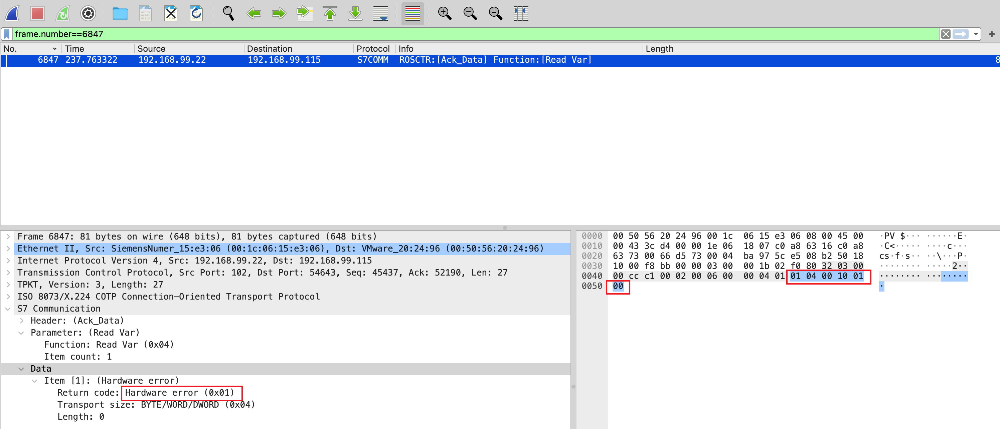

# 上位机通讯异常分析

## 知识点

`s7comm异常流量`

## 解题

> 生产车间某流水线运行异常，而上位机SCADA系统未开启报警功能，导致无法查询控制设备异常情况，请根据组态软件与控制设备之间通讯流量查找问题，flag为异常数据包data内容

给了一个流量包，使用`wireshark`进行流量分析，发现很多是`s7comm`流量，正常数据流量返回`Return code`的是`0xff`,用`python`筛选一下异常数据

```python
import pyshark


pcap = pyshark.FileCapture('./12.pcap', display_filter='s7comm')

# print(pcap[3]['s7comm'].data_returncode)
# print(dir(pcap[3]['s7comm']))

for i,v in enumerate(pcap):
    try:
        if pcap[i]['s7comm'].data_returncode != "0xff":
            print(pcap[i].number)   # No.
            # print(dir(pcap[i].s7comm))
            # print(pcap[i].s7comm.data.param)
            # print(type(pcap[i].s7comm.data))
            # print(dir(pcap[i].s7comm.data))
    except Exception as e:
        pass
```

运行结果为`6847`，查看出现异常的`6847`包,提交异常数据



`flag{010400100100}`