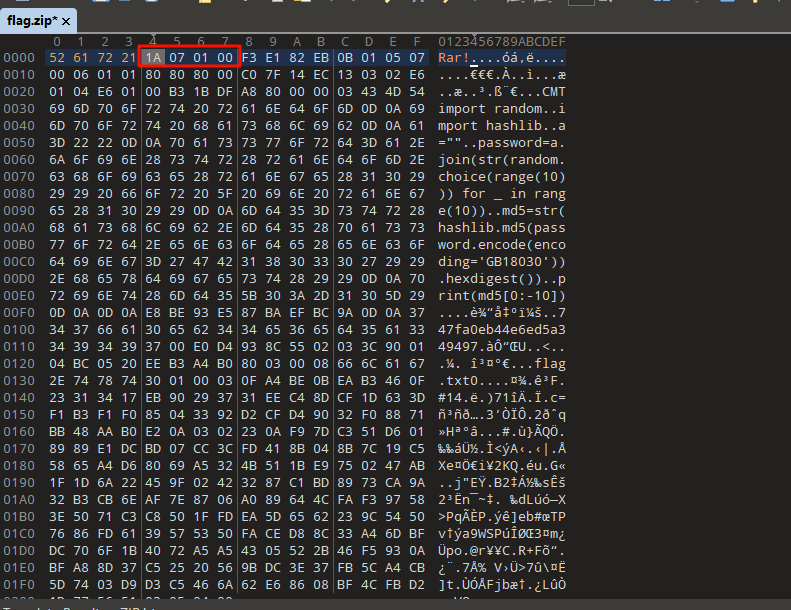
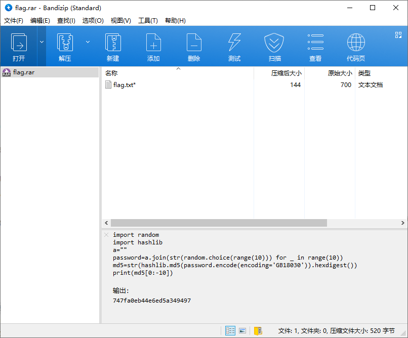
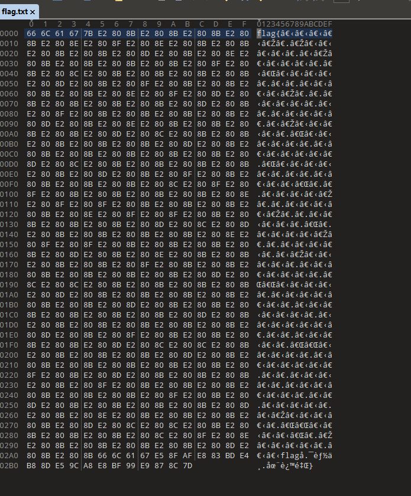

# 加密后的企业数据

## 知识点

`文件头`

`md5爆破`

`零宽字符加密`

## 解题

首先获得一个附件，为`flag.zip`，解压时提示解压失败，文件内容有问题

`010editor`查看发现后面的是`rar`的文件结构，修改文件头`50 4B 03 04`为`52 61 72 21`



然后可以看到密码提示，对代码进行解密



编写解密脚本

```python
# import random
# import hashlib
# a=""
# password=a.join(str(random.choice(range(10))) for _ in range(10))
# md5=str(hashlib.md5(password.encode(encoding='GB18030')).hexdigest())
# print(md5[0:-10])

import string
import hashlib


def crack():
    for i in range(10**10):
        passwd = str(i).rjust(7, '0')
        if '47fa0eb44e6ed5a349497' in hashlib.md5(passwd.encode(encoding='GB18030')).hexdigest():
            print(passwd)

if __name__ == "__main__":
    crack()
```

解密密码为`5546023` 解密后没有`flag`，使用`010editor`查看文件 



看到很多`0宽度字符`，符合`0宽度隐写`的特征 编写解密脚本

```python
import zwsp_steg
# zwsp-steg-py

with open('flag.txt', 'r', encoding='utf-8') as f:
    flag = f.read()
    res = zwsp_steg.decode(flag)
    print(res)
    # b5e6a6572761cc9c5d8222682fdf5802
```

`flag{b5e6a6572761cc9c5d8222682fdf5802}`