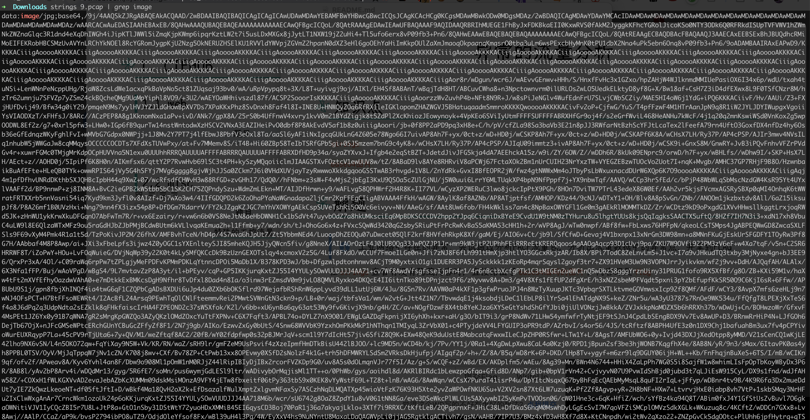
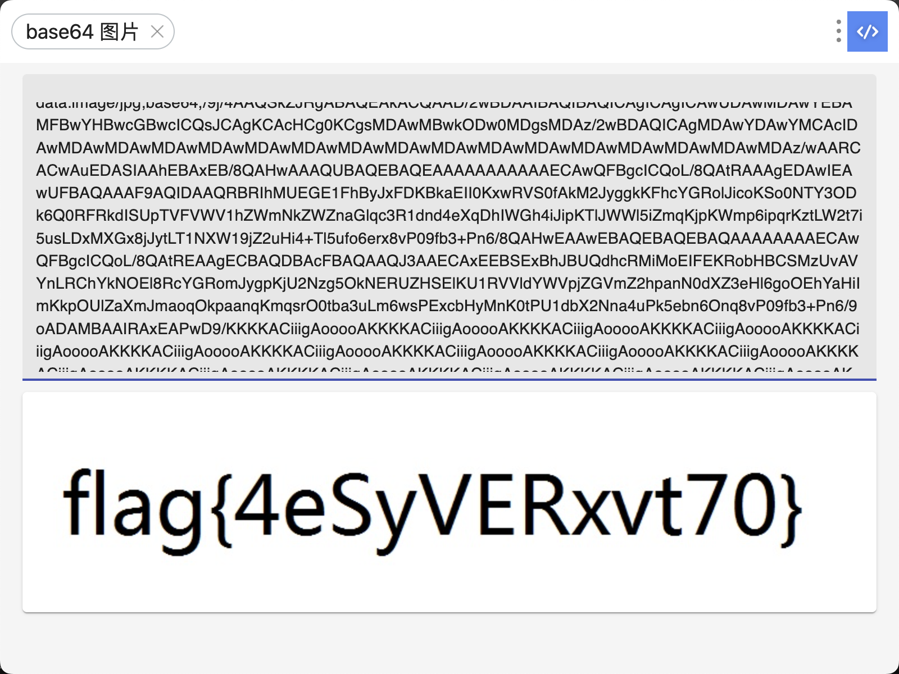

# 异常的流量分析

## 知识点

`strings`

`base64图片`

## 解题

> 工业网络中存在的异常，尝试通过分析PACP流量包，分析出流量数据中的异常点，并拿到FLAG

在`strings`查看有没有隐藏内容时，直接给出了`base64编码的图片`，内容即是`flag`

```bash
string 9.pcap | grep flag
string 9.pcap | grep base64
```



