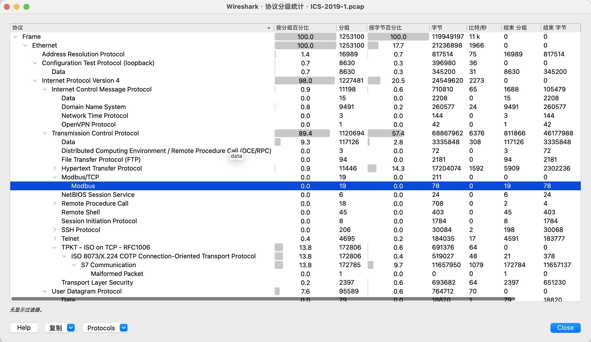
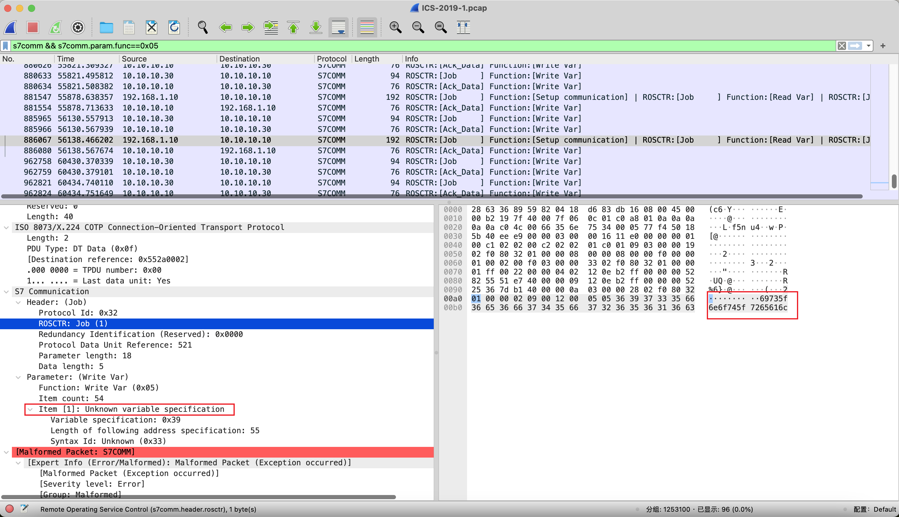
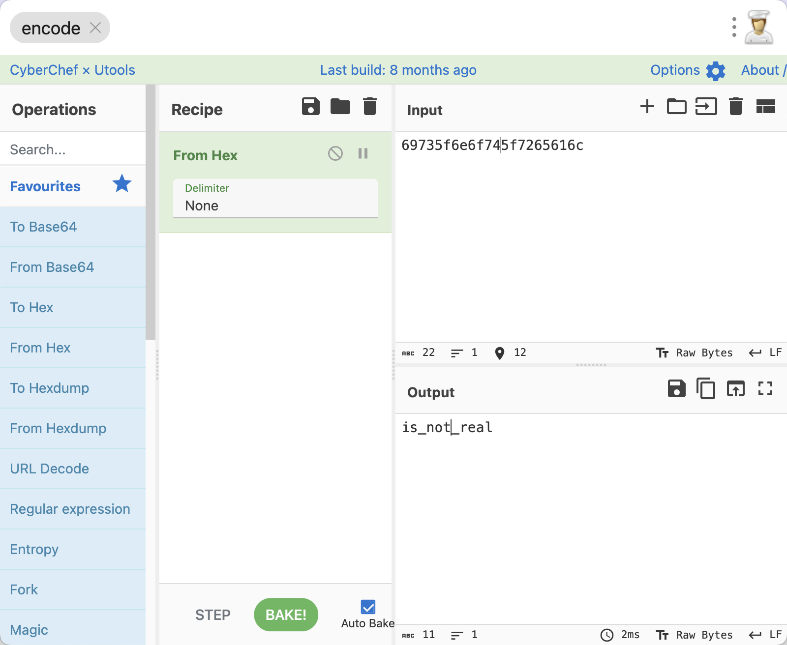

# 特殊的工控流量

## 知识点

`s7comm异常流量`

## 解题

> 某10段工控网络中，工业协议中存在异常数据。请通过流量中的数据找寻flag

下载题目附件，压缩包解压后直接给了流量包附件`ICS-2019-1.pcap`,使用`wireshark`进行分析，因为流量比较大，首先分析看一下`协议分级`,在`wireshark`菜单栏的`统计->协议分级`



因为是工控流量分析题，所以需要重点关注的是`modbus`和`s7comm`,且题目要求寻找异常数据，一般在`s7comm`中，异常数据一般在写入操作中会出现

`s7comm`在该流量包中存在三种功能码，分别是

- 0xf0: Setup communication
- 0x04: Read Var
- 0x05: Write Var

所以首先重点关注写入流量，编写过滤条件为

```
s7comm && s7comm.param.func==0x05
```

筛选出的流量包不多，一个个的笨办法开始看，发现在`No. 886067`发现了异常流量



看起来像是连续的`hex编码数据`，使用`cyberchef`检测一下



检测为`hex`编码，直接解码即可获得`flag`