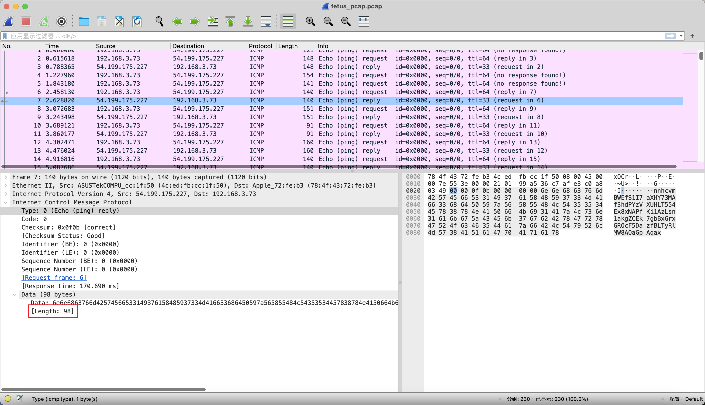

# 简单流量分析

## 知识点

`icmp流量分析`

`icmp数据包长度转ASCII`

## 解题

> 不久前，运维人员在日常安全检查的时候发现现场某设备会不时向某不知名ip发出非正常的ICMP PING包。这引起了运维人员的注意，他在过滤出ICMP包分析并马上开始做应急处理很可能已被攻击的设备。运维人员到底发现了什么?flag形式为 flag{}

解压后给了一个`fetus_pcap.pcap`,`wireshark`打开发现是`icmp`流量，发现流量长度基本与`ASCII`长度类似



将请求包中的数据长度分别转为`ASCII`发现是`base64`，直接`python`处理即可

```python
import pyshark
import base64


caps = pyshark.FileCapture('./fetus_pcap.pcap', display_filter="icmp.type==8")

string = ''

for cap in caps:
    string += chr(int(cap['icmp'].data_len))

flag = base64.b64decode(string)
print(flag)
```


`flag{xx2b8a_6mm64c_fsociety}`