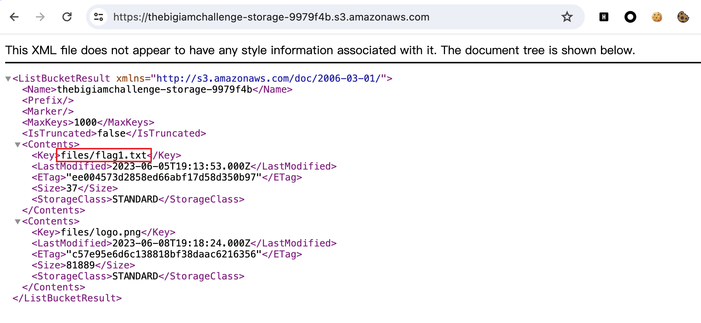
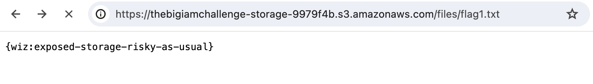

# Buckets of Fun

## 知识点

`bucket公开列对象`

`bucket公开读取对象`

## 解题

题目给了`Bucket`的`Policy`

```json
{
    "Version": "2012-10-17",
    "Statement": [
        {
            "Effect": "Allow",
            "Principal": "*",
            "Action": "s3:GetObject",
            "Resource": "arn:aws:s3:::thebigiamchallenge-storage-9979f4b/*"
        },
        {
            "Effect": "Allow",
            "Principal": "*",
            "Action": "s3:ListBucket",
            "Resource": "arn:aws:s3:::thebigiamchallenge-storage-9979f4b",
            "Condition": {
                "StringLike": {
                    "s3:prefix": "files/*"
                }
            }
        }
    ]
}
```

从策略里发现，这个存储桶具有公开列对象和公开读取的权限，由于题目已经给出了`Bucket`的名称，拼接一下完整的`URL`为https://thebigiamchallenge-storage-9979f4b.s3.amazonaws.com/

访问`url`可以获得`flag`对应的`key`



访问对应的`key`即可获得`flag`



题目含义为对于存储桶应该避免允许公开访问以及避免允许公开列对象，防止敏感信息遭到泄露