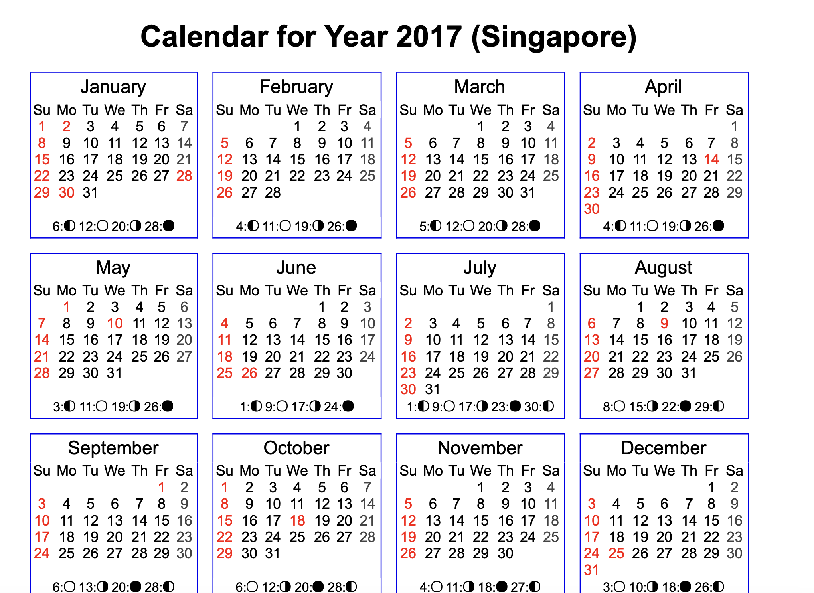
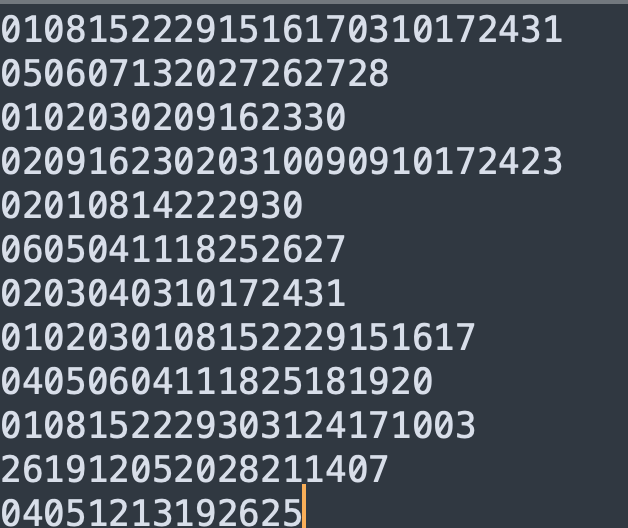
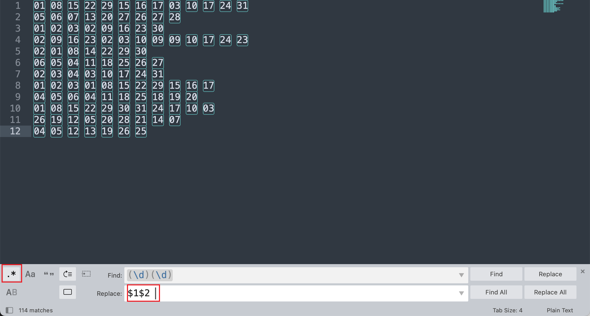
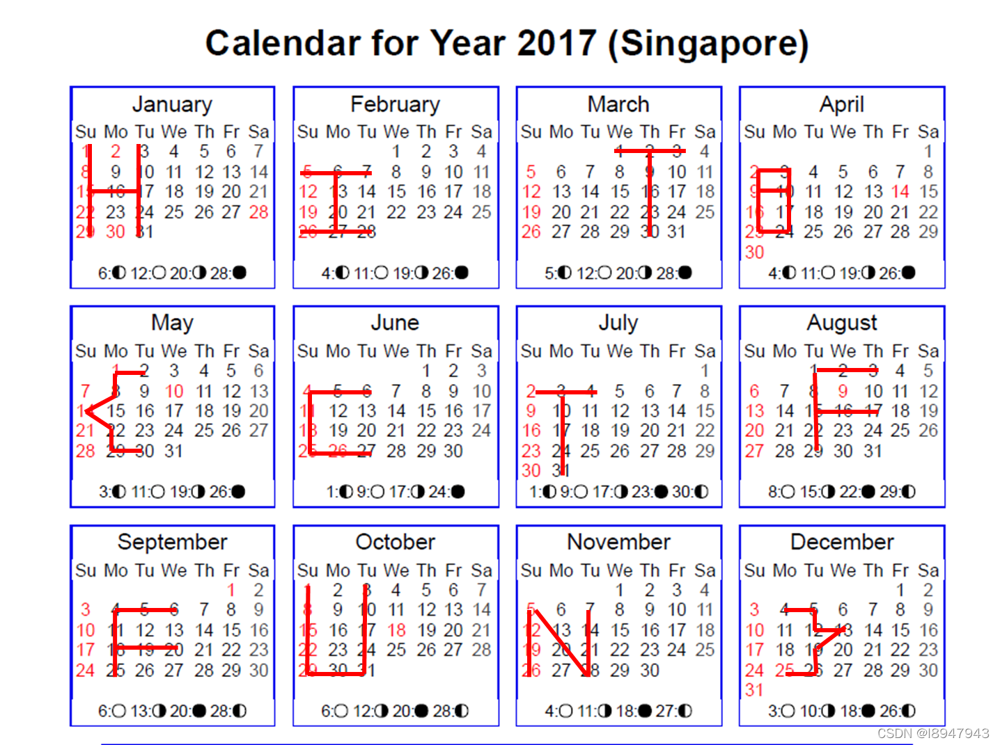

# 2017_Dating_in_Singapore

## 知识点

`日历`

## 解题

> 01081522291516170310172431-050607132027262728-0102030209162330-02091623020310090910172423-02010814222930-0605041118252627-0203040310172431-0102030108152229151617-04050604111825181920-0108152229303124171003-261912052028211407-04051213192625

然后给出了个日历

对这串数字两两分开制图

`HITB{CTFFUN}`

参考文章：https://blog.csdn.net/l8947943/article/details/122451282