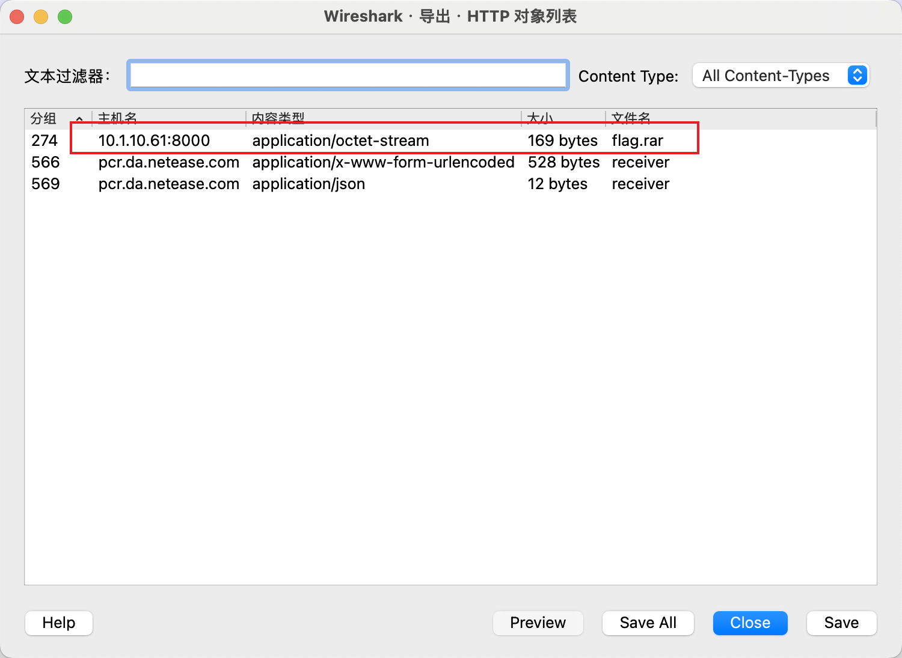
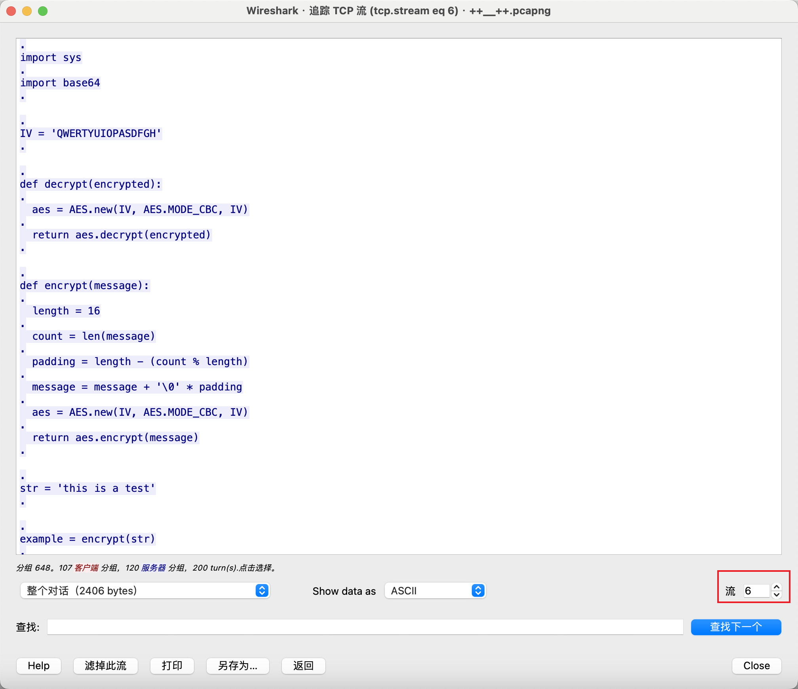
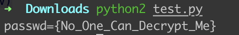

# 3-1

## 知识点

`python2 AES`

## 解题

首先给了一个没有后缀名的文件，使用`file`命令查看文件类型


然后解压后又有一个没有后缀名的文件，使用`file`命令


然后使用`wireshark`打开，发现`flag.rar`



导出解压发现有秘密，继续找，在追踪tcp流6时发现代码



编写解码代码

```python
# coding:utf-8
__author__ = 'YFP'

from Crypto import Random

from Crypto.Cipher import AES


import sys

import base64


IV = 'QWERTYUIOPASDFGH'


def decrypt(encrypted):
    aes = AES.new(IV, AES.MODE_CBC, IV)

    return aes.decrypt(encrypted)


def encrypt(message):

  length = 16

  count = len(message)

  padding = length - (count % length)

  message = message + '\0' * padding

  aes = AES.new(IV, AES.MODE_CBC, IV)

  return aes.encrypt(message)


str = 'this is a test'
res = '19aaFYsQQKr+hVX6hl2smAUQ5a767TsULEUebWSajEo='

example = encrypt(str)
print(decrypt(base64.b64decode(res)))
```

`python2`运行即可

