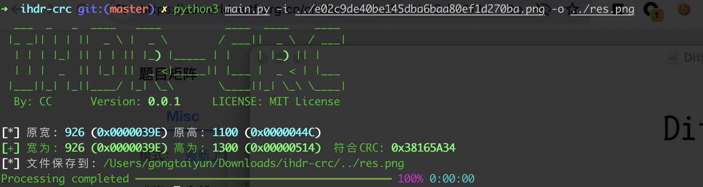
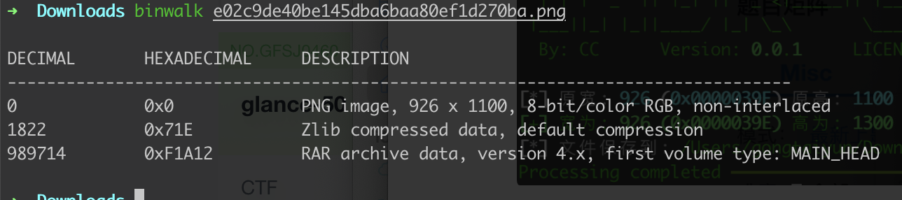
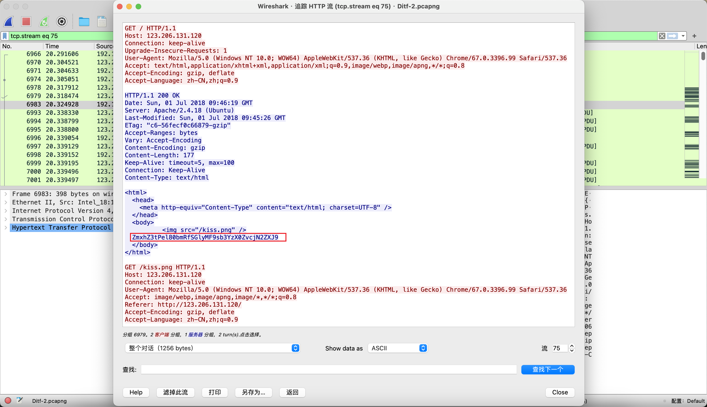
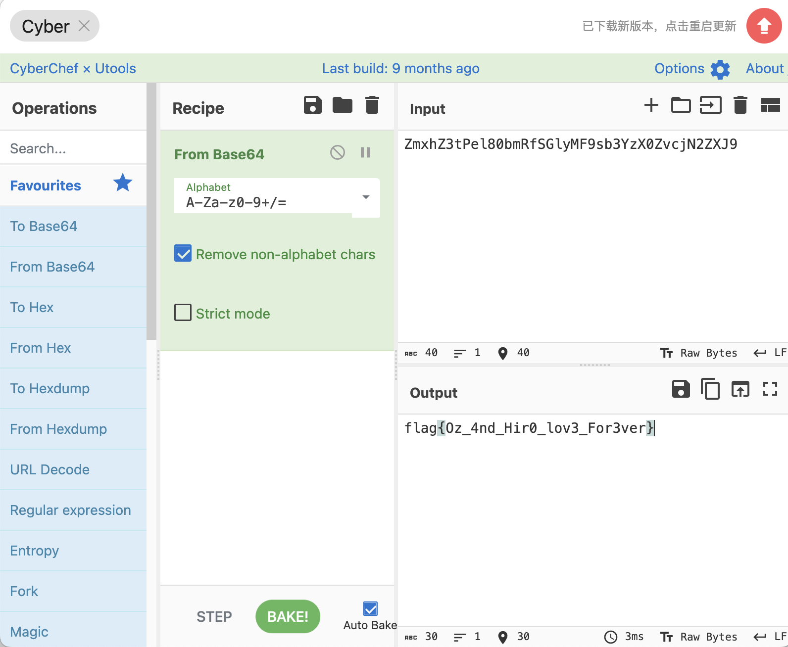

# Ditf

## 知识点

`图片隐藏高度`

`流量分析`

## 解题

首先得到一张图片，无法正常显示，使用`crc`计算正确宽高



然后`binwalk`发现有隐藏文件



然后解压`rar`文件需要密码，使用


解压后获取到一个`.pcapng`文件，进行流量分析

```
http && !http.request.uri contains ".js" && !http.request.uri contains ".gif"
```

过滤流量后在`kiss.png`追踪流量包时找到了一串`base64`，解密后获得`flag`



