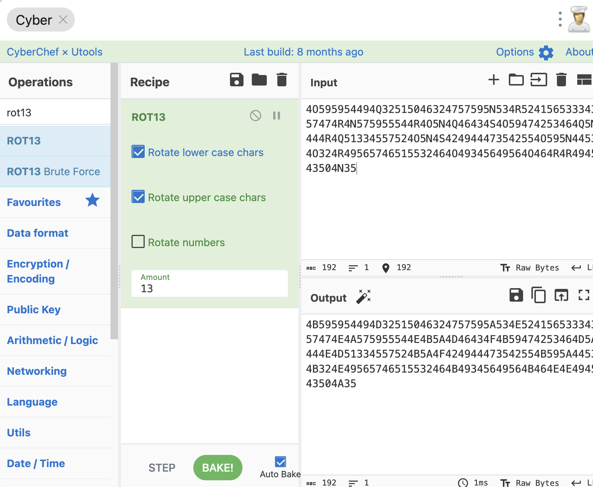
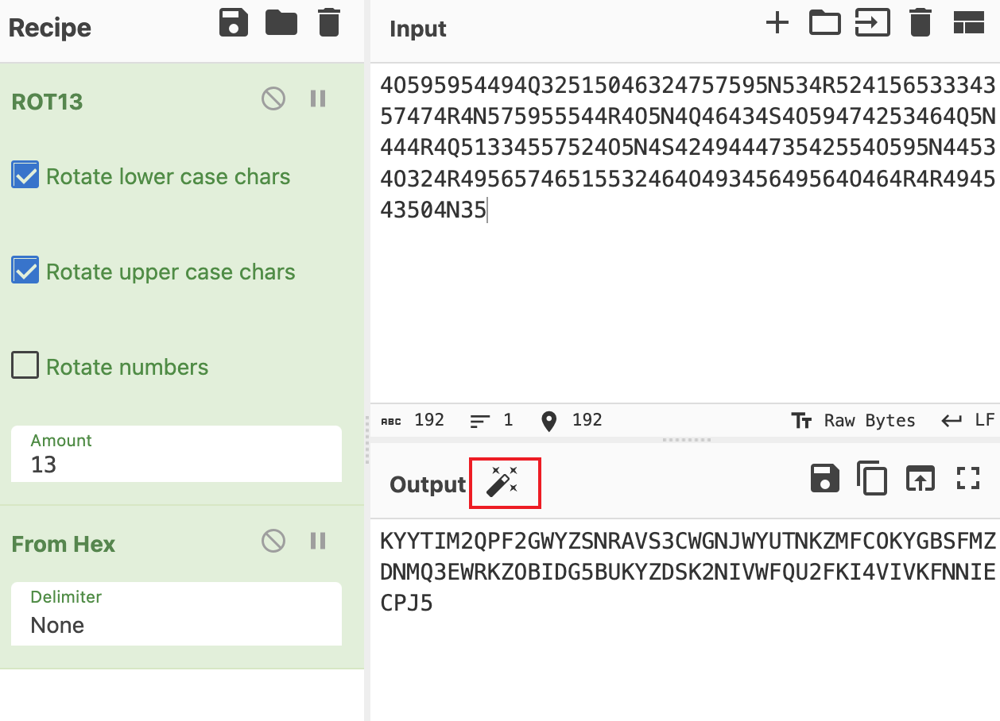
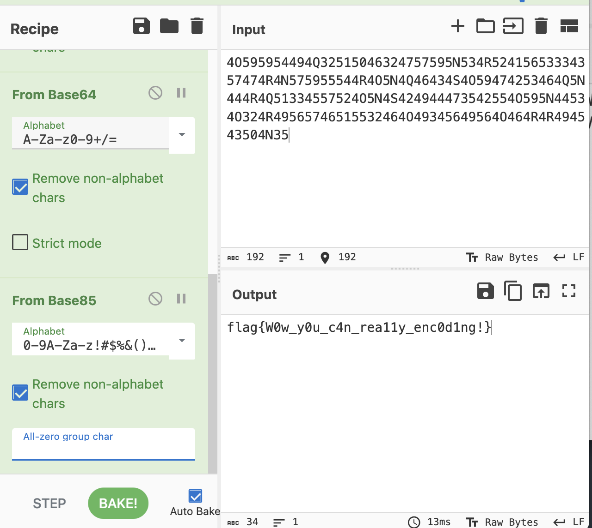

# Encode

## 知识点

`rot13`

`base85`

## 解题

解压后给了一串字符串

```
4O595954494Q32515046324757595N534R52415653334357474R4N575955544R4O5N4Q46434S4O59474253464Q5N444R4Q51334557524O5N4S424944473542554O595N44534O324R49565746515532464O49345649564O464R4R494543504N35
```

发现看起来像16进制，但是有`N` `Q`这些字符存在，先尝试`rot13`转换



发现看起来是`hex`且像`hex`编码文件，且`CyberChef能解码`，点击魔棒转换



出来一串字符串，继续转即可获得`flag`

