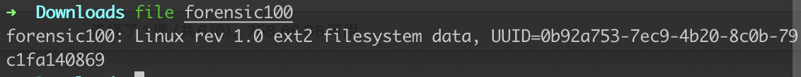
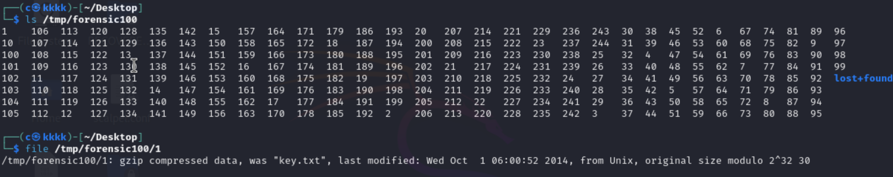

# Get-the-key

## 知识点

`文件挂载`

`gz`

## 解题

因为给的文件没有后缀，使用`file`命令查看是什么文件，发现是个`ext2`的文件系统



使用`mount`挂载

```bash
mkdir /tmp/forensic100
mount -o loop forensic100 /tmp/forensic100
```



在1发现了`key.txt`，且是`gz`压缩的，使用

```bash
gunzip < 1
```

