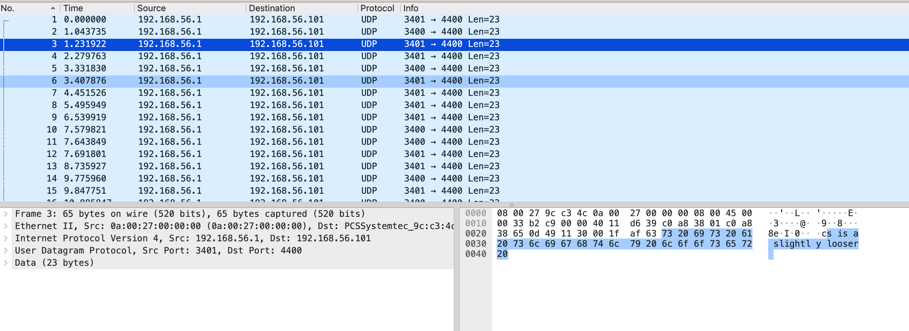
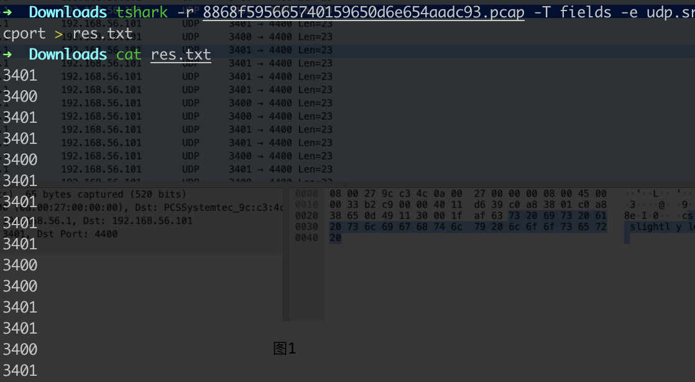
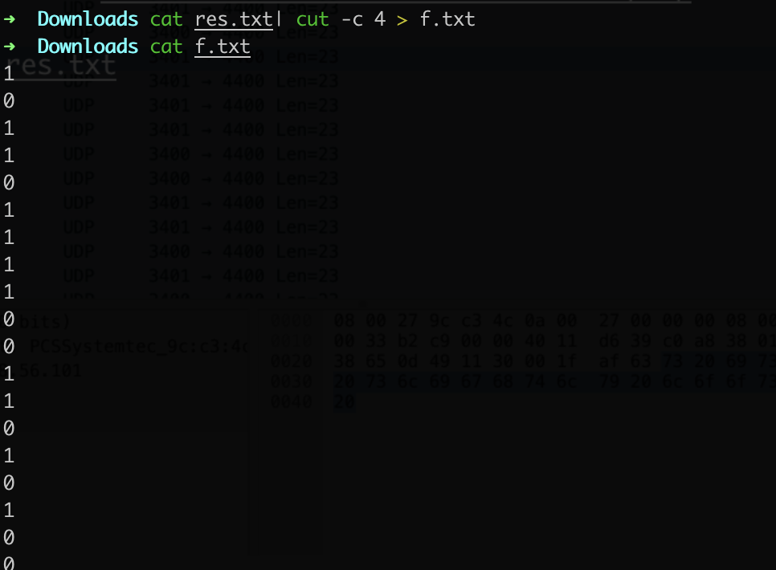
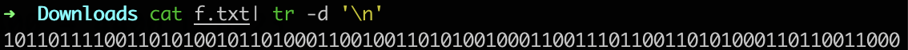
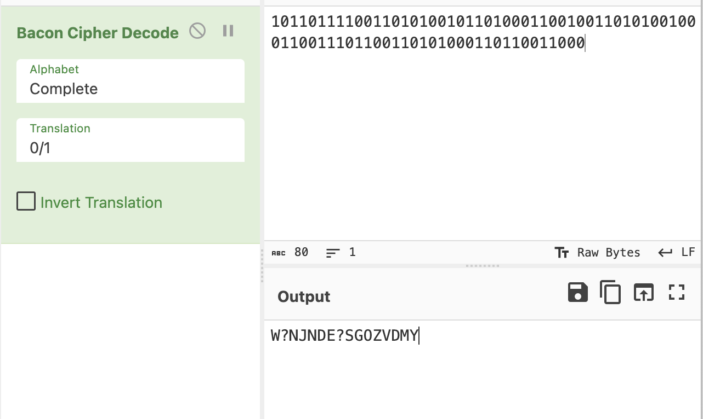
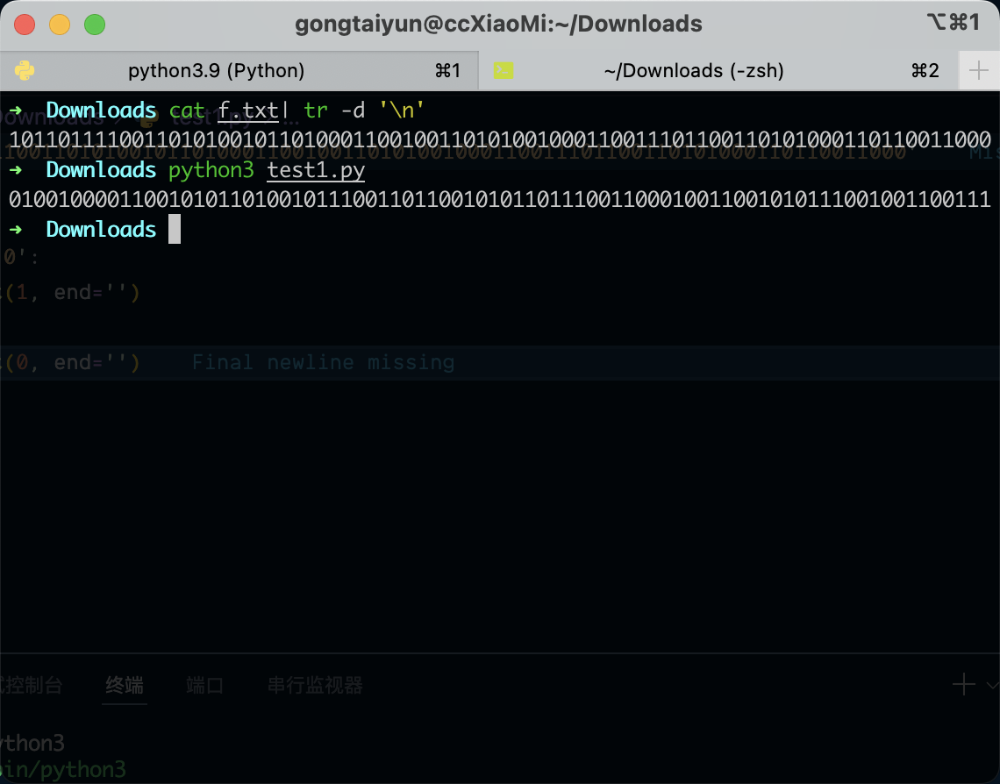
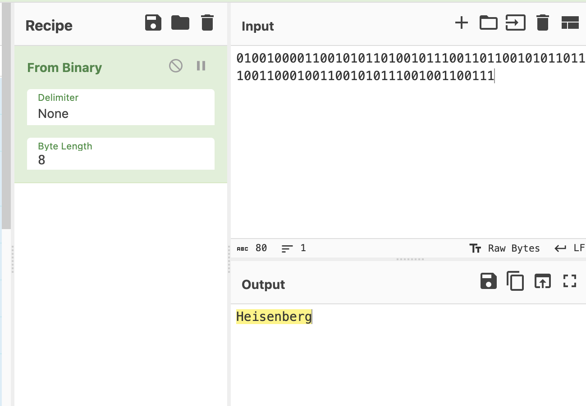

# Hidden-Message

## 知识点

`UDP流量端口二进制`

## 解题



没有发现什么东西，追踪流量包也没什么东西，然后发现端口似乎只有两个，尝试二进制

```bash
tshark -r 8868f595665740159650d6e654aadc93.pcap -T fields -e udp.srcport > res.txt
```



只要最后一个数字

```bash
cat res.txt | cut -c 4 > f.txt
```



```bash
cat f.txt| tr -d '\n'
```





发现是错的 尝试翻转一下

```python
a = '10110111100110101001011010001100100110101001000110011101100110101000110110011000'

for i in a:
    if i == '0':
        print(1, end='')
    else:
        print(0, end='')
```



