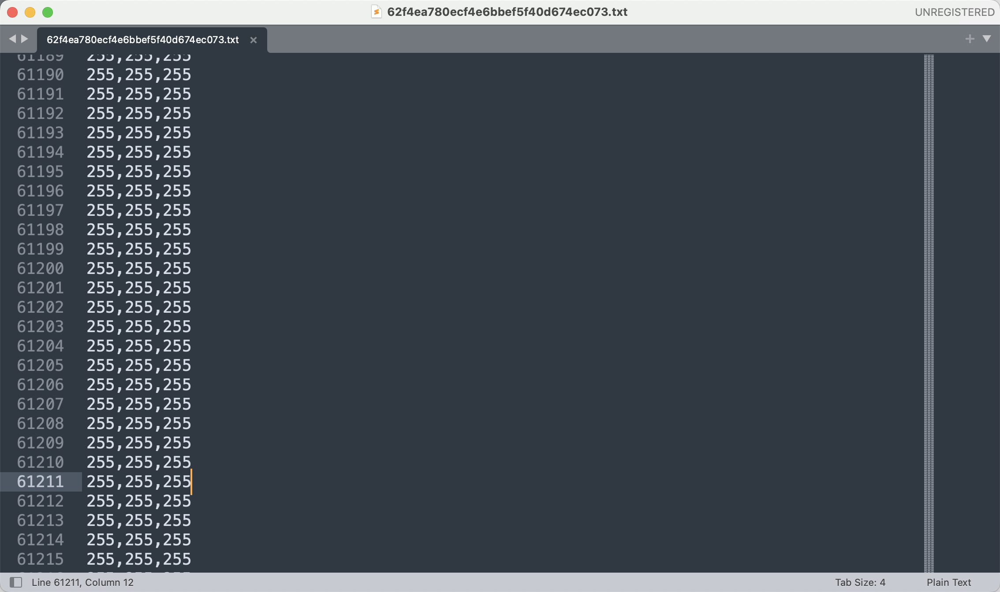

# Miscellaneous-200

## 知识点

`坐标绘图`

## 解题

打开`txt`文本文档可以看到数据，看起来类似坐标，尝试绘图



```python
from PIL import Image
import math

with open('./62f4ea780ecf4e6bbef5f40d674ec073.txt', 'r') as f:
    res = f.read().strip().split('\n')
    # print(res[0].split(','))
    array_row = [(int(i.split(',')[0]), int(i.split(',')[1]), int(i.split(',')[2])) for i in res]
    # print(len(array_row))
size = int(math.sqrt(len(array_row)))
# print(size)

img = Image.new('RGB', (size, size), '#ffffff')

k = 0
for i in range(size):
    for j in range(size):
        img.putpixel((i, j), array_row[k])
        k += 1

img.save('res.png')
```


